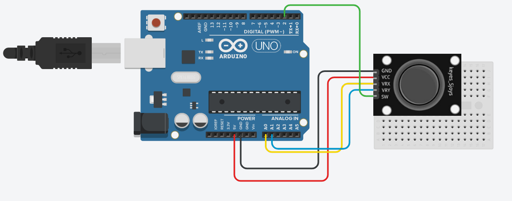
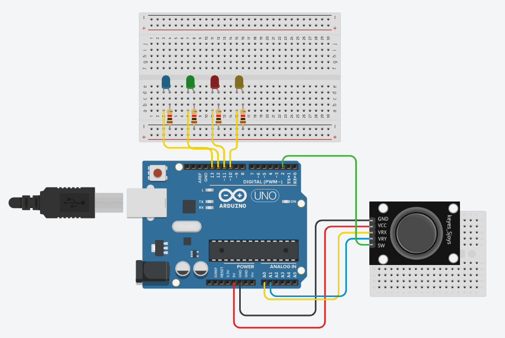

# Joysticks in Arduino 
## How do joysticks work?
An analog joystick in its simplest form is just two potentiometers square with eachother, each responsible for measuring the X and Y readings of the joystick. These potentiometers are sat ontop of a push button which is contantly in one of two binary values (1 for un-pressed, 0 for pressed)

## Analog vs Digital Joysticks
Digital joysticks rely on single electrical connections to determine the joysticks state. This restricts digital joystics to a binary state, being either 0 or 1 depending on its state. 

An analog joystick differs from this in the way that it uses **continuous** electrical activity in order to measure the exact possision of the joystick. In the context of arduino, a analog joystick has a measurment range of -1023 to 1023.   

## Joystick Properties 
Joysticks have 5 main components that should be wired before being used. 
* VCC+ -> Voltage
* GND -> Ground
* VRX -> Variable resistance X
* VRY -> Variable resistance Y
* SW -> Switch / Button

The first two properties (VCC+ and GND) are connected to the arduino and are essential for the joystick to function. The other three (VRX, VRY and SW) are responsible for the X movement, Y movement and switch state of the joystick. 

*Note that different joysticks may have different names for these properties, but will ultimatly server the same purpose. 

## Joystick setup
### Wiring up the joystick
**Where do we wire up the joystick properties?**

* VCC -> 5V
* GND -> GND
* VRx -> A0
* VRy -> A1
* SW -> Pin 2

The analog joystick we are using requires a female to male wire in order to connect to the joystick, however if you are unable to find these, you can just user a F to F and a M to M as a work around. 

Here is a visual aid to help you wire up the joystick: 

Note that unfortunatly, tinkercad does not have any joysticks in their circut simulator, this is just a visual aid to help with wiring up an actual arduino.

### Working The Switch
First lets figure out how to use the switch button on the joystick. First we have to assign the pins to variables and set the state of the pins.

    int SW = 2;
    int SW_state = 0;

    void setup() {
      Serial.begin(9600); 
      pinMode(SW, INPUT_PULLUP); 
    }
    
With this, we can now edit the loop function in order print out the state of the switch. All we need is to use the `digitalRead()` method to save the state to a variable, then use `Serial.println` to display it in the Serial Monitor.

    void loop(){
      SW_state = digitalRead(SW);
      Serial.println("Switch State: ");
      Serial.print(SW_state);

      delay(100);
    }

Now you're all good to go! 

We add the delay at the end just so the Serial Monitor isn't moving too fast.  

### Joystick X and Y
Simmillarly to the joystick switch, we again have to set the pins to variables and set their state.

    int VRx = A0;
    int VRy = A1;

    int xPosition = 0;
    int yPosition = 0;

    void setup() {
      Serial.begin(9600); 
      
      pinMode(VRx, INPUT);
      pinMode(VRy, INPUT);
    }

Now we do almost the exact same thing we did for the switch, however instead of using `digitalRead()` we use `analogRead()`. 

    void loop(){
      xPosition = analogRead(VRx);
      yPosition = analogRead(VRy);

      Serial.println("X Value: ");
      Serial.print(xPosition);
      Serial.println("Y Value: ");
      Serial.print(yPosition);

      delay(100);
    }
    
And just like that we can see the the X and Y values of the joystick!

### Mapping Joystick Values
Now you might have noticed that the joystick values are rather strange, ranging from 0 to 1023. Needless to say that these values could be rather annoying to code with. 

Luckily this is easily fixable using the `map()` method. The `map()` method takes a variable, its origioal values, and two new values. Using this we can change the origional range of 0 to 1023 to something much more useable, such as -100 to 100.

Using the previous code you wrote, add these two variables before the `setup()` function.
    
    int mapX = 0;
    int mapY = 0;

Jumping to the `loop()` function we can map the original joystick values and print the map vairables instead.

    void loop(){
      xPosition = analogRead(VRx);
      yPosition = analogRead(VRy);
      mapX = map(xPosition, 0, 1023, -100, 100);
      mapY = map(yPosition, 0, 1023, -100, 100);

      Serial.println("X Value: ");
      Serial.print(mapX);
      Serial.println("Y Value: ");
      Serial.print(mapY);

      delay(100);
    }

And there we go, we've made the joystick positional reading significantly easier to work with.

### Practice Problem 1
Lets make the switch value actually mean something.

Write some code that turns the binary of the switch state into a message that tells the user if the joystick is being pressed down or not. 

### Practice Problem 2 
Lets make the joystick switch actually do something other than writing to the Serial Monitor.

Wire up a light to the arduino and write some code that causes the light to turn on for a second whenever the joystick is pressed down. 

### Practice Problem 3
Lets use those mapping skills to alter what we write to the Serial Monitor.

Write some code that maps the joystick readings from -30 to 30, writing different intensities of messages to the Serial Monitor depending on how far in one direction the joystick is pressed. 

    e.g. left, Left and LEFT 

### Challenge
Create a circuit containing 4 different coloured lights, these lights should be assigned to a different direction on the joystick. The switch, when pressed down should cause all of the lights to light up for 2 seconds (bonus points if you make them do some flashy light dance thing).

Here is a image to assist the wiring of the circuit:

