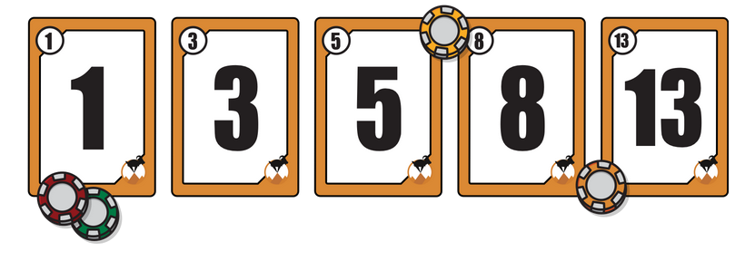

# Topic

What is this recipe about?

```
  Front
┌────────────────────────────────────┐
│                                    │
│   Priority          Story Points   │
│                                    │
│         * I want to...             │
│                                    │
│                                    │
│         * So that...               │
│                                    │
└────────────────────────────────────┘
```

```
 Back
┌────────────────────────────────────┐
│                                    │
│   * I will know when it is done    │
│     when...                        │
│                                    │
│                                    │
│                                    │
│                                    │
│                                    │
└────────────────────────────────────┘
```


**original author:** [carteras](https://github.com/carteras)

<!-- add a new author mark if you updated this -->

## Topics covered

"At the end of this recipe, you will be able to answer the following questions or solve the following problems"

<!-- why should people expect to be able to do or know after doing this recipe -->

* How can we use Project Collaboration Cards to help manage our project?
* How do we define what the Card is about?
* What are Story Points?
* What is priority?
* How do we know when the Card is complete?
* What is Velocity?

### Things you'll need to know before you start this

<!-- what should they know before learning it -->

* [Card Sorting](../Card%20Sorting/card_sorting.md)


### Third party resources

<!-- Are there other locations where they can find this information? -->

* [Minimum viable Product](https://en.wikipedia.org/wiki/Minimum_viable_product)
* resource
* resource

## Topics

### Introduction

<!-- Introduce the topic, what is it, how does it work, include pictures -->

#### Using Project Collaboration Cards to help manage our project

At the most basic, Project Collaboration Cards are used to help project teams and managers: 

* Work out what work needs to be done
* When that work needs to be done
* How complex that work is
* What the agreement is for when the work is complete

#### Defining our task

Defining our task is pretty easy. We focus on two sentences: 

* What is it we want to do
* Why do we want to do it

For example, imagine we are creating an ASCII Roguelike. One common aspect of ASCII Roguelikes is that monsters spawn in certain locations. We could define our story like that: 

* We want to be able to make a spawn point 
* so we can spawn mobile objects (MOBs). 

#### Story Points

We need someway of estimating how long work will take, even if those estimates aren't likely to be accurate in the field. In Agile teams, they normally use a sequence such as this: 1/2-day, 1-day, 2-days, 3-days, 5-days. If they need to, they can use the Fibonacci sequence to keep rendering out new days. However, a common practice is that if a story is larger than 5-days they need to split the story.

However, we don't have that much time. In CBRC version of Story Points, we will use 1/2-hour, 1-hour, 2-hours, 3-hours, and 4-hours. While we don't follow the standard of Fibonacci sequence, we only have slightly more than 4 hours per week. If a story is going to take more than a week, we need to split the project. 

How do we estimate this time? We take the unrealistic approach of assuming perfect time. How much can we get done if we don't have any disruptions and work 100% effectively? 

It doesn't matter if our estimates are wrong. In fact, we are counting on it. We will track this later.

#### Prioritising Cards

Which tasks should we work on first? Which should we give up on first? We classify all Collaboration Stories as: Must | Should | Could

How do we classify this? 

* Must: This must be a part of the [minimum viable product](https://en.wikipedia.org/wiki/Minimum_viable_product). It is something that you absolutely need to build. No exceptions.
* Should: This is something that logically should be a part of the project. It might even be expected features/functionality. However, it can likely wait until after all of the must have components are done.
* Could: the polish, or features/functionality that would be nice to have but aren't mission critical.

#### Card Completion

All tasks need to have some sort of rule that defines when they are done. How do we do that from a Collaboration point of view? We look at the task, and in natural English we write an explanation of what we can manually test. 

Using the MOB spawn point from above, what might the completion of that be? It could be something as simple as: 

* I can see the MOB Spawn Point spawning mobs as defined by rule blah blah blah

#### Planning Poker

Planning Poker is an agile estimating and planning technique that is consensus based. To start a poker planning session, the product owner or customer reads an agile user story or describes a feature to the estimators. 

Each estimator is holding a deck of Planning Poker cards with values like 0, 1, 2, 3, 5, 8, 13, 20, 40 and 100, which is the sequence we recommend. The values represent the number of story points, ideal days, or other units in which the team estimates.

The estimators discuss the feature, asking questions of the product owner as needed. When the feature has been fully discussed, each estimator privately selects one card to represent his or her estimate. All cards are then revealed at the same time.

If all estimators selected the same value, that becomes the estimate. If not, the estimators discuss their estimates. The high and low estimators should especially share their reasons. After further discussion, each estimator reselects an estimate card, and all cards are again revealed at the same time.

The poker planning process is repeated until consensus is achieved or until the estimators decide that agile estimating and planning of a particular item needs to be deferred until additional information can be acquired.



#### Tracking Velocity

Earlier, we estimated how long something would take to build in a perfect world. How do we make this meaningful? We track how long it took in actuality to produce and divide the estimate with reality to find our velocity.

Let's say we estimate that Task X would take 2 hours to produce. We physically worked on it for 5 hours, our velocity would be 2/5= 0.4

Velocity is tracked over time (often with a rolling average). This helps project members and managers understand how many tasks are being consumed and how long it is likely going to take to complete. For example, if you summed your remaining tasks and had 18 hours estimated you would likely have 45 hours of actual work remaining due to your velocity. 

You need to purge some tasks.

#### Purging tasks

When we remove features/tasks/cards from the backlog we start with the could haves and work backwards. It often becomes a moment of truth where some of the features we thought were should have or even must have, suddenly become less important.

### Worked Examples

<!-- Provide some basic worked examples that let people follow your worked examples. If it's a library, don't forget to tell people how to install it -->

* Collect your "poker cards"
* Listen to the Tasks to be completed
* Discuss the Task as a group, clarify any questions about the task that was just read.
* Play cards. Each team member face down.
* When asked, turn your cards over. Do they all match?
  * If not, discuss
