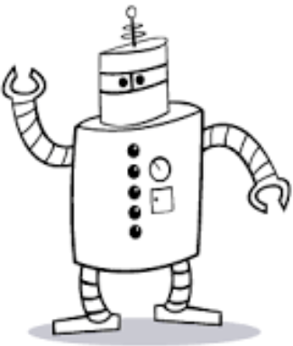

# Lines

This recipe is focused on building core visual thinking skills. We are going to learn how to draw lines. Long straight lines that aren't hairy.

No hairy lines.

**original author:** [carteras](https://github.com/carteras)

<!-- add a new author mark if you updated this -->

## Topics covered

"At the end of this recipe, you will be able to:

<!-- why should people expect to be able to do or know after doing this recipe -->

* Draw lines. Long, straight, lines that aren't hairy.
* In different directions.
* In different patterns.

## Topics

### Introduction

<!-- Introduce the topic, what is it, how does it work, include pictures -->

Lines are the building blocks of visual thinking. Why do we care about visual thinking? Because describing abstractions by waving your hands around is often complex. By forcing ourselves to think about it, and draw something that represents our thoughts we bring tools to our conversation to help transfer our knowledge.

With a simple visual alphabet we can describe complicated things easily:

Using just the symbols from above, can we draw a Train?

Stupid hairy lines :(

How about a robot?

How about a more advanced robot?

If I told you these were bridges, would you believe me?

## Worked Examples

<!-- Provide some basic worked examples that let people follow your worked examples. If it's a library, don't forget to tell people how to install it -->

While we learn how to think visually we have some rules more than worked examples: 

* Lines are done in a single stroke. No hairy lines!
* No rulers or ruler substitutes. Everything is freehand!

That's it

## Practice Questions

<!-- Provide some basic practice questions that let people follow your worked examples.  -->

Go grab 5 pieces of paper:

* Page 1 side 1: Draw long straight horizontal lines
* Page 1 side 2: Draw long straight vertical lines
* Page 2 side 1: draw diagonal lines angled so the left side is higher than the right side
* page 2 side 2: draw diagonal lines angled to the right side is higher than the left side
* page 3 side 1: draw a single, curvy line that takes up as much of the page as you can
* page 3 side 2: draw boxes in circles in boxes until the page is filled with as many different boxes in circles in boxes as you can

## Challenge Question

Problem: You have been challenged to design a car for "car lawn bowls". In car lawn bowls a car must navigate around an obstacle to run over a target. The car is not controlled. However, you do not know the size or the shape of the obstacle so you need to have the ability to set different configurations (steering, speed, etc) between attempts.

In your heads come up with a design that you think could work. 

Task 1: Design challenge with words

Using only words, write down your design solution so that someone else could could build it without any support from you. You have 5 minutes.

Task 2: Design challenge with sketches

Using a combination of shapes (dot, line, angle, arc, spiral, loops, square, rectangle, triangle, circle, cloud, etc). Describe your design solution so that someone else could build it without any support from you. You have 5 minutes. 

Task 3: Design challenge with sketches and words

Using a combination shapes (dot, line, angle, arc, spiral, loops, square, rectangle, triangle, circle, cloud, etc) and words. Describe your design solution so that someone else could build it without any support from you. You have 5 minutes.

Task 4: Storyboard

Split a page into 6 elements (3x2). In each panel describe different parts of your solution. You may use a combination of shapes and words to describe your solution. You have 5 minutes

Constraint: NO HAIRY LINES!

When you are finished, ping me and I'll come over and check your work.