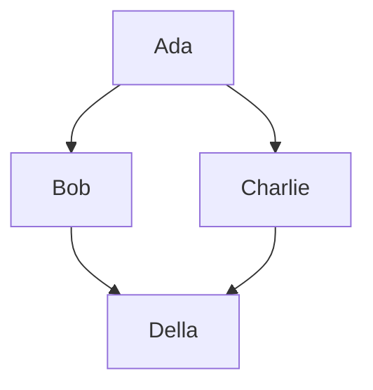
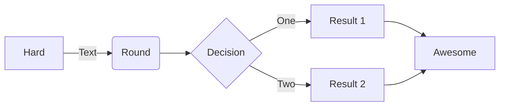
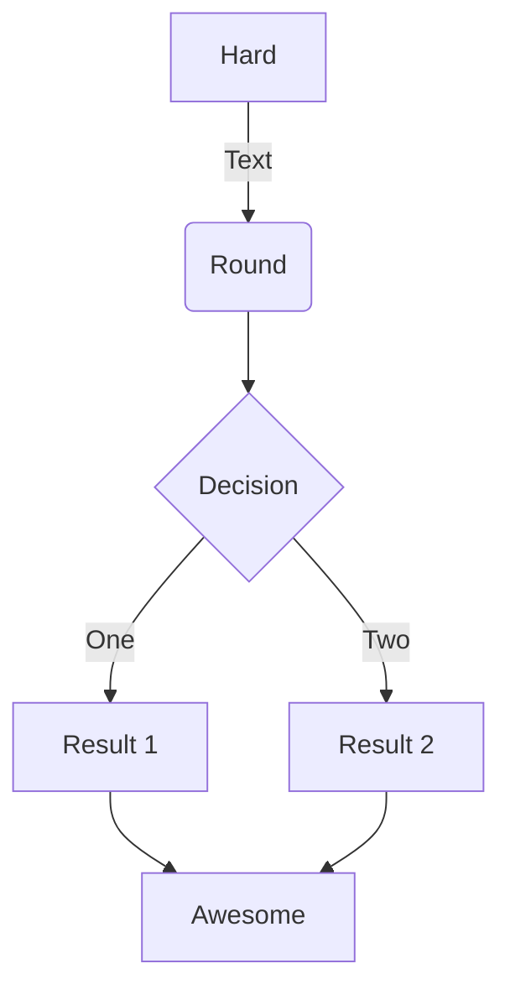
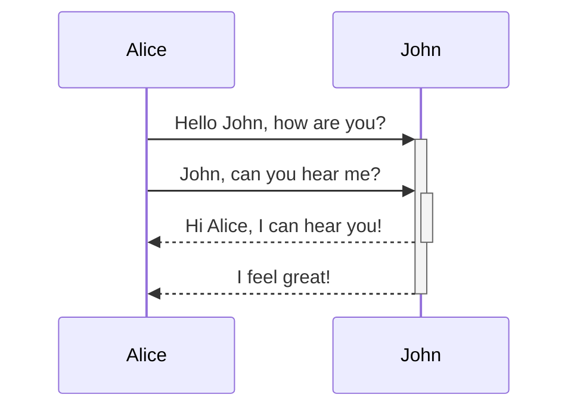
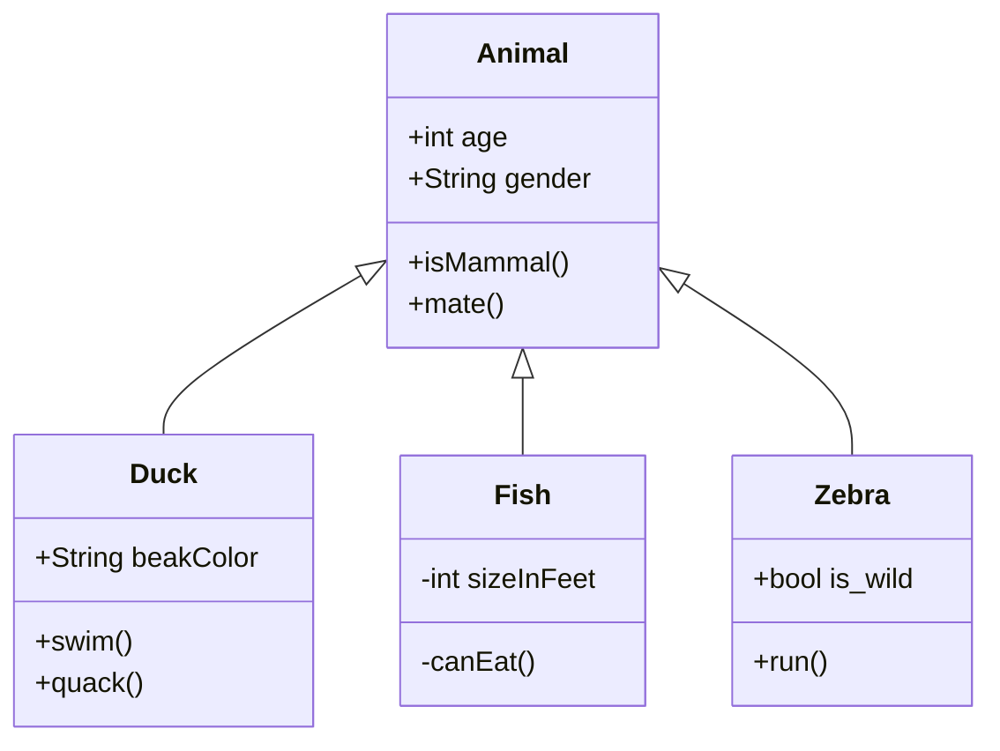
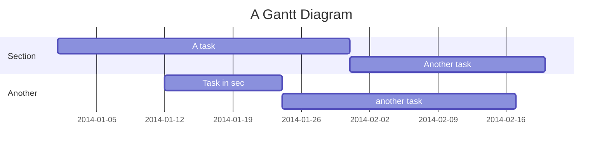

# Mermaid.js

```mermaid
  graph TD;
      Ada-->Bob;
      Ada-->Charlie;
      Bob-->Della;
      Charlie-->Della;
```

```mermaid
    flowchart LR;
        A[Hard] -->|Text| B(Round);
        B --> C{Decision};
        C -->|One| D[Result 1];
        C -->|Two| E[Result 2];
        D --> F[Awesome];
        E --> F[Awesome];
```

```mermaid
    flowchart TD;
        A[Hard] -->|Text| B(Round);
        B --> C{Decision};
        C -->|One| D[Result 1];
        C -->|Two| E[Result 2];
        D --> F[Awesome];
        E --> F[Awesome];
```

```mermaid
    sequenceDiagram;
        Alice->>+John: Hello John, how are you?;
        Alice->>+John: John, can you hear me?;
        John-->>-Alice: Hi Alice, I can hear you!;
        John-->>-Alice: I feel great!;
```

```mermaid
classDiagram
    Animal <|-- Duck
    Animal <|-- Fish
    Animal <|-- Zebra
    Animal : +int age
    Animal : +String gender
    Animal: +isMammal()
    Animal: +mate()
    class Duck{
      +String beakColor
      +swim()
      +quack()
    }
    class Fish{
      -int sizeInFeet
      -canEat()
    }
    class Zebra{
      +bool is_wild
      +run()
    }
            
```

```mermaid
    gantt
        title A Gantt Diagram
        dateFormat  YYYY-MM-DD
        section Section
        A task           :a1, 2014-01-01, 30d
        Another task     :after a1  , 20d
        section Another
        Task in sec      :2014-01-12  , 12d
        another task      : 24d
```