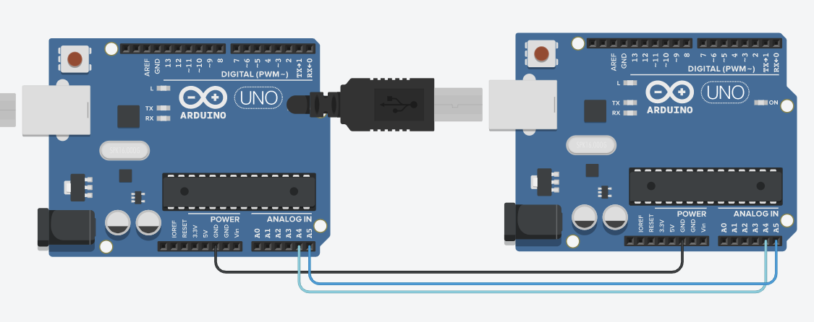
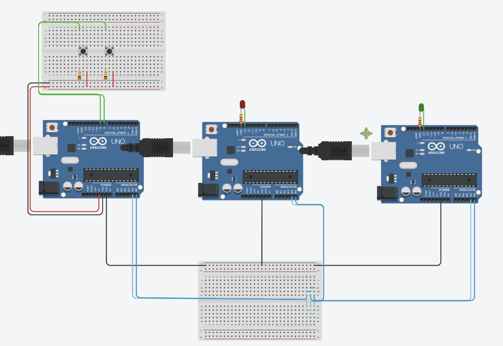

# Topic 

### Learning Goals

*By the end of this module you should be able to answer the following:*

* What is I<sup>2</sup>C?
* How does I<sup>2</sup>C broadly work?
* When would you choose to use I<sup>2</sup>C over Serial connections?

### Dictionary Corner

*To be able to answer a question, you need to be able to answer it. Pay special attention to Dictionary Corner because it arms you with the language to express yourself in this space.*

* I<sup>2</sup>C
* Wire.h
* Wire.begin()
* Wire.requestFrom()
* Wire.read()
* Wire.onRequest()
* Master/Slave (Services)
* receiveEvent()

## I<sup>2</sup>C connections

### Simple MasterReader



`MasterReader.ino`
```cpp
#include <Wire.h>

void setup() {
  Wire.begin();        // join i2c bus (address optional for master)
  Serial.begin(9600);  // start serial for output
}

void loop() {
  Wire.requestFrom(8, 6);    // request 6 bytes from slave device #8

  while (Wire.available()) { // slave may send less than requested
    char c = Wire.read(); // receive a byte as character
    Serial.print(c);         // print the character
  }

  delay(500);
}
```

`SlaveSender.ino`
```cpp
#include <Wire.h>

void setup() {
  Wire.begin(8);                // join i2c bus with address #8
  Wire.onRequest(requestEvent); // register event
}

void loop() {
  delay(100);
}

// function that executes whenever data is requested by master
// this function is registered as an event, see setup()
void requestEvent() {
  Wire.write("hello "); // respond with message of 6 bytes
  // as expected by master
}
```

### Master Writer / Slave Receiver

```cpp
#MasterWriter.ino
#include <Wire.h>

void setup()
{
  Wire.begin(); // join i2c bus (address optional for master)
}

byte x = 0;

void loop()
{
  Wire.beginTransmission(4); // transmit to device #4
  Wire.write("x is ");        // sends five bytes
  Wire.write(x);              // sends one byte  
  Wire.endTransmission();    // stop transmitting

  x++;
  delay(500);
}
```

```cpp
#Slavereader
#include <Wire.h>

void setup()
{
  Wire.begin(4);                // join i2c bus with address #4
  Wire.onReceive(receiveEvent); // register event
  Serial.begin(9600);           // start serial for output
}

void loop()
{
  delay(100);
}

// function that executes whenever data is received from master
// this function is registered as an event, see setup()
void receiveEvent(int howMany)
{
  while(1 < Wire.available()) // loop through all but the last
  {
    char c = Wire.read(); // receive byte as a character
    Serial.print(c);         // print the character
  }
  int x = Wire.read();    // receive byte as an integer
  Serial.println(x);         // print the integer
}

```

## Practice and Challenges

## Questions

### Practice

* Build both I<sup>2</sup>C circuits (MasterReader and MasterWriter)

### Challenge

