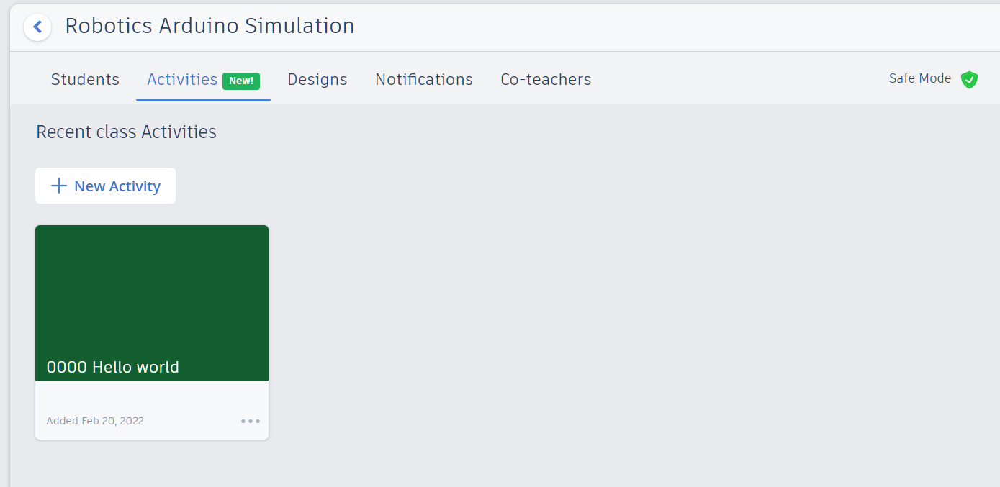
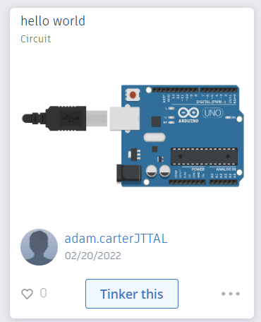
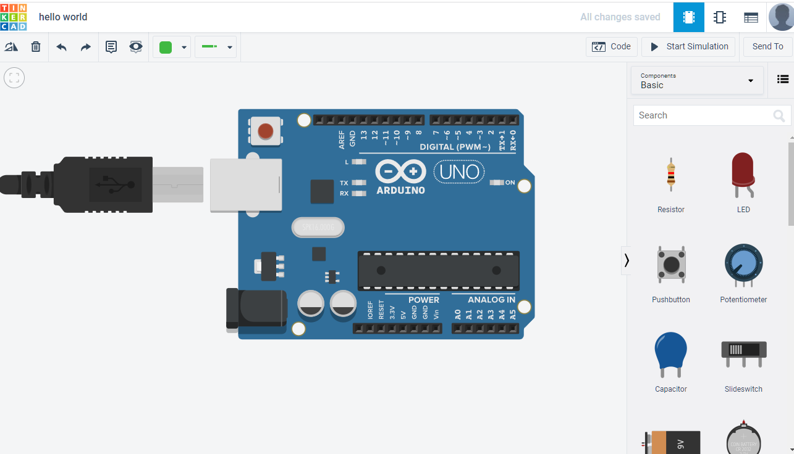
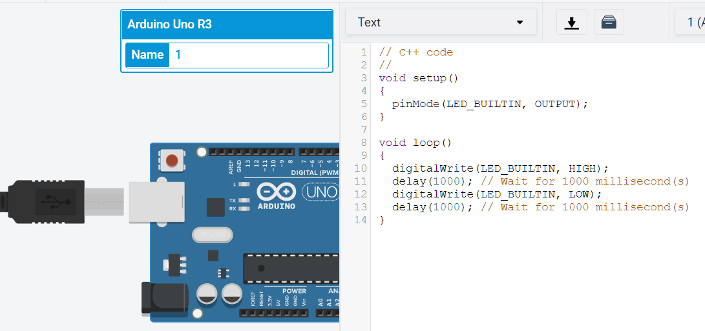
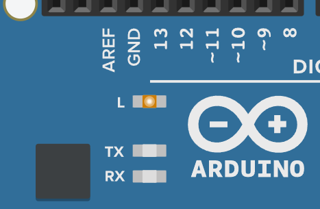

# Tinkercad

## Learning Goals

*By the end of this module you should be able to answer the following:*

* What is Tinkercad? 
* How can you make a LED blink on and off using Arduino C/C++

Go to www.tinkercad.com

Sign in with your student account

Go to your classroom (link in google classrooms)

Open Robotics Arduino Simulation 

Click on Activities and open 0000 Hello World 

You might need to then use the Tinker This button 

When you land into the circuit simulator it should look like this: 

Click on the Arduino Uno and then click on code

Convert the code to text mode

It should look like this! 

To make the simulation run, you can click start simulation 

Your light should be blinking!

