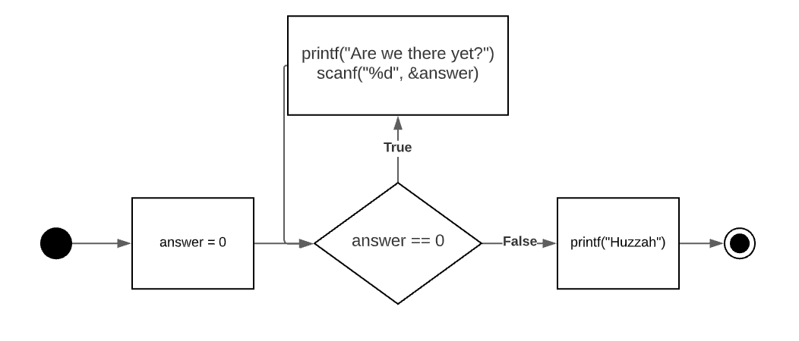

# Iteration

## Learning Goals

*By the end of this module you should be able to answer the following:*

* What is Iteration?
* What is a while loop?

# Code

*It is important to practice code and challenge our brain in new ways. Do all of the problems below, including the example problems. They will make you a better programmer.*

## Example Problems

*Example problems are best if you code them up yourself and store them. Don't just copy and paste, code them in and make them work. If you are really smart about it, you'll remake them slightly differently to really establish your learning.*

### Problem: We want to keep doing something until some condition is met

There are times where you might need to keep doing something while some condition is true. Take the following diagram as a reference: 



1. answer is assigned to the number `0`
2. if answer is equivalent to `0` then go to 3 else go to 6
3. write `"are we there yet"` to console
4. wait for user input
5. Go to 2
6. print "huzzah

We can solve this with the while loop. 

```cpp
int answer == 0;
while (answer == 0){
    printf("Are we there yet?");
    scanf("%d", &answer);
}
printf("huzzah");

```

### Problem: I want to do something n number of times but no more. 

```cpp
int i = 0;
while (i < 10):
    printf("%d", i);
    i = i + 1
```

```cpp
for (int i = 0; i < 10; i = i + 1){
    printf("%d", i);
}
```

## Practice Problems

*Practice questions are essential to mastering a skill. Often, you will be asked to do things you haven't exactly done yet, or not at all. Be challenged by it and see if you can get google, the person next to you, or the teacher, to help before you stop working.*


### The times table

Create the following output. You must use a while loop. You must be able to do the times tables of any integer between any starting point and end point.

Potential viable tests:

* 5 times tables from 1 - 5
* 23 times tables from 100 to 100,000
* 1 times tables from -50 to +50

```text
Time tables goodness
which times table do you want? 5
Where do you want to start? 1
Where do you want to end? 5
5 * 1 = 5
5 * 2 = 10
5 * 3 = 15
5 * 4 = 20
5 * 5 = 25
```

### Abusing while loops

Using while loops, expand the starter code to create the following shapes.

```cpp
char shape = '*'
```

NERD ALERT: Hey, what's that `char`? What does it mean? 

output1:

```bash
*
**
***
****
```

output2:

```text
*
***
******
***
*
```

### Factorials

A factorial the product of an integer and all the integers below it; e.g. factorial four ( 4! ) is equal to 4\*3\*2\*1 = 24.

Find the factorial for any number: 

```cpp
int factorial;
printf("Pick a number to calculate your factorial");
scanf("%d", factorial);

// your code here
```

### Average 

The average is the sum of numbers divided by the number of numbers. Create a program that will continually take numbers from the user until the user presses `q`. Then it prints the average of all of the numbers given. 

```cpp
int number;
char playing = 'y';
// some of your code will go here
while (playing == 'y'):
    printf("Add a number to add to the sum.")
    scanf("%d", &number);
    
    # some more of your code goes here

    printf("More numbers? y/n ");
    scanf(" %c", &userInput);

```
NOTE: why do chars have single quotes and strings have double quotes? 

NOTE: Why does that last scanf have a space in front of the %c?
