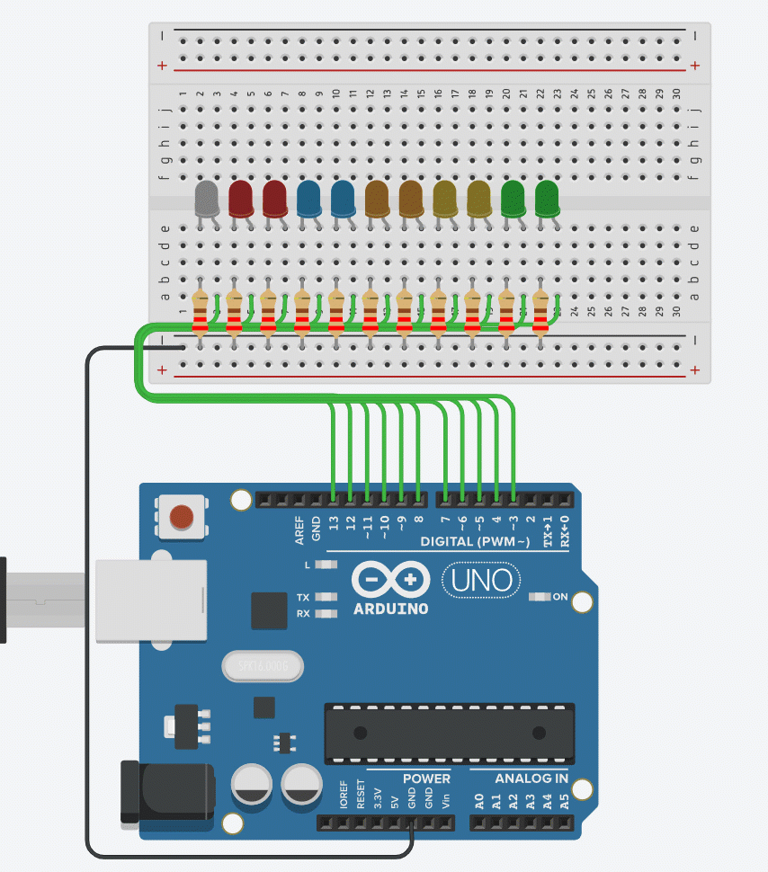

# Challenge Introduction to Arduino

## Masteries

To complete this challenge you will need to have a mastered a range of skills and gained a level of understanding. Some of which you may not have acquired yet.

### Required Mastery

You should have completed the mastery questions from the following sections

* [Using TinkerCad to simulate circuits](../../micro_lessons/tinkercad/hello_world/using_tinkercad.md)
* [How do breadboards work?](https://learn.sparkfun.com/tutorials/how-to-use-a-breadboard/all)
* [Setting Pin Modes](../../micro_lessons/simple_analog_input/../simple_digital_input/setting_pin_modes/setting_pin_mods.md)
* [Blinking Lights](../micro_lessons/blinking_lights/../../../micro_lessons/blinking_lights/blinking_lights_cookbook.md)
* [For loops](../../../c/micro_lessons/iteration/for_loops_basics/for_loops_basics.md)

### Recommended Masteries

* [Sending Debugging information to your computer from your arduino](../../micro_lessons/serial_communication/sending_debug_information_to_your_computer/sending_debug_information_to_your_computer_cookbook.md)
* if statements (previous learning briefs)
* if/else statements (previous learning  briefs)
* if/else-if/else statements (previous learning  briefs)

## Challenge: Scrolling LEDs

### Materials

You will need:

* 11x LEDs of various colours
* 11 220 Ohm resistors
* 1x Arduino Uno

### Challenge description

You are challenged to created the following circuit. 

Recommendations: if your first instinct is to write a metric tonne of if/else statements, don't. There are easier ways.
