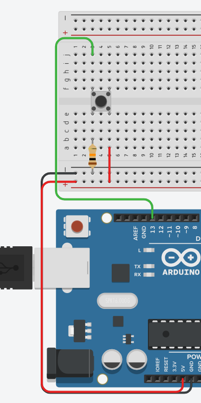
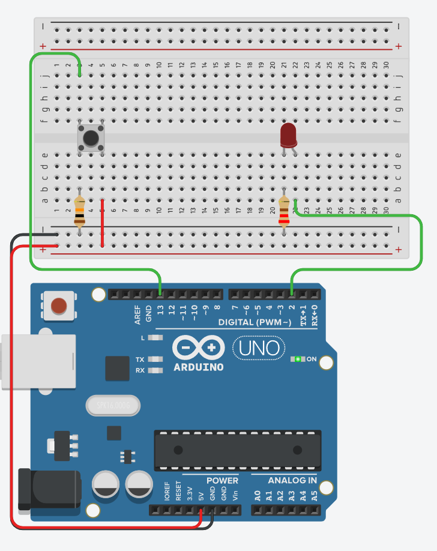
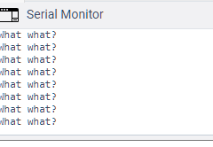

# Using buttons

## Topics covered

"At the end of this learning brief, you will be able to answer the following questions"

* How to make a simple circuit with a button
* How to limit double/triple pressing by waiting without blocking

## Learning Resources

* [Arduino Example](https://www.arduino.cc/en/Tutorial/BuiltInExamples/Button)
* [Accessing time on the Arduino](https://www.arduino.cc/reference/en/language/functions/time/millis/)

## Topics

### Creating a circuit



```cpp

#define BUTTON 13

int buttonPressed = 0;

void setup()
{
  Serial.begin(9600);
  pinMode(BUTTON, INPUT);
}

void loop()
{
  buttonPressed = digitalRead(BUTTON);
  Serial.println(buttonPressed);
}
```

## Practice Questions

### A simple circuit



```cpp

#define BUTTON 13
#define LED 2

int buttonPressed = 0;

void setup()
{
  pinMode(BUTTON, INPUT);
  pinMode(LED, OUTPUT);
}

void loop()
{
  buttonPressed = digitalRead(BUTTON);
  if (buttonPressed){
    digitalWrite(LED, HIGH);
  } else {
    digitalWrite(LED, LOW);
  }
}
```

### A simple circuit that only measures a single input

One of the problems with with the configurations above is that you can get a lot of erroneous signals. Let's modify the above code and test it. 

```cpp
#define BUTTON 13
#define LED 2

int buttonPressed = 0;

void setup()
{
  Serial.begin(9600);
  pinMode(BUTTON, INPUT);
  pinMode(LED, OUTPUT);
}

void loop()
{
  buttonPressed = digitalRead(BUTTON);
  if (buttonPressed){
    digitalWrite(LED, HIGH);
    Serial.println("What what?");
  } else {
    digitalWrite(LED, LOW);
  }
}
```


```cpp
#define BUTTON 13
#define LED 2

int buttonPressed = 0;
long delayTime = 0;
int delayBetweenPressses = 1000;

void setup()
{
  Serial.begin(9600);
  pinMode(BUTTON, INPUT);
  pinMode(LED, OUTPUT);
}

void loop()
{
  buttonPressed = digitalRead(BUTTON);
  if (buttonPressed && millis() > delayTime){
    digitalWrite(LED, HIGH);
    Serial.println("What what?");
    delayTime = millis() + delayBetweenPressses;
  } else {
    digitalWrite(LED, LOW);
  }
}
```
