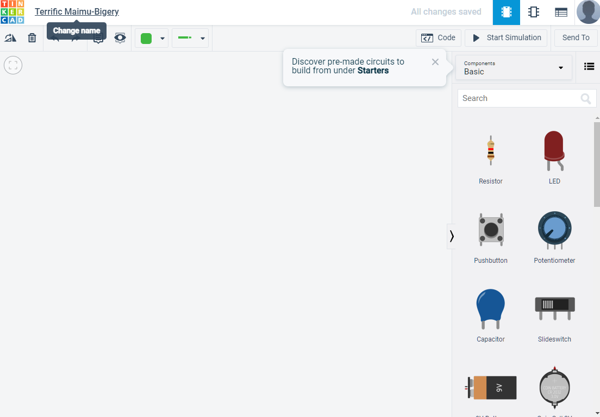
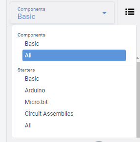
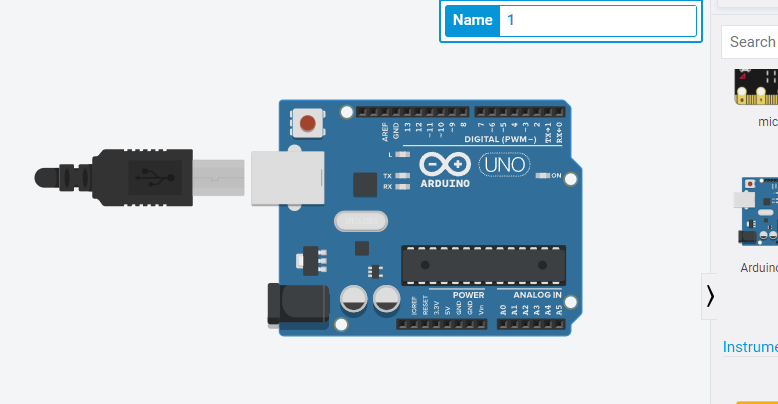
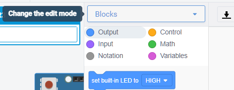
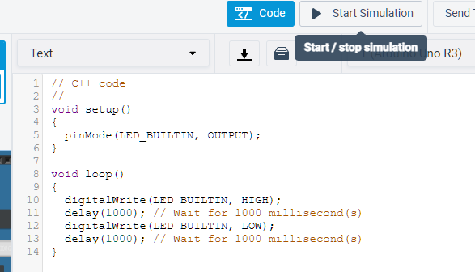
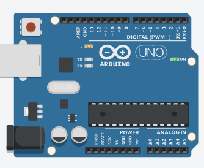

# Using TinkerCad

## Topics covered

"At the end of this learning brief, you will be able to answer the following questions"

* How to put an Arduino onto the environment
* How to configure an Arduino to use C/C++
* How to execute the program

## Learning Resources

* Reference Material
* Lecture Video

## Topics

### Basic Environment

### Configuring code

