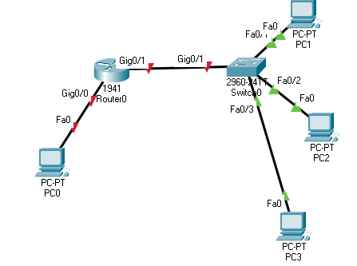
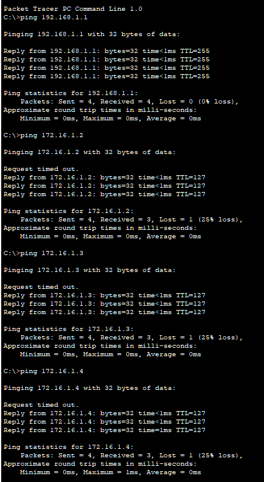

# ARP Tables

## Learning Objectives 

* What is ARP?


### Address Resolution Protocol
The Address Resolution Protocol is a communication protocol used for discovering the link layer address, such as a MAC address, associated with a given internet layer address, typically an IPv4 address. This mapping is a critical function in the Internet protocol suite

## Lab Purpose

ARP Maps are a known IP address to an unknown MAC address. It allows a router to encapsulate a packet correctly before forwarding. 

## Lab

### Topology



### Task 1: Configure router

```bash
Router>enable
Router#show arp

Router#configure terminal
Enter configuration commands, one per line.  End with CNTL/Z.
Router(config)#interface g0/0
Router(config-if)#ip add 192.168.1.1 255.255.255.0
Router(config-if)#no shut

Router(config-if)#
%LINK-5-CHANGED: Interface GigabitEthernet0/0, changed state to up

%LINEPROTO-5-UPDOWN: Line protocol on Interface GigabitEthernet0/0, changed state to up

Router(config-if)#interface g0/1
Router(config-if)#ip add 172.16.1.1 255.255.0.0
Router(config-if)#no shut

Router(config-if)#
%LINK-5-CHANGED: Interface GigabitEthernet0/1, changed state to up

%LINEPROTO-5-UPDOWN: Line protocol on Interface GigabitEthernet0/1, changed state to up

Router#
%SYS-5-CONFIG_I: Configured from console by console
```
### Step 2: Configure hosts

NOTE: There are two networks. Assign IPs accordingly. 

Configure PC the 192.168.1.0 subnet to `191.168.2.1 255.255.255.0` and configure it's gateway to `192.168.1.1` 


Configure the PCs on the 172.16.0.0 subnet to anything starting with `172.16.*.* 255.255.0.0` and set their gateways to `172.16.1.1`

### Step 3: Ping stuff

Go back to PC0 (or stay where you are) and ping: 

* That PC Hosts IP number (my case `192.168.1.2`)
* Your relevant gateway (in my case `192.168.1.1`)
* Each of the other PC hosts

### Step 4: Test the ARP Table

Go back to your router and hop back into the CLI to check the ARP table. 

```bash
Router#show arp
Protocol  Address          Age (min)  Hardware Addr   Type   Interface
Internet  172.16.1.1              -   0001.4248.3E02  ARPA   GigabitEthernet0/1
Internet  172.16.1.2              1   0090.2183.36A4  ARPA   GigabitEthernet0/1
Internet  172.16.1.3              1   00D0.5819.2E8D  ARPA   GigabitEthernet0/1
Internet  172.16.1.4              0   0010.1105.B084  ARPA   GigabitEthernet0/1
Internet  192.168.1.1             -   0001.4248.3E01  ARPA   GigabitEthernet0/0
Internet  192.168.1.2             1   0000.0C3D.73A9  ARPA   GigabitEthernet0/0
```

After a few minutes, check the ARP table again. 

## Questions: 

What do you think the following commands do? 
* `ip add 192.168.1.1 255.255.255.0`
* In regard to ARP tables, what do you think the `-` symbol means in age? 
