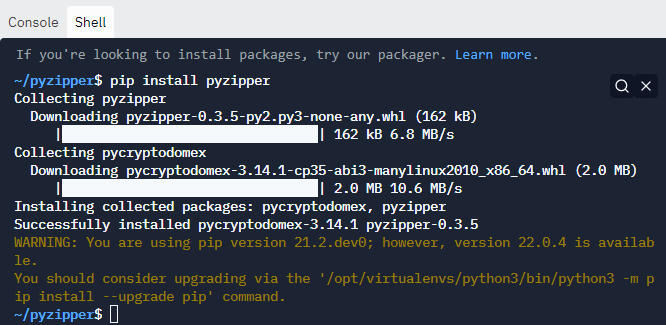

# Pyzipper

## Topics covered

"At the end of this learning brief, you will be able to answer the following questions"

* What is pyzipper?
* Why do we need pyzipper over python's zipfile?
* How do you install pyzipper?
* How to unzip a file? 
* How to unzip a file that is compressed and encrypted?
* How to unzip a file that has a password?

## Learning Resources

* Reference Material
* Lecture Video

## Topics

### What is pyzipper?

Pyzipper is a replacement for Python's zipfile module. This replacement is necessary because python's zipfile can't read or write AES encrypted zipfiles.

### How to install pyzipper

On the right hand side of replit click on `Shell`



In the shell window, type: 

```text
pip install pyzipper
```

Python should download and install pyzipper.

### How to zip a file? 

In case you want to play around with making zip files, maybe to practice with, here is the following code for making a zip file. This code allows for zipfiles that are both password protected or not.

```python
import pyzipper

def writezip(zip_name, file_name, message = "don't tell anyone", password=None):
  '''
  Creates a zipfile with a given name, with a file and a message.

  parameters
  zip_name: the name of the zipfile 
  file_name: the name of the file to be zipped
  message: the message in the file
  password: what password (if any)

  '''
  with pyzipper.AESZipFile(f"{zip_name}.zip", 'w', compression=pyzipper.ZIP_LZMA) as zf:
    if password:
      zf.setpassword(password.encode('UTF-8'))
      zf.setencryption(pyzipper.WZ_AES, nbits=128)
    zf.writestr(f"{file_name}.txt", message)

writezip('test1', 'secret1', "you're a wizard!")
writezip('test2', 'secret2', "you're a ninja!", "password")
```

### How to read the contents of a zipfile?

Sometimes it's pretty useful just to be able to read the contents of a zipfile before you extract them.

```python
def read_zipped_files(zip_name):
    '''
    Reads the names of the files in a zipped file. 
    parameters
    zip_name: a string containing the name of the zipfile

    returns: a list of strings representing the names of the zipped files. 
    '''
    zipped_files = []
    with pyzipper.AESZipFile(f'{zip_name}.zip') as zf:
        for file_name in zf.namelist():
            zipped_files.append(file_name)
  return zipped_files
```

### How to extract a file from a zipfile

```python
def extract_files(zip_name):
    '''
    Extracts all files of a zipfile to the common working directory.
    '''
    with pyzipper.AESZipFile(f'{zip_name}.zip') as zf:
        zf.extractall(path='.')
```

```python
def extract_password_protected_files(zip_name, password):
    '''
    Extracts all of the files from a password protected zipfile. 

    parameters 
    zip_name: a string representing the name of the file to be unzipped
    password: a string representing the password of the zipfile. 

    note: the password must be encrypted into utf-8. utf-8 is a a standard encoding used for electronic communication known as Unicode. 

    Unicode is backwards compatable with ASCII. 

    https://en.wikipedia.org/wiki/UTF-8
    '''
    with pyzipper.AESZipFile(f'{zip_name}.zip') as zf:
        zf.extractall(path='.', pwd=password.encode('utf-8'))
```

## Practice Questions

### Practice Question 1

Create a program that can complete the following: 

* Creates a zipfile called party list
* The zipfile contains 
  * a text file called friends with some of your friends names
  * a text file called treats with a list of some of the treats you are going to buy for a party
* The zipfile must be password protected, compressed, and encrypted


### Practice Question 2

Using the practice question from above

Create program that can unzip that file and read

* All of your friends names
* All of the treats you need to buy

## Mastery Questions

### Mastery Question 1

Using the knowledge above, unzip the file `passwords.zip`. The password for this zipfile is `password`. 

Use python to read through the text file that you've unzipped and find the average length of passwords in that list.