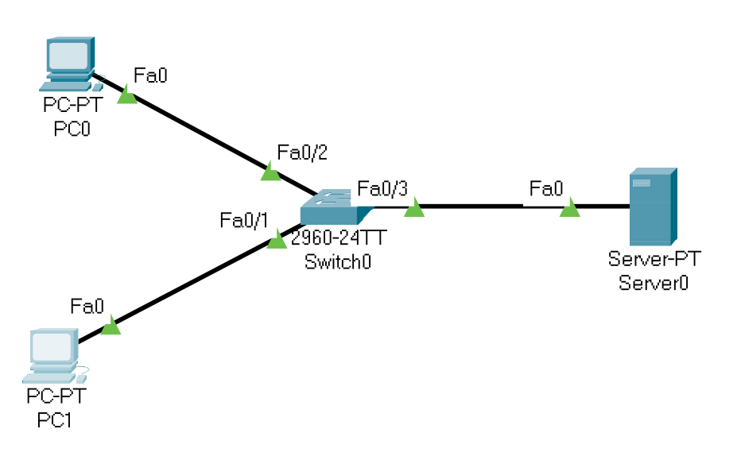
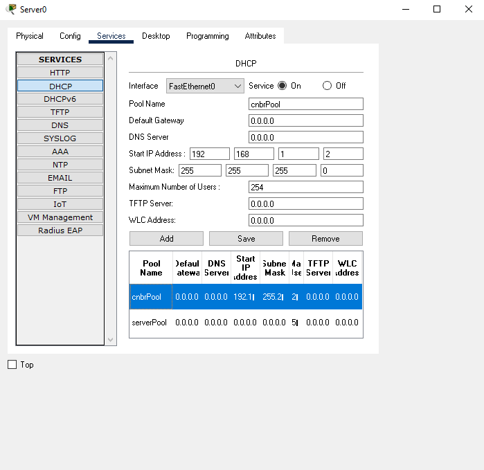
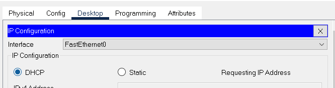
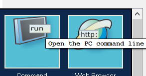
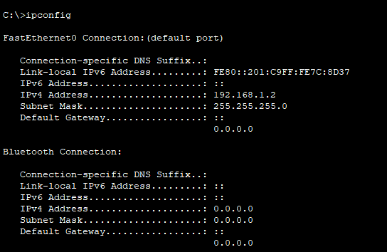
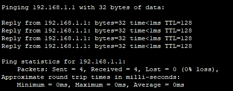
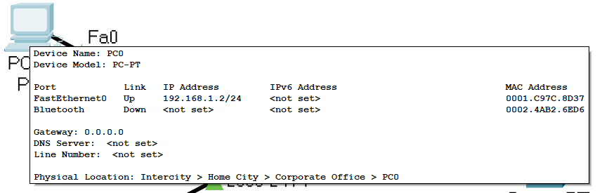

# DHCP 

## Objective: 
Learn how DHCP servers allocate IP information. 

The vast majority of IP networks use DHCP to allocate IP information to hosts. Here we’ll configure a scope of addresses and other IP information to be allocated. 

## Lab Topology: 

Please use the following topology to complete this lab exercise:

Switch: 2960x1
PCx2
Serverx1

## Tutorial

### Step 1: 
Connect a generic server to a Cisco switch using straight-through cables. You will add an IP address to the server but not to the host PCs, which will be using DHCP.

Server 
IP: 192.168.1.1.
Subnet: 255.255.255.0

### Step 2:
Configure the DHCP information on the server. Allocate the following: Address start—192.168.1.2 Subnet mask—255.255.255.0 Pool name—101Pool

Pool Name: cbrPool (or anything)
Start IP Address: 192.168.1.2
Subnet Mask: 255.255.255.0

Add (and check it is turned on ;p)

### Step 4:

Configure the hosts to obtain information via DHCP. 

Click on the PC client and open the desktop

Switch DHCP on

### Step 4: 

Check the configuration has been applied by issuing the ‘ipconfig’ command on the hosts. 

Go do desktop and cmd window

type ipconfig

You can also ping the server from here

 If you hover your mouse over the image of any device in Packet Tracer, you will also see the IP configuration settings.

 

## Practice:

Finalise the configuration of PC 2

