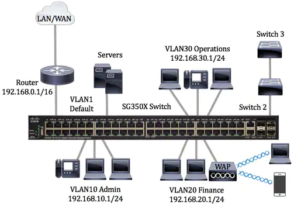
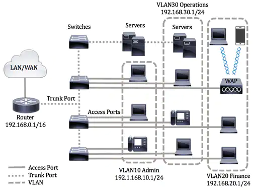
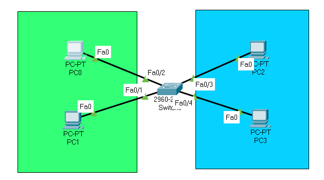
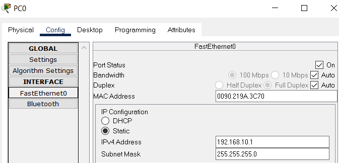
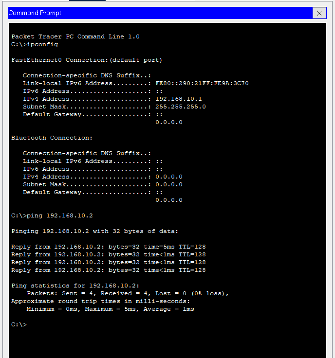
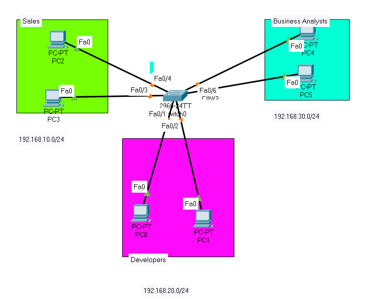

# VLANs 

## Objective: 

Learn how to configure VLANs and see why you need a Layer 3 device to communicate between them. 

## Purpose: 

VLANs help you segment your network for easier administration and added security. It’s important you understand how they work because they will form part of your daily routine as a network engineer.

## Topics: 

### VLans

VLAN is a network that is usually segmented by function or application. VLANs behave much like physical LANs, but you can group hosts even if they are not physically co-located. A switch port can belong to a VLAN. Unicast, broadcast, and multicast packets are forwarded and flooded out ports in the same VLAN.

VLANs can also be used to enhance performance by reducing the need to send broadcasts and multicasts to unnecessary destinations. It also eases network configuration by logically connecting devices without physically relocating those devices.



* VLAN1 - This is the default VLAN. The switch is connected to the router through this VLAN. This can be used but cannot be modified or deleted.
* VLAN10 - Virtual network for the Admin department. The network address is 192.168.10.1 with subnet mask 255.255.255.0 or /24.
* VLAN20 - Virtual network for the Finance department. The network address is 192.168.20.1 with subnet mask 255.255.255.0 or /24.
* VLAN30 - Virtual network for the Operations department. The network address is 192.168.30.1 with subnet mask 255.255.255.0 or /24.

In a bigger network, the configured VLANs with interfaces assigned as access and trunk ports on switches could look like this:



he port modes are defined as follows:

Access Port - The frames received on the interface are assumed to not have a VLAN tag and are assigned to the specified VLAN. Access ports are used primarily for hosts and can only carry traffic for a single VLAN.

Trunk Port - The frames received on the interface are assumed to have VLAN tags. Trunk ports are for links between switches or other network devices and are capable of carrying traffic for multiple VLANs.

### What's this /24 stuff? 

We are going to cover this a little later (subnet masks) but in essence they limit the size of a network. In this case, they limit the size of a network to 254 hosts. 

### Switchport
Configures the interface to support non-trucking non-tagged VLANs. 
## Lab 

###Topology: 

Please use the following topology to complete this lab exercise: 



### Step 1: 

Connect four hosts to a Cisco switch  using straight-through cables. Note which devices you connect to which switch interfaces because you will be putting these interfaces into their respective VLANs shortly. 

### Step 2: 

Allocate IP addresses to the hosts from within the subnets they are assigned to: 

`VLAN 10—192.168.10.0`  
`VLAN 20—192.168.20.0 `

I suggest you use 192.168.10.1 and 192.168.10.2 for VLAN 10 and 192.168.20.1 and 192.168.20.2 for VLAN 20, but feel free to use any IP address within the subnet. Here is an example from a host on VLAN 10:




### Task 3: 

Configure interfaces F0/1 and F0/2 into VLAN 10 and F0/3 and F0/4 into VLAN 20. Force the ports to be access-only (to never become a trunk), which you do with the ‘switchport mode access’ command. 

```bash
Switch>enable
Switch#configure terminal
Enter configuration commands, one per line.  End with CNTL/Z.
Switch(config)#vlan 10
Switch(config-vlan)#interface f0/1
Switch(config-if)#switchport mode access
Switch(config-if)#switchport access vlan 10
Switch(config-if)#interface f0/2
Switch(config-if)#switchport mode access
Switch(config-if)#switchport access vlan 10
Switch(config-if)#vlan 20
Switch(config-vlan)#interface f0/3
Switch(config-if)#switchport mode access
Switch(config-if)#switchport access vlan 20
Switch(config-if)#int f0/4
Switch(config-if)#switchport mode access
Switch(config-if)#switchport access vlan 20
Switch(config-if)#end
Switch#
%SYS-5-CONFIG_I: Configured from console by console
Switch#
```

Task 4: Check the VLANs on the switch and which ports are in which VLANs. By default, all ports are in the native VLAN named ‘default’. Use the ‘show vlan brief’ command.

```bash
Switch#show vlan brief

VLAN Name                             Status    Ports
---- -------------------------------- --------- -------------------------------
1    default                          active    Fa0/5, Fa0/6, Fa0/7, Fa0/8
                                                Fa0/9, Fa0/10, Fa0/11, Fa0/12
                                                Fa0/13, Fa0/14, Fa0/15, Fa0/16
                                                Fa0/17, Fa0/18, Fa0/19, Fa0/20
                                                Fa0/21, Fa0/22, Fa0/23, Fa0/24
                                                Gig0/1, Gig0/2
10   VLAN0010                         active    Fa0/1, Fa0/2
20   VLAN0020                         active    Fa0/3, Fa0/4
1002 fddi-default                     active    
1003 token-ring-default               active    
1004 fddinet-default                  active    
1005 trnet-default                    active 
```

Task 5: Now test some pings. You should be able to ping between hosts in the same VLAN but not to the other VLAN (you would need a router to be able to do this). 



Notes: You will need a Layer 3 device to ping between VLANs. We will do this in another lab. You can make recognizing each VLAN easier by naming it ADMIN or SALES, for example.

```bash
Switch>en
Switch#conf t Enter configuration commands, one per line. End with CNTL/Z. 
Switch(config)#vlan 10 
Switch(config-vlan)#name SALES 
Switch(config-vlan)#end 
Switch#show vlan brief [output truncated] 10 SALES active 1002 fddi-default active

Practice: 

Complete Lab5_Vlan_challenge


