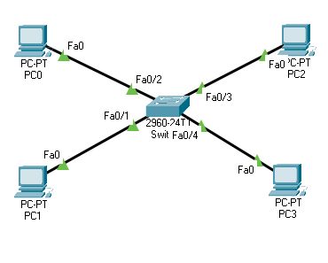
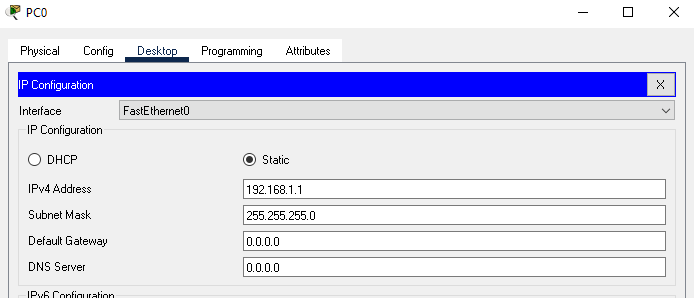
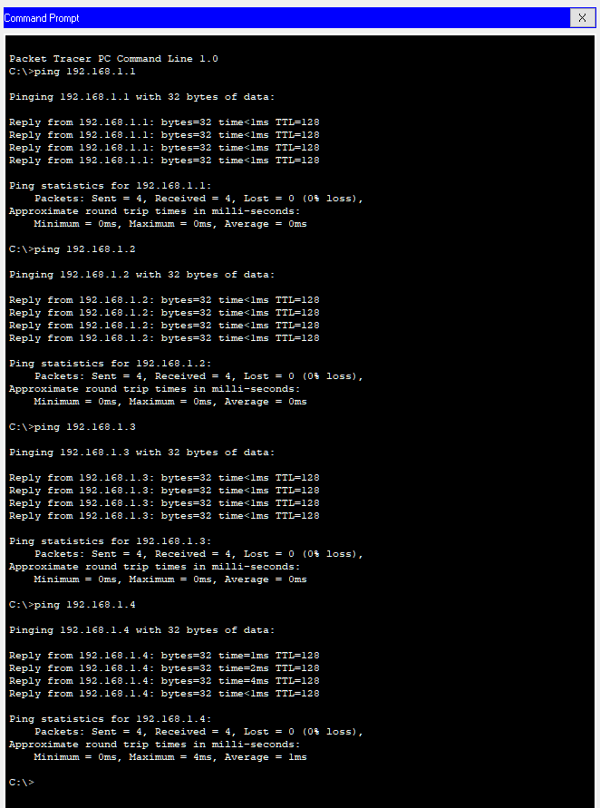

# MAC Address Tables

## Learning Objectives 

* Know what a MAC Address is
* Know what a MAC Address Table is and why it is used
  
### What is a MAC Address?

Media Access Control Address is a unique identifier assigned to a network interface controler (NIC) for use as a network address in communications within a network segment. This is a common attribute of IEEE 802 networking technologies including Ethernet, WiFi, and Bluetooth. 

### Why do we use MAC Address tables? 

The MAC address table is a way to map each port to a MAC address. This makes it efficient to forward traffic directly to a host. Without the MAC address table, traffic would be forwarded out each port, like a hub.

## Lab Topology 



## Lab

### Step 1: Connect the hosts. 

Using a straight through copper connection connect each host to the server. 

### Step 2: Configuring the network
Check the MAC address table on the switch. 

It should be empty at the moment. 


```bash
Switch>enable
Switch#show mac-address-table
          Mac Address Table
-------------------------------------------

Vlan    Mac Address       Type        Ports
----    -----------       --------    -----

Switch#
```

Allocate IPs to the hosts on within the subnet `192.168.1.0`. Make sure you don't repeat any. 



On  your last host, ping all four IP numbers. 



### Step 3: Check the MAC Address table on the switch. 

```bash
Switch#show mac-address-table
          Mac Address Table
-------------------------------------------

Vlan    Mac Address       Type        Ports
----    -----------       --------    -----

   1    0001.4247.63d8    DYNAMIC     Fa0/3
   1    0004.9aa6.95e9    DYNAMIC     Fa0/4
   1    0050.0f7d.6b0b    DYNAMIC     Fa0/2
   1    0090.0c93.386e    DYNAMIC     Fa0/1
```
