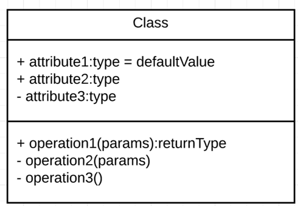
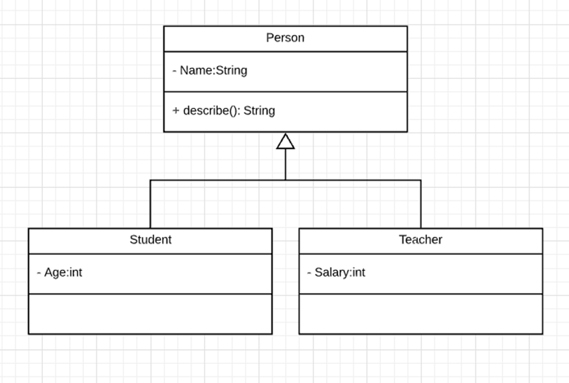
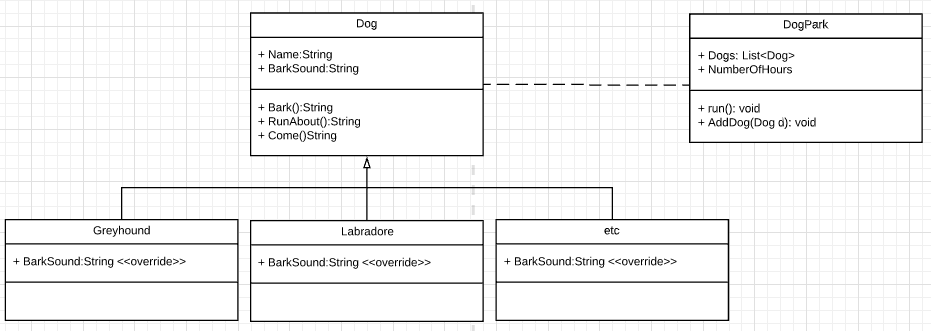
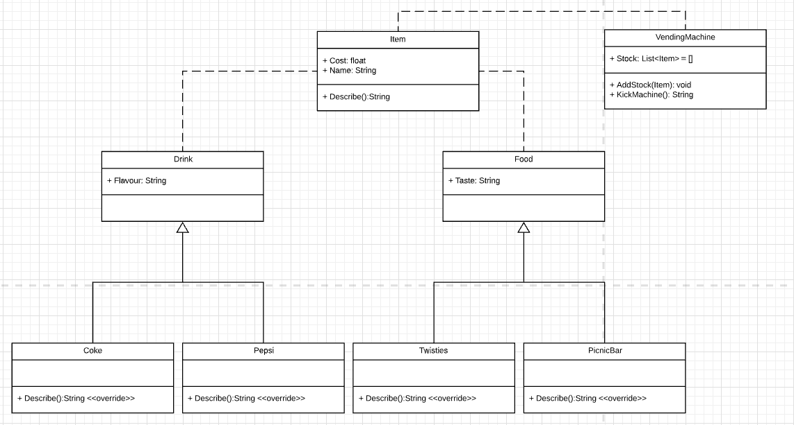

## Inheritance 

## Learning Goals

* Extend your knowledge of objects/classes into an understanding of how and when they are used to break up complex problems
* Gain a working knowledge of inheritance 
* * What is simple inheritance? 
* * How is it used to define problems? 
* * How do we visualise classes and their relationship with each other?

## Flashback

### Classes

A class is an extensible program-code-template for creating objects
They provide initial values for state (member variables) and implementations of behaviour (methods). They have special methods called constructors (a method which creates objects). Objects are generating by instantiating the class. 

Structural features (attributes) define what objects of the class "know"
* Represent the state of an object of the class
* Are descriptions of the structural or static features of a class

Behavioral features (operations) define what objects of the class "can do"
* Define the way in which objects may interact
* Operations are descriptions of behavioral or dynamic features of a class

## Visually Representing Classes 

In Software Development, a class diagram in the Unified Modelling Language (UML) is a type of static structure diagram. They describe the structure of a system by showing that systems classes including their properties and methods and how classes relate to each other. 

They show the structure of classes in a system. This is helpful for developers to think about problems before they strike a line of code and allows programmers to collaborate. It also allows non-technical members to include business perspectives. 

Class Notation comes in three parts: 

* The class name
* Class Properties 
* Class Methods

### Class Relationships (through inheritance)

We can use diagrams to show how classes relate or are built up of other classes. 

## Practice
Let's practice what we we've just learned. 

Create a DogPark. A DogPark is a structure that holds a bunch of dogs. It stores these dogs in a list. 

Dogs come in a number of breeds but they all share some common properties. They all bark and they all have names. 

The first challenge is to use the class diagram below as a guide and create a dog park with 100 dogs with dogs being a random breed. Each breed will have a different bark sound. You should create more than two types of breeds. 

Every time you run the DogPark.Run() method you will iterate through all of the dogs in the dogpark and get them to Bark. 

https://www.rd.com/list/dogs-different-languages/

Extension: Get them to do a random function in the run method (Bark(), RunAbout(), and Come())

## Challenges

There is a new vending machine and someone discovered that if you kick it stuff comes out. 

The kind of stuff that exists in the vending machine includes (so far) different types of food and drinks.

Drinks return a string which says something similar to "Ahh that cool refreshing flavour of {Name}" 

Foods return a string which says something like "Yum {Name} taste amazing!"

