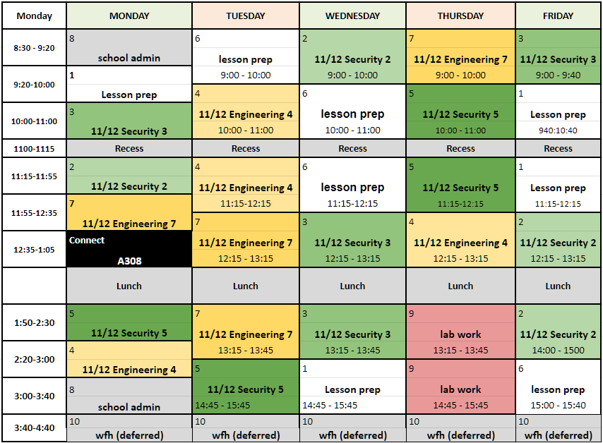
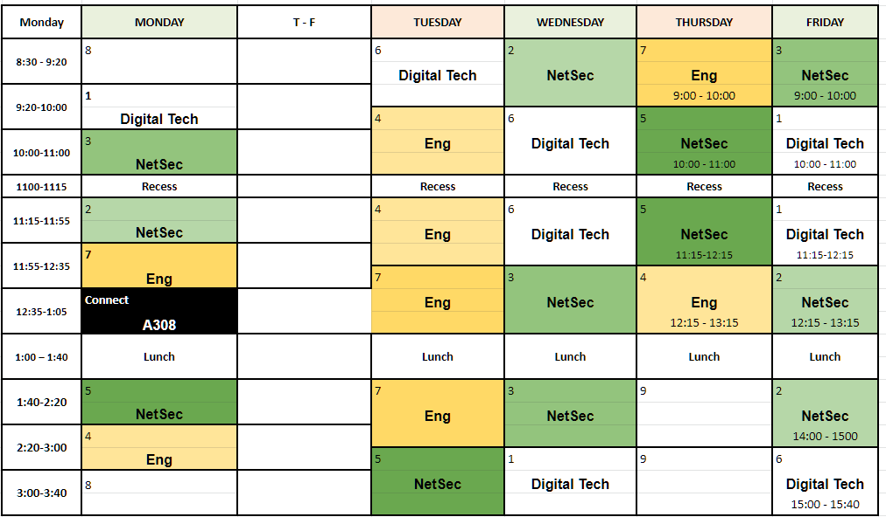

# Canberra College repository for lessons and stuff

Welcome to the Canberra College repository for learning briefs, assignments, guides, etc.

## Lessons

* [python](https://github.com/carteras/IT-CBR/tree/main/learning_briefs/python)
* [Arduino](https://github.com/carteras/IT-CBR/tree/main/learning_briefs/arduino)

## Assignments

* Networking and Security
* Engineering

## Timetables

My timetable:

A308 timetable: 

