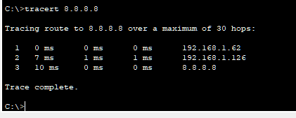

192.168.1.0/24 -> 4 subnets

11111111.11111111.11111111.11111111.00000000
255.255.255.0

Network | Host
192.168.1 | .0

Subnets -> 2^n 
2^2 = 4 subnets

192.168.1.00 00 0000

192.168.1.0/26

1. 192.168.1.00 192.168.1.0/26
2. 192.168.1.01 192.168.1.64/26
3. 192.168.1.10 192.168.1.128/26
4. 192.168.1.11 192.168.1.192/26

## Subnet 1
Network   = 192.168.1.00   00 0000 = 192.168.1.0/26
1st       = 192.168.1.00   00 0001 = 192.168.1.1/26
3rdlast   = 192.168.1.00   11 1100 = 192.168.1.60/26
2ndlast   = 192.168.1.00   11 1101 = 192.168.1.61/26
Last      = 192.168.1.00   11 1110 = 192.168.1.62/26
Broadcast = 192.168.1.00   11 1111 = 192.168.1.63/26

## Subnet 2
Network   = 192.168.1.01   00 0000 = 192.168.1.64/26
1st       = 192.168.1.01   00 0001 = 192.168.1.65/26
3rdlast   = 192.168.1.01   11 1100 = 192.168.1.124/26
2ndlast   = 192.168.1.01   11 1101 = 192.168.1.125/26
Last      = 192.168.1.01   11 1110 = 192.168.1.126/26
Broadcast = 192.168.1.01   11 1111 = 192.168.1.127/26

## Subnet 3
Network   = 192.168.1.10   00 0000 = 192.168.1.128/26
1st       = 192.168.1.10   00 0001 = 192.168.1.129/26
3rdlast   = 192.168.1.10   11 1100 = 192.168.1.188/26
2ndlast   = 192.168.1.10   11 1101 = 192.168.1.189/26
Last      = 192.168.1.10   11 1110 = 192.168.1.190/26
Broadcast = 192.168.1.10   11 1111 = 192.168.1.191/26

## Subnet 4
Network   = 192.168.1.11   00 0000 = 192.168.1.192/26
1st       = 192.168.1.11   00 0001 = 192.168.1.193/26
3rdlast   = 192.168.1.11   11 1100 = 192.168.1.252/26
2ndlast   = 192.168.1.11   11 1101 = 192.168.1.253/26
Last      = 192.168.1.11   11 1110 = 192.168.1.254/26
Broadcast = 192.168.1.11   11 1111 = 192.168.1.255/26

## Configure Router 1

```bash
R1>en
R1#sh ip int brief
Interface              IP-Address      OK? Method Status                Protocol 
GigabitEthernet0/0/0   unassigned      YES unset  administratively down down 
GigabitEthernet0/0/1   unassigned      YES unset  administratively down down 
Serial0/1/0            unassigned      YES unset  administratively down down 
Serial0/1/1            unassigned      YES unset  administratively down down 
Loopback0              1.1.1.1         YES manual up                    up 
Vlan1                  unassigned      YES unset  administratively down down
R1#conf t
Enter configuration commands, one per line.  End with CNTL/Z.
R1(config)#int g0/0/0
R1(config-if)#no shut

R1(config-if)#
%LINK-5-CHANGED: Interface GigabitEthernet0/0/0, changed state to up

%LINEPROTO-5-UPDOWN: Line protocol on Interface GigabitEthernet0/0/0, changed state to up
ip add
% Incomplete command.
R1(config-if)#ip add
R1(config-if)#ip address 192.168.1.62 255.255.255.192
R1(config-if)#end
R1#
%SYS-5-CONFIG_I: Configured from console by console
show
R1#show ip int
R1#show ip interface brief
Interface              IP-Address      OK? Method Status                Protocol 
GigabitEthernet0/0/0   192.168.1.62    YES manual up                    up 
GigabitEthernet0/0/1   unassigned      YES unset  administratively down down 
Serial0/1/0            unassigned      YES unset  administratively down down 
Serial0/1/1            unassigned      YES unset  administratively down down 
Loopback0              1.1.1.1         YES manual up                    up 
Vlan1                  unassigned      YES unset  administratively down down
R1#ping 192.168.1.62

Type escape sequence to abort.
Sending 5, 100-byte ICMP Echos to 192.168.1.62, timeout is 2 seconds:
!!!!!
Success rate is 100 percent (5/5), round-trip min/avg/max = 0/3/6 ms

R1#
```

## Configure Switch 1

```bash
Switch>en
Switch#conf
Switch#configure t
Switch#configure terminal 
Enter configuration commands, one per line.  End with CNTL/Z.
Switch(config)#host S1
S1(config)#int vlan1
S1(config-if)#no shut

S1(config-if)#
%LINK-5-CHANGED: Interface Vlan1, changed state to up

%LINEPROTO-5-UPDOWN: Line protocol on Interface Vlan1, changed state to up
ip addre
S1(config-if)#ip address 192.168.1.61 255.255.255.192
S1(config-if)#end
S1>show ip interface brief
Interface              IP-Address      OK? Method Status                Protocol 
GigabitEthernet1/0/1   unassigned      YES unset  up                    up 
[...]
Vlan1                  192.168.1.61    YES manual up                    up
S1>
S1>ping 192.168.1.62

Type escape sequence to abort.
Sending 5, 100-byte ICMP Echos to 192.168.1.62, timeout is 2 seconds:
.!!!!
Success rate is 80 percent (4/5), round-trip min/avg/max = 0/0/0 ms

S1>ping 192.168.1.62

Type escape sequence to abort.
Sending 5, 100-byte ICMP Echos to 192.168.1.62, timeout is 2 seconds:
!!!!!
Success rate is 100 percent (5/5), round-trip min/avg/max = 0/0/0 ms

S1>
S1>en
S1#conf t
Enter configuration commands, one per line.  End with CNTL/Z.
S1(config)#ip def
S1(config)#ip default-gateway 192.168.1.62
S1(config)#end
S1#
%SYS-5-CONFIG_I: Configured from console by console

S1#ping 192.168.1.62

Type escape sequence to abort.
Sending 5, 100-byte ICMP Echos to 192.168.1.62, timeout is 2 seconds:
!!!!!
Success rate is 100 percent (5/5), round-trip min/avg/max = 0/0/0 ms

S1#
```

## Configure DHCP 1 


Second PC


Second PC


## Router 1 Config

```bash
R1>sh ip int brief
Interface              IP-Address      OK? Method Status                Protocol 
GigabitEthernet0/0/0   192.168.1.62    YES manual up                    up 
GigabitEthernet0/0/1   unassigned      YES unset  administratively down down 
Serial0/1/0            unassigned      YES unset  administratively down down 
Serial0/1/1            unassigned      YES unset  administratively down down 
Loopback0              1.1.1.1         YES manual up                    up 
Vlan1                  unassigned      YES unset  administratively down down
R1(config-if)#ip address 192.168.1.65 255.255.255.192
R1(config-if)#end
R1#
%SYS-5-CONFIG_I: Configured from console by console
show ip inter
R1#show ip interface brief
Interface              IP-Address      OK? Method Status                Protocol 
GigabitEthernet0/0/0   192.168.1.62    YES manual up                    up 
GigabitEthernet0/0/1   unassigned      YES unset  administratively down down 
Serial0/1/0            192.168.1.65    YES manual up                    up 
Serial0/1/1            unassigned      YES unset  administratively down down 
Loopback0              1.1.1.1         YES manual up                    up 
Vlan1                  unassigned      YES unset  administratively down down
R1#
IntRouter#conf t
Enter configuration commands, one per line.  End with CNTL/Z.
IntRouter(config)#int s0/1/0
IntRouter(config-if)#no shut
IntRouter(config-if)#ip address 192.168.1.126 255.255.255.192
IntRouter(config-if)#
00:58:54: %OSPF-5-ADJCHG: Process 1, Nbr 1.1.1.1 on Serial0/1/0 from LOADING to FULL, Loading Done

IntRouter(config-if)#end
IntRouter#
%SYS-5-CONFIG_I: Configured from console by console

IntRouter#ping 192.168.1.65

Type escape sequence to abort.
Sending 5, 100-byte ICMP Echos to 192.168.1.65, timeout is 2 seconds:
!!!!!
Success rate is 100 percent (5/5), round-trip min/avg/max = 8/11/13 ms

IntRouter#
```

## Proof Router can ping DNS 

```bash
R1#ping 8.8.8.8

Type escape sequence to abort.
Sending 5, 100-byte ICMP Echos to 8.8.8.8, timeout is 2 seconds:
.!!!!
Success rate is 80 percent (4/5), round-trip min/avg/max = 13/14/20 ms
```
ping from PC1

Tracert from PC1


PC 1 external web tests 

Cisco

Facebook


# Configure Router 2

```bash
R2>en
R2#sh ip int brief
Interface              IP-Address      OK? Method Status                Protocol 
GigabitEthernet0/0/0   unassigned      YES unset  administratively down down 
GigabitEthernet0/0/1   unassigned      YES unset  administratively down down 
Serial0/1/0            unassigned      YES unset  administratively down down 
Serial0/1/1            unassigned      YES unset  administratively down down 
Loopback0              2.2.2.2         YES manual up                    up 
Vlan1                  unassigned      YES unset  administratively down down
R2#conf t
Enter configuration commands, one per line.  End with CNTL/Z.
R2(config)#int g0/0/0
R2(config-if)#no shut

R2(config-if)#
%LINK-5-CHANGED: Interface GigabitEthernet0/0/0, changed state to up

%LINEPROTO-5-UPDOWN: Line protocol on Interface GigabitEthernet0/0/0, changed state to up

R2(config-if)#ip address 192.168.1.190 255.255.255.192
R2(config-if)#end
R2#
%SYS-5-CONFIG_I: Configured from console by console
sh ip int brief
Interface              IP-Address      OK? Method Status                Protocol 
GigabitEthernet0/0/0   192.168.1.190   YES manual up                    up 
GigabitEthernet0/0/1   unassigned      YES unset  administratively down down 
Serial0/1/0            unassigned      YES unset  administratively down down 
Serial0/1/1            unassigned      YES unset  administratively down down 
Loopback0              2.2.2.2         YES manual up                    up 
Vlan1                  unassigned      YES unset  administratively down down
R2#ping 192.168.1.190

Type escape sequence to abort.
Sending 5, 100-byte ICMP Echos to 192.168.1.190, timeout is 2 seconds:
!!!!!
Success rate is 100 percent (5/5), round-trip min/avg/max = 2/2/3 ms

R2#
```

## Configure Switch 2

```bash
Switch>en
Switch#conf t
Enter configuration commands, one per line.  End with CNTL/Z.
Switch(config)#host s2
s2(config)#int vlan1
s2(config-if)#no shut

s2(config-if)#
%LINK-5-CHANGED: Interface Vlan1, changed state to up

%LINEPROTO-5-UPDOWN: Line protocol on Interface Vlan1, changed state to up

s2(config-if)#ip address 192.168.1.189 255.255.255.192
s2(config-if)#end
s2#
%SYS-5-CONFIG_I: Configured from console by console

s2#show ip interface brief
Interface              IP-Address      OK? Method Status                Protocol 
[...]
Vlan1                  192.168.1.189   YES manual up                    up
```
pinging router

```bash
s2#
s2#ping 192.168.1.190

Type escape sequence to abort.
Sending 5, 100-byte ICMP Echos to 192.168.1.190, timeout is 2 seconds:
.!!!!
Success rate is 80 percent (4/5), round-trip min/avg/max = 0/0/0 ms

s2#
```

## Configure DHCP 2


Testing PC 


## Configure second serial connection on Internet router

```bash
IntRouter>show ip interface brief
Interface              IP-Address      OK? Method Status                Protocol 
GigabitEthernet0/0/0   unassigned      YES unset  administratively down down 
GigabitEthernet0/0/1   8.8.8.100       YES DHCP   up                    up 
Serial0/1/0            192.168.1.126   YES manual up                    up 
Serial0/1/1            unassigned      YES unset  down                  down 
Loopback0              3.3.3.3         YES manual up                    up 
Vlan1                  unassigned      YES unset  administratively down down
IntRouter>enable
IntRouter#configure terminal
Enter configuration commands, one per line.  End with CNTL/Z.
IntRouter(config)#int s0/1/1
IntRouter(config-if)#no shut
IntRouter(config-if)#ip address 192.168.1.254  255.255.255.192
IntRouter(config-if)#no shut
IntRouter(config-if)#end
IntRouter#
%SYS-5-CONFIG_I: Configured from console by console

IntRouter#show ip int brief
Interface              IP-Address      OK? Method Status                Protocol 
GigabitEthernet0/0/0   unassigned      YES unset  administratively down down 
GigabitEthernet0/0/1   8.8.8.100       YES DHCP   up                    up 
Serial0/1/0            192.168.1.126   YES manual up                    up 
Serial0/1/1            192.168.1.254   YES manual down                  down 
Loopback0              3.3.3.3         YES manual up                    up 
Vlan1                  unassigned      YES unset  administratively down down
IntRouter#
```

## Testing Subnet 2 
Router 2
```bash
show ip int brief
Interface              IP-Address      OK? Method Status                Protocol 
GigabitEthernet0/0/0   192.168.1.190   YES manual up                    up 
GigabitEthernet0/0/1   unassigned      YES unset  administratively down down 
Serial0/1/0            192.168.1.193   YES manual up                    up 
Serial0/1/1            unassigned      YES unset  down                  down 
Loopback0              2.2.2.2         YES manual up                    up 
Vlan1                  unassigned      YES unset  administratively down down
R2#ping 192.168.1.193

Type escape sequence to abort.
Sending 5, 100-byte ICMP Echos to 192.168.1.193, timeout is 2 seconds:
!!!!!
Success rate is 100 percent (5/5), round-trip min/avg/max = 4/15/23 ms
```
PC 3


PC 3 pinging PC 0


PC 3 tracert to PC1 


## Final Network


