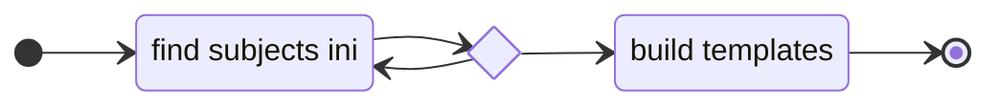
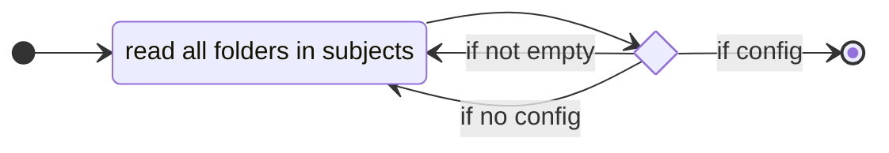
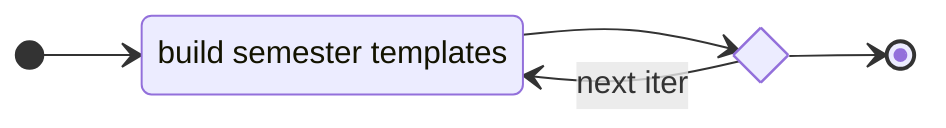

# foo

## build from semester templates

```mermaid
stateDiagram-v2
    direction LR 
        state "find subjects ini" as init
        state "build templates" as build
        state if_state <<choice>>
        [*] --> init
        init --> if_state
            if_state --> init
            if_state --> build
        build --> [*]

```

## find subjects ini

```mermaid
stateDiagram-v2
    direction LR 
        state "read all folders in subjects" as init
        state if_state <<choice>>
            [*] --> init
            init --> if_state
                if_state --> init: if not empty
                if_state --> init: if no config
                if_state --> [*]: if config
```

## build semester templates

```mermaid
stateDiagram-v2
    direction LR 
        state "build semester templates" as build
        state end_build <<choice>>
            [*] --> build
            build --> end_build
                end_build --> build:next iter
                end_build --> [*]      
```
