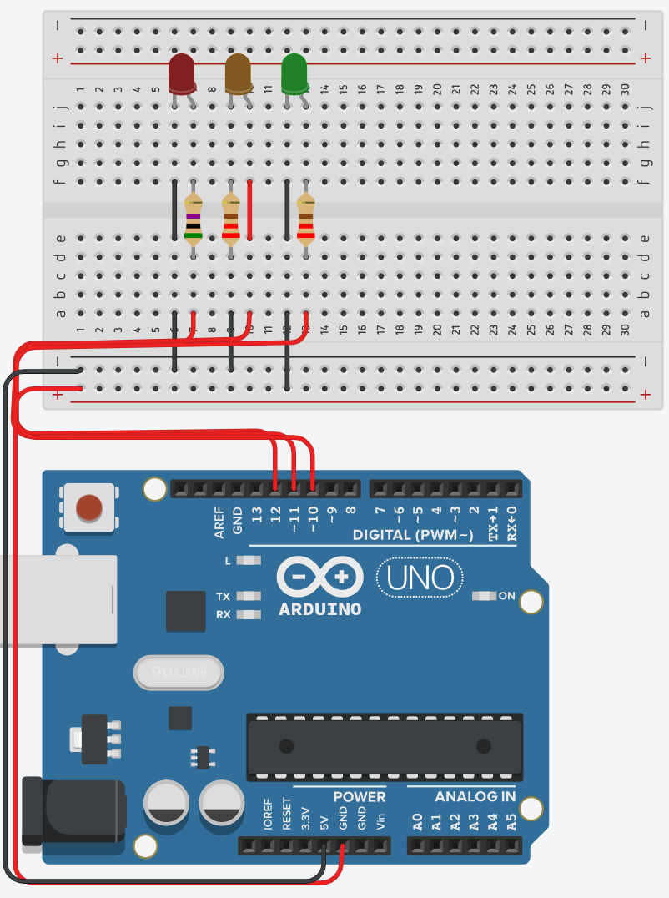

<style>
  table {width: 100%;}
</style>

# Practice Engineering  Exam

NOTE: The exam next week is scheduled for 50 minutes. The time limit is a part of the challenge for scaling purposes. The end result will be scaled. So, if the average mark in the class is say 35% that is a C result.

NOTE 2: The exam is scheduled in the second session of our double. If you are in line 2 Cyber Security we can either attempt to do it in line 2 or you can schedule to do it in any of my teaching lines between Monday and Wednesday. I am happy to get you excused from a different class. 

Scores calculation: 

1 point questions: 

0 points | 1 point
:-- | :--
Answer was not submitted or was not able to be assessed | Answer is given and meet expectations for knowledge or understanding on the topic

2 point questions: 

0 | 1 | 2
:--|:--|:--
Answer was not submitted or was not able to be assessed |  Answer is given but does not meet expectations for knowledge or understanding on the topic | Answer is given and meet expectations for knowledge or understanding on the topic

4 point questions: 

0 | 1 | 2 | 3 | 4
:--|:--|:--|:--|:--
Answer was not submitted or was not able to be assessed | Answer was incomplete and showed a limited understanding of the topic space (1 or 2 of 5 (simple) bugs found) | The answer submitted was a partial response however it showed a growing understanding of the topic space (>2 bugs found ) | The answer submitted was a partial response but answered the majority of the question (>=4 bugs found) | Answer submitted is complete (>=5 bugs found)

## Scope of questions

* Variables and conditions
* Functions
* Arduino signals and circuits

## NOTE: 

This assignment makes use of Serial output. None of the questions will ask you details about serial output other than asking you what they print out. The only things you need to know about Serial output are the following: 

* `Serial.begin(some_value)` starts the serial connection between the Arduino and your computer
* `Serial.print()` prints a character to the serial bus and
* `Serial.println()` print adds a carriage return making it a line

For example:

```cpp
void setup(){
  Serial.begin(9600);
  Serial.print("1");
  Serial.print("2");
  Serial.println("3")
}
```

Would output

> 123\n

(the \n is hidden from view)

```cpp
void setup(){
  Serial.begin(9600);
  Serial.print("hello");
  Serial.print(" ");
  Serial.println("world")
}
```

Would output

> hello world\n

```cpp
void setup(){
  Serial.begin(9600);
  Serial.println("1");
  Serial.println("2");
  Serial.println("3")
}
```

Would output

> 1  
> 2  
> 3  

---

### MC: After executing, what is the value of a (1 mark)

```cpp
int a = (18-4)/(5*2+3)
```

1. 0.8
2. 7
3. "14/7"
4. 2

### Consider the following code blocks:  (4 marks)

```cpp

//example 1
if (condition1){
  // do something
} 
if (condition2) {
  // do something else
}

//example 2
if (condition1) {
  // do something
} else if (condition2) {
  // do something else
}
```

Why would a programmer choose either of these conditional solutions? Provide an example for best practice for each

```text

answer: 


```

### Short Answer: What is the likely output of the following code and why? (2 marks)

**NOTE:** *the for loop only exists for simplicity of code. You do not need to understand how it is working just know that it sets pins 2 to 6 to OUTPUT mode.*

```cpp
int j;
int c;
void setup() {
  // IGNORE ME!!!
  for (int i = 2; i <= 6; i++){
    pinMode(i, OUTPUT);
  }
  //STOP IGNORING ME!!!
  j = 1;
  c = 2;
}

void loop()
{
  if (c >= -1) {
    digitalWrite(c, HIGH);
    delay(500);
    digitalWrite(c, LOW);
    if (c == 6 || c == 1){
      j = 0 - j;
    }
    c = c + j;
  }
}
```

1. This is clearly the work of witchcraft
2. This will likely have an exception due to the `if (c == 6 || c == 1)` being nonsense
3. This code attempts to turn pins on in sequence from 2 to 6 and back and is likely successful. 
4. This code attempts to create a triangle that is 9 high and 5 across but is not likely to be successful due to the while condition being broken.

### Long answer: There are at least 5 errors in the following circuit and code. (4 marks)

**NOTE:** *Problems that are caused by one specific problem only count for the root problem. For example, if an LED won't turn on because the button isn't plugged in right is only one problem*



```cpp
int ledRed = 13;
int ledYellow = 12:
int ledGreen = 11;

void setup() {
  pinMode(redLed, OUTPUT);
  pinMode(ledYellow, OUTPUT);
  pinMode(ledGreen, OUTPUT);
}

void loop() (
  digitalWrite(ledRed, HIGH);    
  digitalWrite(ledYellow, LOW);
  digitalWrite(ledGreen, LOW);
  delay(1000);               
  digitalWrite(ledRed, LOW);    
  digitalWrite(ledYellow, HIGH);
  digitalWrite(ledGreen, LOW);
  delay(1000);  
  digitalWrite(ledRed, LOW);    
  digitalWrite(ledYellow, LOW);
  digitalWrite(ledGreen, HIGH);
  delay(1000);
)
```

```text

answer1: 


answer2: 


answer3:


answer4:


answer5:


```
