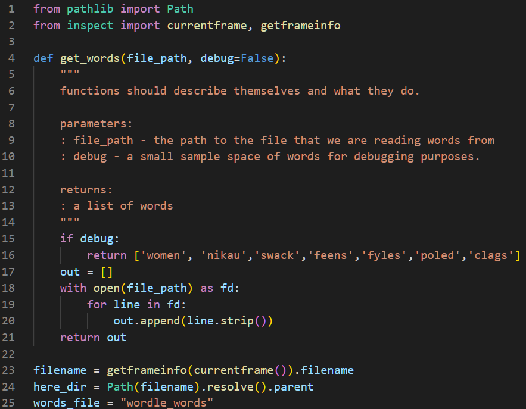
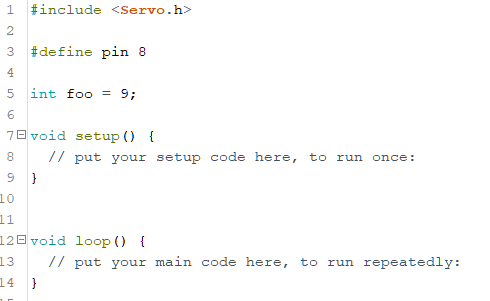
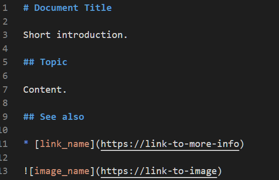
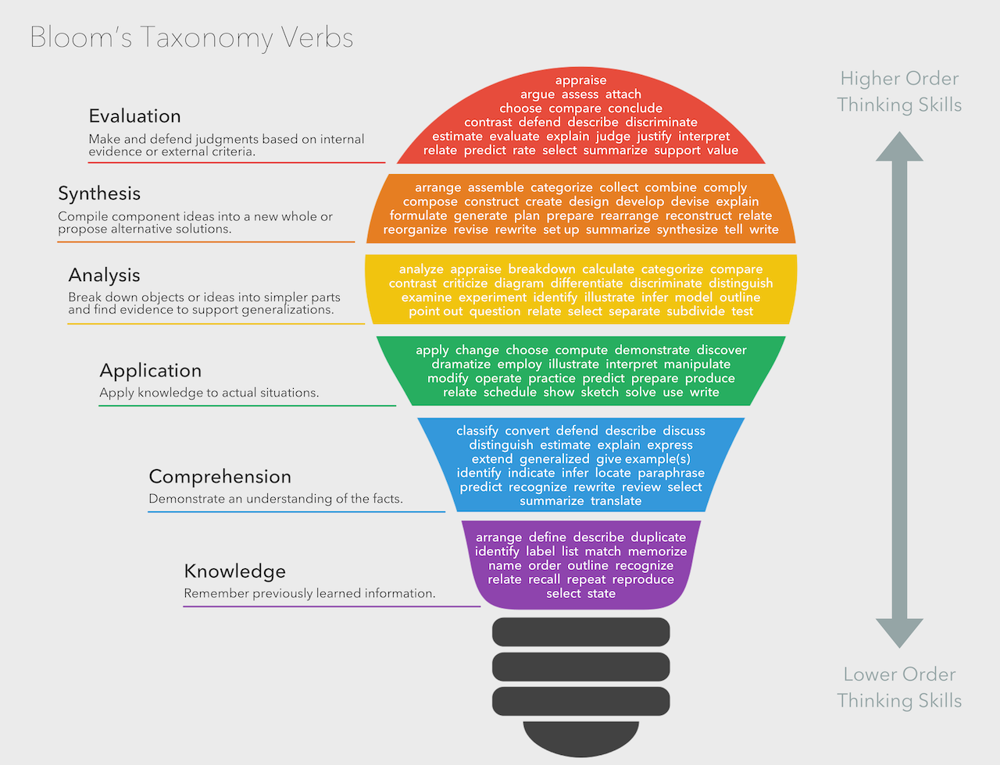

# Task

**Task**

You have been tasked to construct an evidence guide of your learning.
The subject of the evidence guide is defaulted to the construction of a
podcast on cyber security for other students to consume (see below) \--
however the subject matter and medium can be negotiated with the teacher
for individual consideration.

The subject of the evidence (the learning material) can be collaborated
on together in teams of 2 ± 1 but the evidence guide of your learning is
individual.

An evidence guide is a centrally located document which contains
evidence of your growing knowledge and understanding of the content
taught in this course. By default you are required to submit the subject
matter that you are using to base your evidence on and your evidence
guide itself.

An evidence guide document is, generally, represented on a document that
consists of short, and sharp, responses to high level questions.
Historically, this document has been a PowerPoint document but this year
the focus is on creating Markdown Documents.

**Topics for podcast** (choose one, all continuing content must be
chosen before we can allow for duplicate choices).

1.  Moonlight Maze

2.  BlackEnergy/Arrakis02

3.  Stuxnet

4.  FancyBear

5.  Industroyer/Crash Override

6.  The Shadow Brokers

7.  EternalBlue

8.  Mimikatz

9.  NotPetya and its impact on Ukraine

10. NotPetya and its impact on Maersk

**Each must podcast include the following at a minimum**

-   An introduction to the topic

-   A summary of what the topic is about including placing it in the
    historic timeline

-   Information regarding the topic on technology or industry

Additionally, the group must submit an annotated bibliography of their
work.

-   An annotated Bibliography that represents your research. This should
    have multiple resources. There is no hard minimum limit but you
    should have multiple supporting pieces of evidence.

-   A script where major claims are linked to the bibliography

-   An audio or video podcast piece that goes for no less than 5 minutes
    and no more than 10 minutes

**Evidence Guide**

Individually, Students must respond to the following questions:

-   Question 1: What was the process you used to ensure that you would
    meet all of the required elements of the Podcast? What were the
    elements, how did you know this?

-   Question 2: How did your existing knowledge and/or understanding of
    this topic within Information Technology help inform your work on
    this work?

-   Question 3: How has your understanding of this topic within
    Information Technology changed over the course of this assignment?

Details about how to answer these questions can be found in the rubric.

##### Section 1: Knowledge Comprehension, and Application

This section of the rubric consists of the required elements of the
assignment. Students should take special care to include ALL these
elements as they are often extended in the following sections

##### Section 2: Analysis, Synthesis, and Evaluation. 

This section will evaluate your ability to include critical thinking and
justification elements into your work. Often the requirements for
extension are not explicitly given, so it will be up to the you to
decide how best to demonstrate what you have learned beyond the required
unit goals and curriculum. Items such as 3D models, pictures, drawings,
diagrammatic responses, notes, evidence of problem solving, advanced
programming concepts, elegant responses, media, etc., are all available
options.

##### Section 3: Submission Guidelines 

For this section, students will be expected to provide a submission
which fulfills all of the formatting and citation requirements listed in
this assessment sheet but also that the submission is of a professional
quality. Be aware, points in this section could be 2- or 4-point items.
Treat them accordingly.

## Submission

All submission items should be stored in an appropriate format. For
example, code must be stored in a programmatical format so it can be
evaluated (**images of code, or code simply copied and pasted into a
document, will not be marked**)

Evidence of working material must be recorded where appropriate. For
example, if you are showing how your game meets some requirement, you
must submit a recording. Similarly, if you are showing how your robot
meets a requirement, you must record it.

If you are unsure if an element needs to be recorded, **ask the
teacher.**

All materials must be submitted to google classrooms.

Students are responsible for keeping backups/master-copies.

**\
**

## **Scoring Notes**

Formatting for all typed/written assessments should be as follows:

<table>
<colgroup>
<col style="width: 14%" />
<col style="width: 8%" />
<col style="width: 11%" />
<col style="width: 15%" />
<col style="width: 13%" />
<col style="width: 13%" />
<col style="width: 22%" />
</colgroup>
<thead>
<tr class="header">
<th><strong>Google Doc</strong></th>
<th><em>11-12 Pt</em></th>
<th><em>1.15-1.5 Line Spacing</em></th>
<th><em>1 Space between paragraphs</em></th>
<th><em>Spelling and Grammar “Soft Limit”</em></th>
<th><em>In-Text Citations with footnotes</em></th>
<th rowspan="2">
<em>Title Page/Slide:</em>

<ul>
<li>
<em>Name</em>
</li>
<li>
<em>Date</em>
</li>
<li>
<em>Class</em>
</li>
<li>
<em>Aim</em>
</li>
<li>
<em>Assessment title</em>
</li>
</ul></th>
</tr>
<tr class="odd">
<th><strong>Slides</strong></th>
<th>
<em>10-12 pt. font text</em>

<em>14-24 pt. font titles</em>
</th>
<th><em>1.0 1.15 Line Spacing</em></th>
<th><em>Bullet Points Preferred</em></th>
<th><em>Word Count per slide &gt;100-110 “Soft Limit”</em></th>
<th><em>Approved Templates and Themes</em></th>
</tr>
</thead>
<tbody>
<tr class="odd">
<td><strong>Python</strong></td>
<td colspan="6">
<em>We apply the following style guide to Python
files. However, in general most programs follow this broad
layout.</em>

<a href="https://pep8.org/">PEP 8: The Style Guide for Python
Code</a>
</td>
</tr>
<tr class="even">
<td>
<strong>Arduino</strong>

<strong>C/C++</strong>
</td>
<td colspan="6">
<em>We apply the following style guide to C/C++
files. However, in general most programs follow this broad
layout.</em>

<em>I accept both K&amp;R and K&amp;R alternative bracing format. As
long as it is consistent in your file.</em>

<a
href="https://docs.arduino.cc/learn/contributions/arduino-library-style-guide">Arduino
Style Guide for Creating Libraries | Arduino Documentation | Arduino
Documentation</a>
</td>
</tr>
<tr class="odd">
<td><strong>Markdown</strong></td>
<td colspan="6">
<em>We apply the following style guide to markdown
documents. However, in general, most documents follow some variation of
the following layout:</em>

<a
href="https://github.com/google/styleguide/blob/gh-pages/docguide/style.md">https://github.com/google/styleguide/blob/gh-pages/docguide/style.md</a>
</td>
</tr>
</tbody>
</table>

"Soft Limits" are not rigidly defined limits and will be assessed on a
case-by-case basis. Ask for clarification for specific tasks

## Possible Scoring Groups are out of 2 or 4 Points. 

**2-Point Criteria - Knowledge and Understanding**

Criteria assessed as 2-Points are classified as Knowledge and
Understanding criteria. These will examine and evaluate a student's
ability to state facts and define terms and concepts effectively.
Analysis and synthesis of the information will not be assessed through
these criteria.

|                        | ***0 Points***                                                            | ***1 Point***                                                                          | ***2 Points***                                                                    |
|---------|------------------|-----------------------|----------------------|
| ***2 Point Criteria*** | ***Not present** or **not able to be assessed** as the required criteria* | *Item is presented but **does not meet expectations** for quality, rigour, or detail.* | *Item is presented and **does meet expectations** for quality, rigour, or detail* |

**4-Point Criteria - Analysis and Synthesis and Expert Review**

To show true mastery of your developing skills, students must show that
they can go beyond simple repetition of the given tasks or an
explanation of processes. Students will show their ability to show
higher order thinking through analysis, evaluation, or the linking of
multiple fields of learning to solve problems in novel ways.

**Analysis and Synthesis**

Analysis and Synthesis components evaluate a student's ability to
effectively review data and understandings and develop these into a
coherent and relevant statement. Analysis refers to the generating of
thoughts from interpreting the data, while synthesis refers to combining
analysis of the data with other relevant information to develop an
original and effective idea.

<table>
<colgroup>
<col style="width: 9%" />
<col style="width: 11%" />
<col style="width: 18%" />
<col style="width: 18%" />
<col style="width: 21%" />
<col style="width: 20%" />
</colgroup>
<thead>
<tr class="header">
<th></th>
<th><em><strong>0 Points</strong></em></th>
<th><em><strong>1 Point</strong></em></th>
<th><em><strong>2 Points </strong></em></th>
<th><em><strong>3 Points</strong></em></th>
<th><em><strong>4 Points</strong></em></th>
</tr>
</thead>
<tbody>
<tr class="odd">
<td><em><strong>4 Point Criteria</strong></em></td>
<td><em><strong>Not present</strong> or <strong>not able to be
assessed</strong> as the required criteria</em></td>
<td><em>Item is presented and explained. However, it <strong>does not
show appropriate evidence of higher order thinking</strong> such as
analysis, evaluation, or synthesis.</em></td>
<td><em>Item is presented and <strong>shows appropriate evidence of
higher order thinking</strong> such as analysis, evaluation, or
synthesis.</em></td>
<td>
<em>Item is presented and <strong>exceeds expectations for
evidence of higher order thinking</strong> such as analysis, evaluation,
or synthesis.</em>

<em><strong>-or-</strong></em>

<em>Item is presented and shows appropriate evidence of higher order
thinking such as analysis, evaluation, or synthesis and <strong>exceeds
expectations for quality or rigour</strong>, of understanding of the
selected mastery.</em>
</td>
<td><em>Item is presented and <strong>exceeds expectations for evidence
of higher order thinking</strong> such as analysis, evaluation, or
synthesis. <strong>Additionally, this item exceeds expectations for
quality or rigour</strong>, of understanding of the selected
mastery.</em></td>
</tr>
</tbody>
</table>

**Expert Review**

Expert Reviews evaluate a student's ability to build solutions using the
skills that have been taught during the semester. Criteria assessed as
4-Points are classified as Analysis and Synthesis criteria. These will
examine and evaluate a student's ability to effectively review data and
understandings and develop these into a coherent and relevant statement.
Analysis refers to the generating of thoughts from interpreting the
data, while synthesis refers to combining analysis of the data with
other relevant information to develop an original and effective idea.

<table>
<colgroup>
<col style="width: 9%" />
<col style="width: 13%" />
<col style="width: 19%" />
<col style="width: 18%" />
<col style="width: 16%" />
<col style="width: 22%" />
</colgroup>
<thead>
<tr class="header">
<th></th>
<th><em><strong>0 Points</strong></em></th>
<th><em><strong>1 Point</strong></em></th>
<th><em><strong>2 Points </strong></em></th>
<th><em><strong>3 Points</strong></em></th>
<th><em><strong>4 Points</strong></em></th>
</tr>
</thead>
<tbody>
<tr class="odd">
<td><em><strong>4 Point Criteria</strong></em></td>
<td><em><strong>Not present</strong> or <strong>not able to be
assessed</strong> as the required criteria</em></td>
<td><em>Item is presented and broadly solves the problem. However, upon
review, it <strong>does not show enough evidence of appropriate
mastery</strong>.</em></td>
<td><em>Item is presented and broadly solves the problem. On review, it
<strong>does show appropriate evidence</strong> of mastery.</em></td>
<td>
<em>Item is presented and solves the specific problem. On review,
the evidence <strong>shows understanding beyond expected
mastery</strong>.</em>

<em><strong>-or-</strong></em>

<em>Item is presented and broadly solves the problem. On review, it
does show appropriate evidence of mastery and is <strong>done so in a
well-constructed or design method</strong> that clearly shows higher
levels of understanding<strong>.</strong></em>
</td>
<td><em>Item is presented and solves the specific problem. On review,
<strong>the evidence shows understanding well beyond expected
mastery</strong> and is <strong>done so in a well-constructed or design
method</strong> that clearly shows higher levels of
understanding.</em></td>
</tr>
</tbody>
</table>

**Multiplier**

Criteria will be combined with a **Multiplier**. While each criterion
will be scored on the 0-1-2-4 scale, the multiplier will attach relevant
worth to each criterion. Be aware of these multipliers and dedicate
appropriate time to ensure you achieve your best result.

**Achievement Standards: **

##### Evidence of higher order learning: 

What is it that I mean by "higher order thinking"?

It means I want you to go beyond just replicating what we do in class. I
want you to dig into your brain and understand why you did something,
what about it was great, what could be improved.

Why is this important? Reflective thinkers can go beyond what they are
taught and can customise their learning to ben

##  

## Rubric

<table>
<colgroup>
<col style="width: 12%" />
<col style="width: 41%" />
<col style="width: 7%" />
<col style="width: 10%" />
<col style="width: 7%" />
<col style="width: 7%" />
<col style="width: 12%" />
</colgroup>
<thead>
<tr class="header">
<th></th>
<th><strong>Knowledge, Comprehension &amp; Application</strong></th>
<th></th>
<th></th>
<th></th>
<th></th>
<th></th>
</tr>
</thead>
<tbody>
<tr class="odd">
<td><strong>CRITERIA</strong></td>
<td><strong>EXPECTATIONS</strong></td>
<td><strong>POSS</strong></td>
<td><strong>STUDENT</strong></td>
<td><strong>GIVEN</strong></td>
<td><strong>MULTI</strong></td>
<td><strong>TOTAL</strong></td>
</tr>
<tr class="even">
<td>
<strong>Podcast</strong>

(group)
</td>
<td>
You have submitted evidence of completing required assessment
material. This evidence is submitted in an appropriate format unless
negotiated for a different format.

There is evidence of the following submissions:

<ul>
<li>
An introduction to the topic
</li>
<li>
An inclusion that situates where in the timeline of the first
cyber war your topic is in (or relative timeline if negotiated a
separate topic)
</li>
<li>
Detailed information on the selected topic
</li>
</ul>

Evidence for knowledge, comprehension, and application may
include:

<ul>
<li>
<strong>Knowledge</strong>: Your evidence highlights that you
recall, and list relevant terms covered in your learning. It may tell a
story to the reader (the teacher) or state the conditions of your
learning.
</li>
<li>
<strong>Comprehension</strong>: Your evidence highlights that you
can identify key aspects of your learning or explains to the author what
you've done.
</li>
<li>
<strong>Application</strong>: It is clear from your evidence that
you constructed a complete submission
</li>
</ul></td>
<td>
2

2

2
</td>
<td>__/2 
__/2 
__/2</td>
<td>__/2 
__/2 
__/2</td>
<td>
A x2

T x 1
</td>
<td>A __/12 
T __/6</td>
</tr>
<tr class="odd">
<td>
<strong>Evidence Guide</strong>

(individual)
</td>
<td>
You have submitted evidence of your evidence guide. By default,
your evidence guide responses to each of the three questions selected by
your teacher. However, these questions can be negotiated or reframed
with your teacher. 
 
To achieve a passing grade (2) you must submit a serious attempt to
response to the question. By default, your submission for the evidence
guide would be on a Google Slide or PowerPoint document. This document
has a maximum space allotment of 3 slides per question. 
 
Additional space can be used for introduction, indexes, and summary
slides. The output can be negotiated with the teacher. Previous
submissions have allowed for Google Sites, HTML, or Markdown
documents.

Evidence for knowledge, comprehension, and application may
include:

<ul>
<li>
<strong>Knowledge</strong>: Your evidence highlights that you
recall and list relevant terms covered in your learning. It may tell a
story to the reader (the teacher) or state the conditions of your
learning.
</li>
<li>
<strong>Comprehension</strong>: Your evidence highlights that you
can identify key aspects of your learning or explains to the author what
you've done.
</li>
<li>
<strong>Application</strong>: It is clear from your evidence that
you constructed a complete submission
</li>
</ul></td>
<td>
2

2

2
</td>
<td>__/2 
__/2 
__/2</td>
<td>__/2 
__/2 
__/2</td>
<td>-</td>
<td>__/6</td>
</tr>
<tr class="even">
<td></td>
<td><strong>Analysis, Synthesis &amp; Evaluation</strong></td>
<td colspan="2"></td>
<td colspan="2"><strong>SUB TOTAL</strong></td>
<td>
<strong>A _ / 18</strong>

<strong>T _ / 12</strong>
</td>
</tr>
<tr class="odd">
<td><strong>Question 1</strong></td>
<td>
<strong>Question</strong>: What was the process you used to
ensure that you would meet all the required elements for the
tutorial?

Evidence guides are a tool <strong>you use to highlight your learning
to the teacher</strong>. Learning how to reflect on your learning during
your assessments and identifying what parts of your work were high
quality and what you could do to improve your work is an essential
aspect of education.

You will present your <strong>evidence guide within a PowerPoint
document</strong>. Your response can be <strong>no more than 3
slides</strong> <strong>following the style guide</strong> for
PowerPoint documents.

This aspect of the assessment evaluates your ability to
<strong>analyse your learning</strong>, identify <strong>how and when
you synthesised new understanding</strong> on your own, and your ability
to <strong>assess your work</strong>

Each of your questions will be marked against the following aspects
of your ability to:

<ul>
<li>
express <strong>your understanding of technology</strong>
concepts and principles
</li>
<li>
<strong>your ability to communicate ideas</strong> appropriately
in the selected medium
</li>
</ul>

Evidence for higher order learning may include:

<ul>
<li>
<strong>Analysis</strong>: Your evidence shows a reasoned
understanding of what you did and why you did it. For example, you may
have explained how you did X, Y, and Z, but you continue to explain why
you did them the way you did.
</li>
<li>
<strong>Evaluative</strong>: your evidence makes a judgement of
something or between multiple things. This judgement may be the value of
one thing over another or a highlighting the major differences between
two things.
</li>
<li>
<strong>Transferal</strong>: your evidence highlights when you
apply information, strategies, or skills that you have learnt to a new
situation or context.
</li>
</ul></td>
<td>
4

4
</td>
<td>__/4 
__/4</td>
<td>__/4 
__/4</td>
<td>
A x1

T x 2
</td>
<td>
A __/ 8

T __/16
</td>
</tr>
<tr class="even">
<td><strong>Question 2</strong></td>
<td>
<strong>Question</strong>: How did your existing knowledge and/or
understanding of Information Technology helped inform your work on the
tutorial.

Evidence guides are a tool <strong>you use to highlight your learning
to the teacher</strong>. Learning how to reflect on your learning during
your assessments and identifying what parts of your work were high
quality and what you could do to improve your work is an essential
aspect of education.

You will present your <strong>evidence guide within a PowerPoint
document</strong>. Your response can be <strong>no more than 3
slides</strong> <strong>following the style guide</strong> for
PowerPoint documents.

This aspect of the assessment evaluates your ability to
<strong>analyse your learning</strong>, identify <strong>how and when
you synthesised new understanding</strong> on your own, and your ability
to <strong>assess your work</strong>

Each of your questions will be marked against the following aspects
of your ability to:

<ul>
<li>
express <strong>your understanding of technology</strong>
concepts and principles
</li>
<li>
<strong>your ability to communicate ideas</strong> appropriately
in the selected medium
</li>
</ul>

Evidence for higher order learning may include:

<ul>
<li>
<strong>Analysis</strong>: Your evidence shows a reasoned
understanding of what you did and why you did it. For example, you may
have explained how you did X, Y, and Z, but you continue to explain why
you did them the way you did.
</li>
<li>
<strong>Evaluative</strong>: your evidence makes a judgement of
something or between multiple things. This judgement may be the value of
one thing over another or a highlighting the major differences between
two things.
</li>
<li>
<strong>Transferal</strong>: your evidence highlights when you
apply information, strategies, or skills that you have learnt to a new
situation or context.
</li>
</ul></td>
<td>
4

4
</td>
<td>__/4 
__/4</td>
<td>__/4 
__/4</td>
<td>
A x1

T x 2
</td>
<td>
A __/ 8

T __/16
</td>
</tr>
<tr class="odd">
<td><strong>Question 3</strong></td>
<td>
<strong>Question</strong>: How has your understanding of
Information Technology changed from the start of this assignment time
until now?

Evidence guides are a tool <strong>you use to highlight your learning
to the teacher</strong>. Learning how to reflect on your learning during
your assessments and identifying what parts of your work were high
quality and what you could do to improve your work is an essential
aspect of education.

You will present your <strong>evidence guide within a PowerPoint
document</strong>. Your response can be <strong>no more than 3
slides</strong> <strong>following the style guide</strong> for
PowerPoint documents.

This aspect of the assessment evaluates your ability to
<strong>analyse your learning</strong>, identify <strong>how and when
you synthesised new understanding</strong> on your own, and your ability
to <strong>assess your work</strong>

Each of your questions will be marked against the following aspects
of your ability to:

<ul>
<li>
express <strong>your understanding of technology</strong>
concepts and principles
</li>
<li>
<strong>your ability to communicate ideas</strong> appropriately
in the selected medium
</li>
</ul>

Evidence for higher order learning may include:

<ul>
<li>
<strong>Analysis</strong>: Your evidence shows a reasoned
understanding of what you did and why you did it. For example, you may
have explained how you did X, Y, and Z, but you continue to explain why
you did them the way you did.
</li>
<li>
<strong>Evaluative</strong>: your evidence makes a judgement of
something or between multiple things. This judgement may be the value of
one thing over another or a highlighting the major differences between
two things.
</li>
<li>
<strong>Transferal</strong>: your evidence highlights when you
apply information, strategies, or skills that you have learnt to a new
situation or context.
</li>
</ul></td>
<td>
4

4
</td>
<td>__/4 
__/4</td>
<td>__/4 
__/4</td>
<td>
A x1

T x 2
</td>
<td>
A __/ 8

T __/16
</td>
</tr>
<tr class="even">
<td></td>
<td><strong>Submission Guidelines</strong></td>
<td colspan="2"></td>
<td colspan="2"><strong>SUB TOTAL</strong></td>
<td>
<strong>A __/24</strong>

<strong>T __/48</strong>
</td>
</tr>
<tr class="odd">
<td><strong>Readability</strong></td>
<td><strong>Assessment submission is ordered</strong> and has a definite
pattern to its construction. <strong>The reader is not confused as to
the content in any given section</strong> and can follow the flow of the
submission easily. </td>
<td>4</td>
<td>__/4</td>
<td>__/4</td>
<td>X2</td>
<td>__ / 8</td>
</tr>
<tr class="even">
<td><strong>Formatting</strong></td>
<td><strong>Students have</strong> <strong>followed the formatting
instructions</strong> including any provided templates and guides
<strong>or have created their own</strong>, legible formatting guide
<strong>and applied it constantly</strong>.</td>
<td>2</td>
<td>__/2</td>
<td>__/2</td>
<td>-</td>
<td>__ / 2</td>
</tr>
<tr class="odd">
<td></td>
<td></td>
<td colspan="2"></td>
<td colspan="2"><strong>SUB TOTAL</strong></td>
<td><strong>__ /10</strong></td>
</tr>
<tr class="even">
<td></td>
<td>DAYS LATE ___/7 = ___%</td>
<td></td>
<td></td>
<td colspan="2"><strong>FINAL</strong></td>
<td><strong>A __/52 
T __/70</strong></td>
</tr>
</tbody>
</table>

## VET Competencies 

| Result | Vocational competencies assessed via this task |                                                       | Aspect of task addressing competency                                   |
|------|-----------|------------------------|--------------------------------|
|        | BSBOHS201A                                     | Participate in OHS processes                          | Proper use of equipment & evacuation drills                            |
|        | ICAICT202A                                     | Work and communicate effectively in an IT environment | Researching, creating, printing & submitting of Research Report        |
|        | ICAICT201A                                     | Use Computer Operating System and Hardware            | Participation in organised IT activity & researching & creating report |
