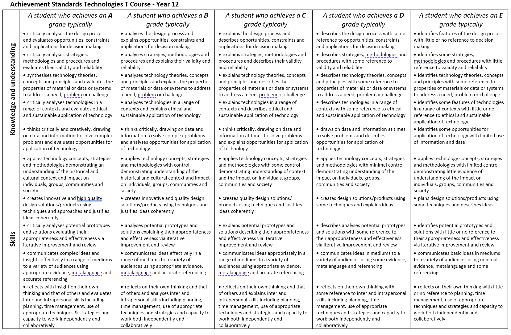

## Task

You have been tasked to construct an evidence guide of your learning.
The subject of the evidence guide is defaulted to the construction of
learning material for other students to consume (see below) -- however
the subject can be negotiated with the teacher for individual interest
or skills.

The subject of the evidence (the learning material) can be collaborated
on together in teams of 2 ± 1 but the evidence guide of your learning is
individual.

An evidence guide is a centrally located document which contains
evidence of your growing knowledge and understanding of the content
taught in this course. By default you are required to submit the subject
matter that you are using to base your evidence on and your evidence
guide itself.

An evidence guide document is, generally, represented on a document that
consists of short, and sharp, responses to high level questions.
Historically, this document has been a PowerPoint document but this year
the focus is on creating Markdown Documents.

**Topics for learning material** (choose one, all continuing content
must be chosen before we can allow for duplicate choices).

### Continuing students

* Motor Controllers
* RF communication
* Servo Motors
* Esplora Board integration
* DPad / Joystick
* I2C communication between Arduinos
* Flatpack design on OnShape and Using a flat pack design on the laser cutter
* 3D design to hold components on OnShape andUsing a 3D design on the 3D printer
* Soldering a small circuit

### New year students may choose from here as well

* Replicating a project from T1 on a physical Arduino (Traffic Light,
* Centre Detector, Train Crossing
* Sending and Receiving Serial Communications

### Each topic of learning must include the following at a minimum

* Some sort of explicit instruction on the topic
* At least 2-4 (group size +1) worked example for any major thought you are trying to express
* At least 2-4 (group size +1)  practice question for each worked example.
* At least 1 challenge question which incorporates the majority the knowledge from above.

**Evidence Guide:**

Students must respond to the following questions:

* What was the design process that you used ensure that you met all of required elements to produce your learning material?
* How did your understanding of digital solutions inform your choice band/or your learning solution?
* What is at least one example of how existing knowledge or understanding framed novel learning?
## Section 1: Knowledge Comprehension, and Application

This section of the rubric consists of the required elements of the
assignment. Students should take special care to include ALL these
elements as they are often extended in the following sections

## Section 2: Analysis, Synthesis, and Evaluation

This section will evaluate your ability to include critical thinking and
justification elements into your work. Often the requirements for
extension are not explicitly given, so it will be up to the you to
decide how best to demonstrate what you have learned beyond the required
unit goals and curriculum. Items such as 3D models, pictures, drawings,
diagrammatic responses, notes, evidence of problem solving, advanced
programming concepts, elegant responses, media, etc., are all available
options.

## Section 3: Submission Guidelines

For this section, students will be expected to provide a submission
which fulfils all of the formatting and citation requirements listed in
this assessment sheet but also that the submission is of a professional
quality. Be aware, points in this section could be 2- or 4-point items.
Treat them accordingly.

## Submission

All submission items should be stored in an appropriate format. For
example, code must be stored in a programmatical format so it can be
evaluated (**images of code, or code simply copied and pasted into a
document, will not be marked**)

Evidence of working material must be recorded where appropriate. For
example, if you are showing how your game meets some requirement, you
must submit a recording. Similarly, if you are showing how your robot
meets a requirement, you must record it.

If you are unsure if an element needs to be recorded, **ask the
teacher.**

**All materials must be submitted to google classrooms.**

Students are responsible for keeping backups/master-copies.

## SCORING NOTES

Formatting for all typed/written assessments should be as follows:

<table>
    <tr>
        <td>Google Doc	</td>
        <td>11-12 Pt	</td>
        <td>1.15-1.5 Line Spacing</td>
        <td>1 Space between paragraphs</td>
        <td>Spelling and Grammar “Soft Limit”</td>
        <td>In-Text Citations with footnotes</td>
        <td>
            Title Page/Slide:
            <ul>
                <li>Name</li>
            </ul>
        </td>
    </tr>
    <tr>
        <td>Slides</td>
        <td>
            <ul>
                <li>10-12 pt. font text</li>
                <li>14-24 pt. font titles</li>
            </ul>
        </td>
        <td>1.0 1.15 Line Spacing</td>
        <td>Bullet Points Preferred</td>
        <td>Word Count per slide >100-110 “Soft Limit”</td>
        <td>Approved Templates and Themes</td>
        <td>
            <ul>
                <li>Date</li>
                <li>Class</li>
                <li>Aim</li>
                <li>Assessment Title</li>
            </ul>
        </td>
    </tr>
</table>

*"Soft Limits" are not rigidly defined limits and will be assessed on a
case-by-case basis. Ask for clarification for specific tasks*

## Possible Scoring Groups are out of 2 or 4 Points

### 2-Point Criteria - Knowledge and Understanding

*Criteria assessed as 2-Points are classified as Knowledge and
Understanding criteria. These will examine and evaluate a student's
ability to state facts and define terms and concepts effectively.
Analysis and synthesis of the information will not be assessed through
these criteria.*

<table>
    <tr>
        <th>0 Points</th>
        <th>1-Point</th>
        <th>2-points</th>
    </tr>
    <tr>
        <th>Not present or able to be assessed as the required criteria</th>
        <th>Item is presented and does not meet expectations for quality, rigour, or detail</th>
        <th>Item is presented and does meet expectations for quality, rigour, or detail</th>
    </tr>
</table>

### 4-Point Criteria - Analysis and Synthesis and Expert Review

*To show true mastery of your developing skills, students must show that
they can go beyond simple repetition of the given tasks or an
explanation of processes. Students will show their ability to show
higher order thinking through analysis, evaluation, or the linking of
multiple fields of learning to solve problems in novel ways.*

### 4-Point Criteria - Analysis and Synthesis

*Analysis and Synthesis components evaluate a student's ability to
effectively review data and understandings and develop these into a
coherent and relevant statement. Analysis refers to the generating of
thoughts from interpreting the data, while synthesis refers to combining
analysis of the data with other relevant information to develop an
original and effective idea.*

<table>
<tr>
    <th>0 Points</th>
    <th>1 Point</th>
    <th>2 Points </th>
    <th>3 Points</th>
    <th>4 Points</th>
</tr>
<tr valign="top">
    <td>
        Not present or able to be assessed as the required criteria
    </td>
    <td>
        Item is presented and explained. However, it does not show any evidence of higher order thinking such as analysis, evaluation, or synthesis.
    </td>
    <td>
        Item is presented and shows appropriate evidence of higher order thinking such as analysis, evaluation, or synthesis
    </td>
    <td>
        

            Item is presented and exceeds expectations for evidence of higher order thinking such as analysis, evaluation, or synthesis.
        

        

            -or-
        

        

            Item is presented and shows appropriate evidence of higher order thinking such as analysis, evaluation, or synthesis and exceeds expectations for quality, rigour, or understanding of the selected mastery. 
        

    </td>
    <td>
        Item is presented and exceeds expectations for evidence of higher order thinking such as analysis, evaluation, or synthesis. Additionally, this item exceeds expectations for quality, rigour, or understanding of the selected mastery.
    </td>
</tr>
</table>

### Expert Review

*Expert Reviews evaluate a student's ability to build solutions using
the skills that have been taught during the semester. Criteria assessed
as 4-Points are classified as Analysis and Synthesis criteria. These
will examine and evaluate a student's ability to effectively review data
and understandings and develop these into a coherent and relevant
statement. Analysis refers to the generating of thoughts from
interpreting the data, while synthesis refers to combining analysis of
the data with other relevant information to develop an original and
effective idea.*

<table>
<tr>
    <th>0 Points</th>
    <th>1 Point</th>
    <th>2 Points </th>
    <th>3 Points</th>
    <th>4 Points</th>
</tr>
<tr valign="top">
    <td>
        Not present or able to be assessed as the required criteria</td>
    <td>
        Item is presented and broadly solves the problem. However, upon review, it does not show any evidence of appropriate mastery.  
    </td>
    <td>
        Item is presented and broadly solves the problem. On review, it does show any evidence of appropriate mastery.
    </td>
    <td>
        

            Item is presented and solves the specific problem. On review, the evidence shows understanding beyond expected mastery. 
        

        

            -or-
        

        

            Item is presented and broadly solves the problem. On review, it does show any evidence of appropriate mastery and is done so in a well-constructed or design method that clearly shows higher levels of understanding.
        

    </td>
    <td>
        Item is presented and solves the specific problem. On review, the evidence shows understanding well beyond expected mastery and is done so in a well-constructed or design method that clearly shows higher levels of understanding.
    </td>
</tr>
</table>

### Multiplier

Criteria will be combined with a **Multiplier**. While each criterion
will be scored on the 0-1-2-4 scale, the multiplier will attach relevant
worth to each criterion. Be aware of these multipliers and dedicate
appropriate time to ensure you achieve your best result.

## Achievement Standards

## Evidence of higher order learning:

##  Rubric

<table style="border: 1px solid black;">
    <tr valign='top' style="border: 1px solid black;">
        <th></th>
        <th>Knowledge, Comprehension & Application</th>
        <th></th>
        <th></th>
        <th></th>
        <th></th>
        <th></th>
    </tr>
    <tr valign='top'>
        <th>CRITERIA</th>
        <th>EXPECTATIONS</th>
        <th>POSSIBLE</th>
        <th>STUDENT</th>
        <th>TEACHER</th>
        <th>MULTIPLYER</th>
        <th>TOTAL</th>
    </tr>
    <tr valign='middle'>
        <td>Learning Material</td>
        <td>
        

            You have submitted evidence of completing the required learning material. This evidence is submitted in an appropriate format (Markdown) unless negotiated for a different format.
        

        

            The evidence of learning material appears to be of appropriate level for your accreditation level and the topic chosen.
        

        

            The evidence appears to have at least 2-4 (group size +1) worked examples / 2-4 practice questions / 2-4 challenge and includes references to any appropriate required learning material that other students may need to know.
        

        <ul>
            <li>Explicit instruction</li>
            <li>At least 2-4 worked example for each required element (minimum group-size + 1) </li>
            <li>At least 1 practice question for each worked example</li>
            <li>At least 1 challenge question which requires most of the practice questions</li>
            <li>(If applicable) A document which includes all your teammates, and who submitted your body of work</li>
        </ul>
        

            Evidence for knowledge, comprehension, and application may include:
        

        <ul>
            <li>Knowledge</li>
            <li>Comprehension</li>
            <li>Application</li>
        </ul>
        </td>
        <td>
        <ul style="list-style: none;">
            <li>2</li>
            <li>2</li>
            <li>2</li>
            <li>2</li>
        </ul>
        </td>
        <td>
        <ul style="list-style: none;">
            <li>__/2</li>
            <li>__/2</li>
            <li>__/2</li>
            <li>__/2</li>
        </ul>
        </td>
        <td>
        <ul style="list-style: none;">
            <li>__/2</li>
            <li>__/2</li>
            <li>__/2</li>
            <li>__/2</li>
        </ul>
        </td>
        <td>
            <ul style="list-style: none;">
                <li>Ax2</li>
                <li>Tx1</li>
            </ul>
        </td>
        <td>
        <ul style="list-style: none;">
            <li>__/8</li>
            <li>__/4</li>
        </ul>
        </td>
    </tr>
    <tr valign='middle'>
        <td>Evidence Guide</td>
        <td>
            

                You have submitted evidence of your evidence guide. By default, your evidence guide responses to each of the three questions selected by your teacher. However, these questions can be negotiated or reframed with your teacher.
            To achieve a passing grade (2) you must submit a serious attempt to response to the question.
            By default, your submission for the evidence guide would be on a Google Slide or PowerPoint document. This document has a maximum space allotment of 3 slides per question. Additional space can be used for introduction, indexes, and summary slides. The output can be negotiated with the teacher. Previous submissions have allowed for Google Sites, HTML, or Markdown documents.
            

        

            Evidence for knowledge, comprehension, and application may include:
        

        <ul>
            <li>Knowledge: Your evidence highlights that you recall and list relevant terms covered in your learning. It may tell a story to the reader (the teacher) or state the conditions of your learning.</li>
            <li>Comprehension: Your evidence highlights that you can identify key aspects of your learning or explains to the author what you've done.</li>
            <li>Application: It is clear from your evidence that you constructed a complete submission</li>
        </ul>
        </td>
        <td>
        <ul style="list-style: none;">
            <li>2</li>
            <li>2</li>
            <li>2</li>
        </ul>
        </td>
        <td>
        <ul style="list-style: none;">
            <li>__/2</li>
            <li>__/2</li>
            <li>__/2</li>
        </ul>
        </td>
        <td>
        <ul style="list-style: none;">
            <li>__/2</li>
            <li>__/2</li>
            <li>__/2</li>
        </ul>
        </td>
        <td>
        <ul style="list-style: none;">
            <li>1</li>
        </ul>
        </td>
        <td>
        <ul style="list-style: none;">
            <li>__/6</li>
        </ul>
        </td>
    </tr>
    <tr valign='middle'>
        <th></th>
        <th>Analysis, Synthesis & Evaluation</th>
        <th></th>
        <th></th>
        <th></th>
        <th>SUB TOTAL</th>
        <th>A _/14  T _/ 6</th>
    </tr>
    <tr valign='top'>
        <th>CRITERIA</th>
        <th>EXPECTATIONS</th>
        <th>POSSIBLE</th>
        <th>STUDENT</th>
        <th>TEACHER</th>
        <th>MULTIPLYER</th>
        <th>TOTAL</th>
    </tr>
    <tr valign='middle'>
        <td>Question 1: What was the process you used to ensure that you would meet all of the required elements of your tutorial?</td>
        <td>
        
Evidence guides are a tool you use to highlight your learning to the teacher. Learning how to reflect on your learning during your assessments and identifying what parts of your work were high quality and what you could do to improve your work is an essential aspect of education.

        
This aspect of the assessment evaluates your ability to analyse your learning, identify how and when you synthesised new understanding on your own, and your ability to assess your work

        

            Each of your questions will be marked against the following aspects of your ability to : 
            <ul>
                <li>express your understanding of technology concepts and principles</li>
                <li>your ability to communicate ideas appropriately in the selected medium</li>
            </ul>
        

        
Evidence for higher order learning may include:

        <ul>
            <li>Analysis: Your evidence shows a reasoned understanding of what you did and why you did it. For example, you may have explained how you did X, Y, and Z, but you continue to explain why you did them the way you did.</li>
            <li>Evaluative: your evidence makes a judgement of something or between multiple things. This judgement may be the value of one thing over another or a highlighting the major differences between two things.</li>
            <li>Transferal: your evidence highlights when you apply information, strategies, or skills that you have learnt to a new situation or context.</li>
        </ul>   
        </td>
        <td>
            <ul style="list-style: none;">
                <li>4</li>
                <li>4</li>
            </ul>
        </td>
        <td>
            <ul style="list-style: none;">
                <li>__/4</li>
                <li>__/4</li>
            </ul>
        </td>
        <td>
            <ul style="list-style: none;">
                <li>__/4</li>
                <li>__/4</li>
            </ul>
        </td>
        <td>
            <ul style="list-style: none;">
                <li>A x1</li>
                <li>T x2</li>
            </ul>
        </td>        
        <td>
            <ul style="list-style: none;">
                <li>A__/ 8</li>
                <li>T__/16</li>
            </ul>
        </td>
    </tr>
    <tr valign='middle'>
        <td>Question 2: How did your existing knowledge and/or understanding of Information Technology helped inform your work on the tutorial. </td>
        <td>
        
Evidence guides are a tool you use to highlight your learning to the teacher. Learning how to reflect on your learning during your assessments and identifying what parts of your work were high quality and what you could do to improve your work is an essential aspect of education.

        
This aspect of the assessment evaluates your ability to analyse your learning, identify how and when you synthesised new understanding on your own, and your ability to assess your work

        

            Each of your questions will be marked against the following aspects of your ability to : 
            <ul>
                <li>express your understanding of technology concepts and principles</li>
                <li>your ability to communicate ideas appropriately in the selected medium</li>
            </ul>
        

        
Evidence for higher order learning may include:

        <ul>
            <li>Analysis: Your evidence shows a reasoned understanding of what you did and why you did it. For example, you may have explained how you did X, Y, and Z, but you continue to explain why you did them the way you did.</li>
            <li>Evaluative: your evidence makes a judgement of something or between multiple things. This judgement may be the value of one thing over another or a highlighting the major differences between two things.</li>
            <li>Transferal: your evidence highlights when you apply information, strategies, or skills that you have learnt to a new situation or context.</li>
        </ul>   
        </td>
        <td>
            <ul style="list-style: none;">
                <li>4</li>
                <li>4</li>
            </ul>
        </td>
        <td>
            <ul style="list-style: none;">
                <li>__/4</li>
                <li>__/4</li>
            </ul>
        </td>
        <td>
            <ul style="list-style: none;">
                <li>__/4</li>
                <li>__/4</li>
            </ul>
        </td>
        <td>
            <ul style="list-style: none;">
                <li>A x1</li>
                <li>T x2</li>
            </ul>
        </td>        
        <td>
            <ul style="list-style: none;">
                <li>A__/ 8</li>
                <li>T__/16</li>
            </ul>
        </td>
    </tr>
    <tr valign='middle'>
        <td>Question 3: How has your understanding of Information Technology changed from the start of this assignment time until now?</td>
        <td>
        
Evidence guides are a tool you use to highlight your learning to the teacher. Learning how to reflect on your learning during your assessments and identifying what parts of your work were high quality and what you could do to improve your work is an essential aspect of education.

        
This aspect of the assessment evaluates your ability to analyse your learning, identify how and when you synthesised new understanding on your own, and your ability to assess your work

        

            Each of your questions will be marked against the following aspects of your ability to : 
            <ul>
                <li>express your understanding of technology concepts and principles</li>
                <li>your ability to communicate ideas appropriately in the selected medium</li>
            </ul>
        

        
Evidence for higher order learning may include:

        <ul>
            <li>Analysis: Your evidence shows a reasoned understanding of what you did and why you did it. For example, you may have explained how you did X, Y, and Z, but you continue to explain why you did them the way you did.</li>
            <li>Evaluative: your evidence makes a judgement of something or between multiple things. This judgement may be the value of one thing over another or a highlighting the major differences between two things.</li>
            <li>Transferal: your evidence highlights when you apply information, strategies, or skills that you have learnt to a new situation or context.</li>
        </ul>   
        </td>
        <td>
            <ul style="list-style: none;">
                <li>4</li>
                <li>4</li>
            </ul>
        </td>
        <td>
            <ul style="list-style: none;">
                <li>__/4</li>
                <li>__/4</li>
            </ul>
        </td>
        <td>
            <ul style="list-style: none;">
                <li>__/4</li>
                <li>__/4</li>
            </ul>
        </td>
        <td>
            <ul style="list-style: none;">
                <li>A x1</li>
                <li>T x2</li>
            </ul>
        </td>        
        <td>
            <ul style="list-style: none;">
                <li>A__/ 8</li>
                <li>T__/16</li>
            </ul>
        </td>
    </tr>
    <tr valign='middle'>
        <th>-</th>
        <th>Submission Guidelines</th>
        <th>-</th>
        <th>-</th>
        <th>-</th>
        <th>SUB TOTAL</th>
        <th>A _/24  T _/48</th>
    </tr>
    <tr valign='top'>
        <th>CRITERIA</th>
        <th>EXPECTATIONS</th>
        <th>POSSIBLE</th>
        <th>STUDENT</th>
        <th>TEACHER</th>
        <th>MULTIPLYER</th>
        <th>TOTAL</th>
    </tr>
    <tr valign='middle'>
        <td>Readability</td>
        <td><b>Assessment submission is ordered and has a definite pattern to its construction</b>. The reader is <b>not confused as to the content in any given section</b> and can follow the flow of the submission easily. </td>
        <td>
            <ul style="list-style: none;">
                <li>4</li>
            </ul>
        </td>
        <td>
            <ul style="list-style: none;">
                <li>__/4</li>
            </ul>
        </td>
        <td>
            <ul style="list-style: none;">
                <li>__/4</li>
            </ul>
        </td>
        <td>
            <ul style="list-style: none;">
                <li>Ax1</li>
                <li>Tx2</li>
            </ul>
        </td>
        <td>
            <ul style="list-style: none;">
                <li>A__/4</li>
                <li>T__/8</li>
            </ul>
        </td>
    </tr>
    <tr valign='middle'>
        <td>Formatting</td>
        <td>Students have followed the formatting instructions including any provided templates and guides or have created their own, legible formatting guide and applied it constantly.</td>
        <td>
            <ul style="list-style: none;">
                <li>2</li>
            </ul>
        </td>
        <td>
            <ul style="list-style: none;">
                <li>__/2</li>
            </ul>
        </td>
        <td>
            <ul style="list-style: none;">
                <li>__/2</li>
            </ul>
        </td>
        <td>
            <ul style="list-style: none;">
                <li>-</li>
            </ul>
        </td>
        <td>
            <ul style="list-style: none;">
                <li>A__/2</li>
                <li>T__/2</li>
            </ul>
        </td>
    </tr>
    <tr valign='middle'>
        <th></th>
        <th></th>
        <th></th>
        <th></th>
        <th></th>
        <th>TOTAL</th>
        <th>A _/58  T _/72</th>
    </tr>
</table>
## VET Competencies 

