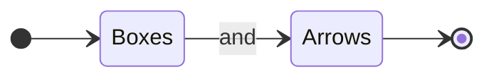
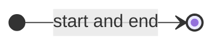
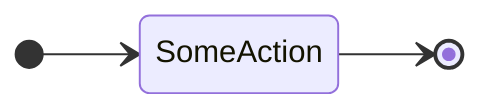
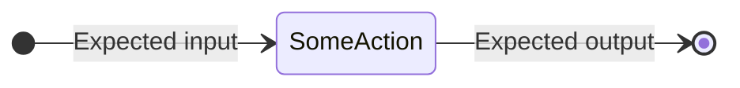
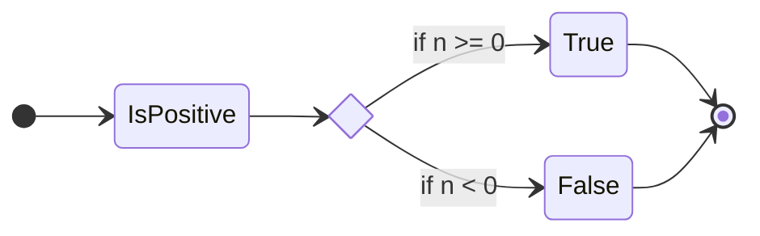
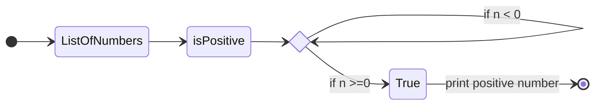
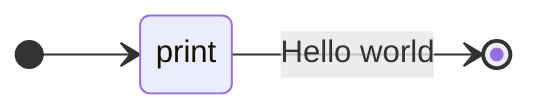
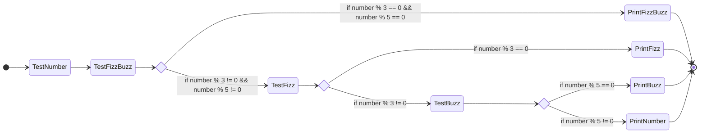

# Boxes and arrows

How do programmers explain complicated logic without (a lot of) handwaving? We use visual language to explain our ideas without having to make a lot of code  



**original author:** [carteras](https://github.com/carteras)

<!-- add a new author mark if you updated this -->

## Topics covered

"At the end of this recipe, you will be able to answer the following questions or solve the following problems"

<!-- why should people expect to be able to do or know after doing this recipe -->

* What are visual | modelling languages? 
* Why visual | modelling languages are prolific in industries that deal with heavy abstractions?
* How to design a solution for some prior problems. 

### Things you'll need to know before you start this

<!-- what should they know before learning it -->

* Programming in some language.

## Topics

### Introduction

<!-- Introduce the topic, what is it, how does it work, include pictures -->

It's rare for Systems to be built by a team of one. As such, systems often need collaboration and planning. Often different teams who are potentially in different buildings or sometimes countries.

Many of the people involved in Systems do not understand code. Business Analysts, Steering Committees, Technical Writers, Stakeholders.

How do we communicate with people who can't understand code? How do we collaborate with technical experts around the globe? 

We need some sort of language that helps us explain our logic. 

Note: Some of you may have seen year Year 11 classes studying UML. We are not going to do UML in this class. Not that it's bad or it doesn't work, but the focus on this modelling language is to create a paradigm of visual languages rather tan a universal language or a methodology of how to explain ourselves. This allows us to be quick, focused, and change the rules if the context requires us to. 

Before we go into the worked examples. Let's talk about our visual languages. 












## Worked Examples

<!-- Provide some basic worked examples that let people follow your worked examples. If it's a library, don't forget to tell people how to install it -->

Let's make a visualisation for printing hello world.



Let's do something more complicated. FizzBuzz

* If a number is divisible by 3 print fizz
* if a number is divisible by 5 print buzz
* if a number is divisible by 3 and 5 print FizzBuzz
* otherwise print the number




## Practice Questions

<!-- Provide some basic practice questions that let people follow your worked examples.  -->

### Creating triangles

Your goal is to produce a program that can construct triangles. The size of the triangle is defined by user input. 

```
*
**
***
****
```

Create a visualisation that describes how this is made. Look at old code if you have to.


## Challenge

<!-- Make up a challenge question which asks people to use all of their knowledge they just learnt (and maybe some prior learning) to solve -->

### Create boxes and arrows for a simple calculator

Your diagram must allow for the following logic

* Accept input from the user
* user input will look like this: operator variable variable
* valid operators are + - / *
* calculations should be solved
* iterates endlessly until user types q as the operator (how do we handle that)

After you have created this diagram find a ~~victim~~ volunteer to build code from your specification. Get feedback. 