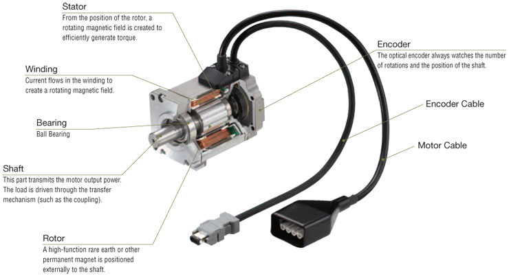
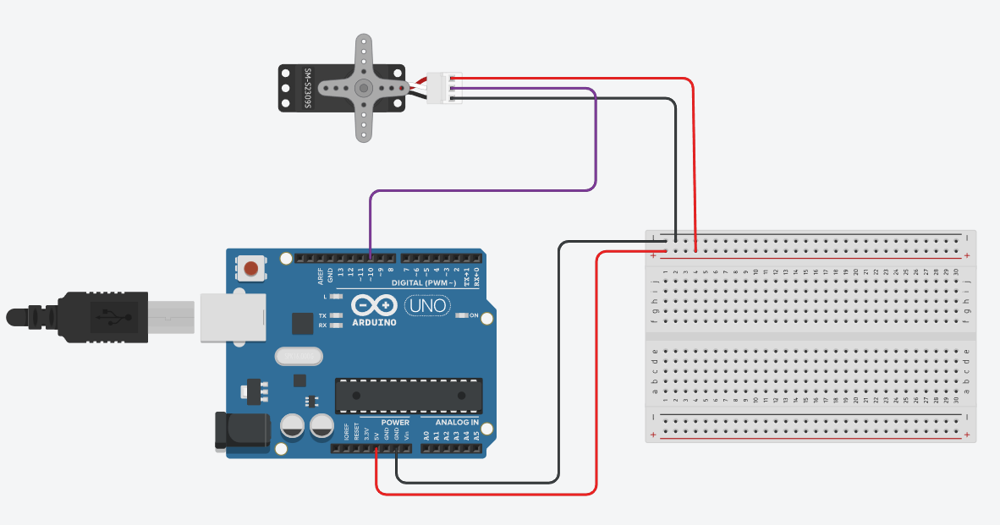

# Servo Motors 
A servo motor is a device used to rotate or push an object when powered. Servo motors are different from a stepper motor because it takes feedback via an encoder and a controller. The encoder takes analog input and sends it to the controller. the controller sends out a pulse to control the rotation, torque, acceleration and speed.



## Definitions (Skip this if you already know it):
-Torque is the amount of force required to rotate and object around an axis.

-Acceleration is the rate of change in velocity over time (how fast it speeds up)

-An Actuator is a device that uses power to convert a signal into physical motion.

-PWM stands for pulse width modulation


### Different types of servo motors (DC and AC)

There are two different types of servo motors, AC and DC. The only relevant difference (to this tutorial) between the two would be their source of power. AC servo motors rely on using electrical outlets whilst DC relies on batteries.A DC servo motor's performance relies only on voltage whilst AC relies on voltage and frequency. AC servo motors are used more than DC in the current age as they are easier to use, more effective and reliable.

## Difference between Servo and Stepper Motor's 
A servo motor uses feedback to dictate position, speed, ect. While a stepper motor is told to move to a certain degree without the need for feedback, unfortunately this limits the accuracy of stepper motors and increases the likelihood of them overshooting (stop accuracy). stepper motors also work differently in how they rotate but that's not important for this tutorial.

## How do you use Servo Motor's with an Arduino?


****Servo.h Commands****:

***attach***: attaches servo to desired pin

***write***: writes the value to the servo (sets the position of the shaft in degrees)

***writeMicroseconds***: sets the angle of the shat using microseconds

***read***: reads the current angle of the servo

***attached***: checks that the servo is attached to a pin

***detach***: detaches servo from pin




```cpp
#include <Servo.h>

Servo myservo; //defines servo

int pos = 0; //interger that will be used to define position

void setup() {
  myservo.attach(10); //attaches defined servo to pin of your choosing
}

void loop() {
  for (pos = 0; pos <= 180; pos += 1) { //when "pos" is less than 180, +1 loop
    myservo.write(pos); //tells servo to use the value of "pos"
    delay(15); 
  }
  for (pos = 180; pos >= 0; pos -= 1) { //when pos is greater than 0, -1 loop
    myservo.write(pos);
    delay(15); 
  }
}
```
****This should be enough to get you started****


## Funny Cat to make you smile :)

