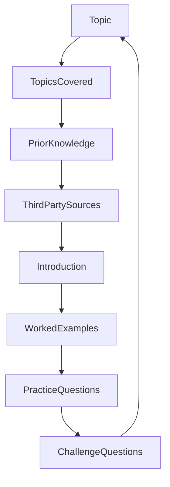

# 360 degree servo motors

This recipe will focus on using the 360 degree servo motors

**original author:** [carteras](https://github.com/carteras)

<!-- add a new author mark if you updated this -->

## Topics covered

"At the end of this recipe, you will be able to answer the following questions or solve the following problems"

<!-- why should people expect to be able to do or know after doing this recipe -->

* Question or problem
* Question or problem
* Question or problem

### Things you'll need to know before you start this

<!-- what should they know before learning it -->

* Prior learning
* Prior learning
* Prior learning

### Third party resources

<!-- Are there other locations where they can find this information? -->

* resource
* resource
* resource

## Topics

### Introduction

<!-- Introduce the topic, what is it, how does it work, include pictures -->

## Worked Examples

<!-- Provide some basic worked examples that let people follow your worked examples. If it's a library, don't forget to tell people how to install it -->

## Practice Questions

<!-- Provide some basic practice questions that let people follow your worked examples.  -->

## Challenge

<!-- Make up a challenge question which asks people to use all of their knowledge they just learnt (and maybe some prior learning) to solve -->
