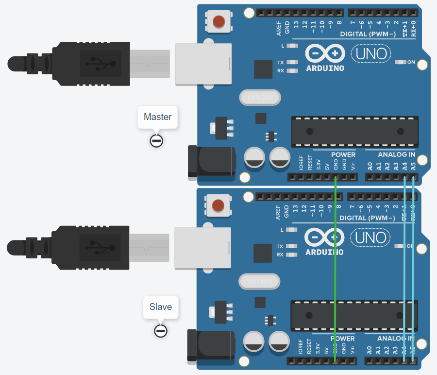
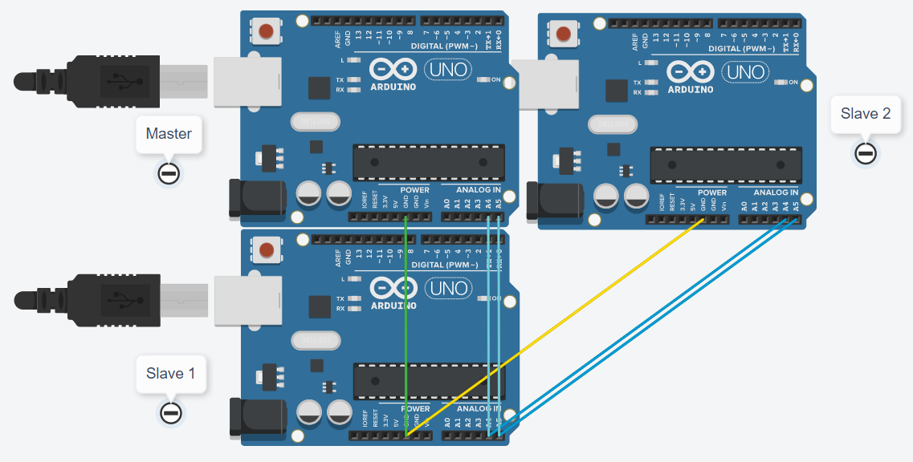

# I2C Tutorial

## Info

I2C is a wire-transmission protocol useful for sending and receiving information from interconnected devices. I2C requires only 2 wires to send digital data over.

## Basics Pt. 1

The I2C structure typically involves one "Master" and multiple "Slaves" the Master is responsible for sending and receiving data from the Slaves. Slaves are identified by a 7-bit address meaning the addresses range from 0 to 2<sup>7</sup> - 1 =  127.

Arduino has a `Wire.h` library for this purpose. To import the library use:

```c++
#include <Wire.h>
```

The next step is to connect the device's intended ports. The Wire.h library will use:

> For Arduino UNO, these are the A4 and A5 pins \
For Arduino Mega, these are the 20 and 21 pins

It is also important that the GNDs are connected. Here is an example of the following setup:



In the example above, the top Arduino is the "Master" who is broadcasting to the bottom Arduino the "Slave"

Using functions from Wire.h. namely; begin, beginTransmission, write, endTransmission, onReceive. A basic program can be constructed where the Master is able to send text to the Slave to be printed

**Master Code:**

```c++
#include <Wire.h>

void setup()
{
  Serial.begin(9600);
  Wire.begin(1);
}

void loop()
{
  delay(10);                     // Prevent writing before Slave has a chance to listen
  Wire.beginTransmission(2);     // Mention address 2
  Wire.write("Ping!");           // Transmit string
  Wire.endTransmission();        // Stop
}
```

**Slave Code:**

```c++
#include <Wire.h>

void setup()
{
  Serial.begin(9600);
  Wire.begin(2);                 // Listen for address 2
  Wire.onReceive(handelReceive); // Await receive request
}

void loop()
{
  delay(10);
}

void handelReceive(int i) {
  
  Serial.print("Message Received: ");

  byte c;
  while (Wire.available()) {
    c = Wire.read();             // Read byte from wire
    Serial.print((char) c);      // Convert byte to character
  }
  
  Serial.print("\n");
  
}
```

The result of the following code will continually print `Message Received: Ping!` to the Serial Monitor

## Practice Question 1

Create a program that allows the Master Arduino to send an arbitrary whole number (from 1 to 100) to the Slave and the Slave prints triple that number.

> e.g: `8` is sent to the Slave, `24` is printed

<details>
  <summary>Hint</summary>

  Adapt the example from Basics Pt. 1 to only transmit one byte of information
  
</details>

## Basics Pt. 2

One of the main features of I2C communication is that multiple slaves can be associated with one master



In the following example, the master is connected to two slaves. In this example, the master will be requesting data from the two slaves and printing it.

> Slave 1 will contain the string `"Ping!"` \
Slave 2 will contain the string `"Pong!"`

The Serial Monitor (of the master) should replicate:

```
Ping!
Pong!
...
Ping!
```


**Master Code:**
```c++
#include <Wire.h>

void setup()
{
  Serial.begin(9600);
  Wire.begin(1);
}

void loop()
{
  delay(10);
  
  char stringOutput[6] = {};       // Create array to receive bytes
  
  Wire.requestFrom(2, 5);          // Request 5 Bytes from Slave 1     
  Wire.readBytes(stringOutput, 5); // Write bytes to array
  Serial.print(stringOutput);
  Serial.print("\n");
  
  Wire.requestFrom(3, 5);          // Request 5 Bytes from Slave 2
  Wire.readBytes(stringOutput, 5); // Write bytes to array
  Serial.print(stringOutput);
  Serial.print("\n");
}
```

**Slaves Code:**

```c++
#include <Wire.h>

void setup()
{
  Serial.begin(9600);
  Wire.begin(2);
  Wire.onRequest(handelRequest);   // Await request request
}

void loop() { delay(10); }

void handelRequest() {
  
  /* Slave 1 */    Wire.write("Ping!");
  /* Slave 2 */ // Wire.write("Pong!");
  
}
```

## Practice Question 2

Construct a program such that a Master Arduino requests a 10-byte string from each of two Slaves and will print \
`Responses from Slaves: 1. {Slave 1 String}, 2. {Slave 2 String}` \
to the Serial Monitor.

<details>
  <summary>Hints</summary>
  
  <details>
  <summary>Getting Data</summary>
  
  Refer to/adapt the code in Basics Pt. 2
  
  </details>

  <details>
  <summary>Writing Data</summary>

  Use multiple `Serial.print()`s to avoid using string methods
  
  </details>
  
</details>

## Practice Question 3

Construct a program such that a Master Arduino can send an arbitrary 10-byte string to a slave. The slave, when requested, will send back the string except reversed for the Master to print to Serial.

> e.g `Hamburgers` is sent to the slave, the Master requests from the slave and receives & prints `sregrubmaH`

<details>
  <summary>Hint</summary>

  Adapt the examples from Basics Pt. 1 and Basics Pt. 2. A global variable may help the Slave.
  
</details>

## Challenge Question

A Master Arduino is connected to 10 Slaves containing the code:

```c++
#include <Wire.h>

void setup()
{
  Serial.begin(9600);
  Wire.begin(SLAVE_NUMBER);
  Wire.onRequest(handelRequest);
}

void loop() { delay(10); }

void handelRequest() {
  
  Wire.write("Real");
  
}
```
Such that SLAVE_NUMBER is a unique address from 1 to 10 for each Slave. One of the 10 Slaves contains a different code for handling a request:

```c++

void handelRequest() {
  
  Wire.write("Fake");
  
}
```

Write a program for the Master that will identify which Slave is different and print to Serial `Slave #{Slave Number} is fake`

> e.g if Slave 7 contained the different code, the Master would output `Slave #7 is fake`

<details>
  <summary>Hint</summary>

  To identify the Fake Slave, request each Slave until you get a `"Fake"` response.
  
</details>