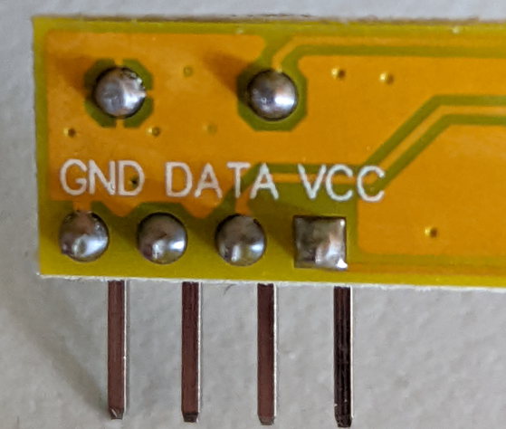
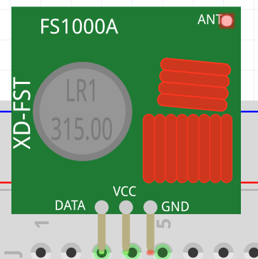
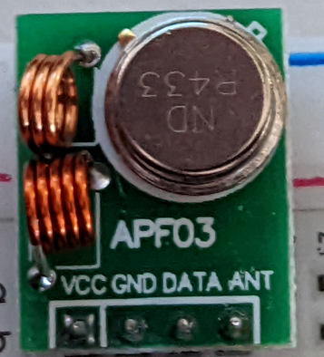
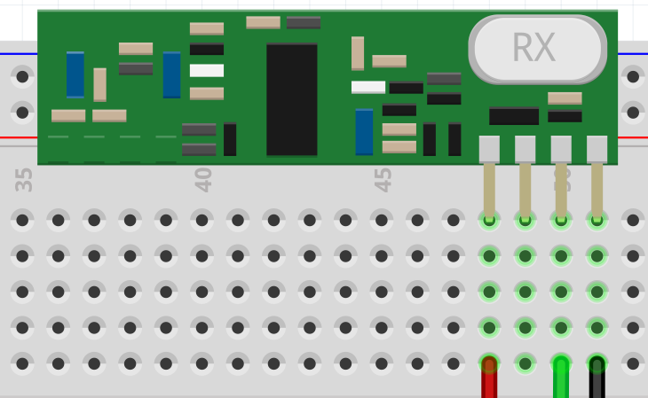
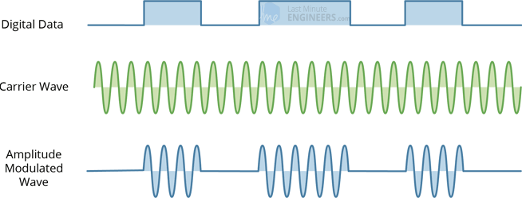
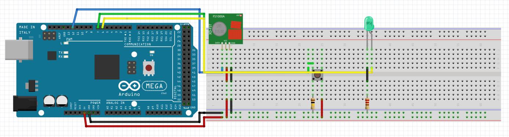
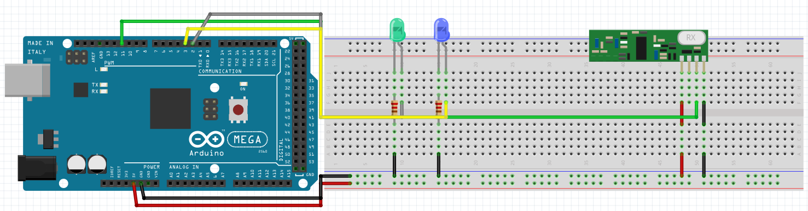

# RF Communication

**author:** [carteras](https://github.com/carteras)

How do we send and receive simple messages remotely using radio transmission?

## Topics covered

"At the end of this recipe, you will be able to answer the following questions"

* How can you send a simple string message using an Arduino?
* How can you receive a simple string message using an Arduino?
* How can you send a simple string message and only respond on the correct message?

## Learning Resources

### Third party resources

* [RH_ASK class reference](http://www.airspayce.com/mikem/arduino/RadioHead/classRH__ASK.html)
* [Someone else's tutorial](https://randomnerdtutorials.com/rf-433mhz-transmitter-receiver-module-with-arduino/)
* [Second third party](https://lastminuteengineers.com/433mhz-rf-wireless-arduino-tutorial/)


### Things you'll need to know before you start this

* How to construct a simple circuit using an Arduino, Breadboards, and Components
* How to read simple circuit diagrams
* How to connect and upload code to an Arduino via the Arduino IDE
* A basic understanding of programming on an Arduino, `#define`, `variables`, `setup()`, `loop()`, `if/else/else-if`, `delay()`, `Serial.println()`
* A basic understanding of Digital and Analog signals
* An understanding of strcmp in Arduino

## Topics

### Introduction

#### Transmitter



The transmitter is relatively straightforward. It has four pins accessible to the programmer, Vcc (power in), GND (ground, power out), data and the antenna. You'll note that there is a difference between the diagram and the components we have. Our component does not have an antenna on board and instead uses a fourth accessible pin for an antenna. This antenna must be 17cm long and can be coiled to save space (but will have better performance if it is straight). 



#### Receiver



The layout for the receiver is pretty much the same as the diagram. The pins are identified on the reverse side of the circuit, so you'll need to ensure that you are applying your pins in the right locations.

What's that spare pin for? I'm not sure. I believe it is a linear output testing pin. If anybody finds out, update this document!




#### How it works

When a logical HIGH is applied to the data input the oscillator activates and produces constant output carrier wave at 433.xx MHz. When the data input is set to LOW the oscillator stops. This technique is known as Amplitude Shift Keying.

##### Amplitude Shift Keying - ASK

Amplitude Shift Keying is when the level of the carrier wave (433MHz signal) is changed in response to the incoming data.

This is very similar to the process of reading analog or pulse width modulation (PWM) that we've used before.

This is how the amplitude modulation looks like: 



The pros of ASK is that it is simple (and thus cheap) to develop a the circuitry. ASK also requires less bandwidth than other techniques such as Frequency Shift Keying (FSK). 

However, there is a significant problem with interference from other radio devices and background noise. However, as long as you keep your transmission to a relative slow speed it can work in most environments. 

### Transmit Msg

* 1x 220 ohm resister
* 1x 100k ohm resister
* 1x Radiohead ASK Transmitter 
* 1x button
* 8x jumpleads
* 1x copper wire 17cm long
* 1x Arduino Mega
* 1x USB
* Download the RadioHead library from this repository



By default the Arduino Radiohead Library uses `pin 12` to send messages.  


```cpp
#include <RadioHead.h>
#include <RH_ASK.h>
#include <SPI.h>


#define SEND_PIN 7
#define SEND_BTN 6

#define debug(x) Serial.print(x); Serial.print(" ")
#define debugln(x) Serial.println(x);

RH_ASK driver;
const char *msg = "foo";

void setup() {
  Serial.begin(57600);
  if (!driver.init()) {
    Serial.println("DRIVER INIT FAILED");
  }
  Serial.println("RX GO!");
  pinMode(SEND_PIN, OUTPUT);
  pinMode(SEND_BTN, INPUT);

  for (int i = 0; i < 10; i++) {
    digitalWrite(SEND_PIN, LOW);
    delay(100);
    digitalWrite(SEND_PIN, HIGH);
    delay(100);
  }

  digitalWrite(SEND_PIN, LOW);
}

void sendMessage() {
  driver.send((uint8_t *)msg, strlen(msg));
  driver.waitPacketSent();
}

void loop() {
  if (digitalRead(SEND_BTN) == HIGH){
    digitalWrite(SEND_PIN, HIGH);
    sendMessage();
    digitalWrite(SEND_PIN, LOW);
  }
  delayMicroseconds(2);

}
```

### Receive Msg




```cpp
#include <RadioHead.h>
#include <RH_ASK.h>
#include <SPI.h>

#define RECV_PIN 6
#define MSG_PIN 5

#define debug(x) Serial.print(x); Serial.print(" ")
#define debugln(x) Serial.println(x);

RH_ASK driver;
uint8_t buf[12];
uint8_t buflen = sizeof(buf);

void setup() {
  Serial.begin(57600);
  Serial.println("INIT BOARD:");
  if (!driver.init()) {
    Serial.println("DRIVER INIT FAILED");
  }
  Serial.println("RX GO!");
  pinMode(RECV_PIN, OUTPUT);
  pinMode(MSG_PIN, OUTPUT);
  for (int i = 0; i < 10; i++) {
    digitalWrite(MSG_PIN, LOW);
    digitalWrite(RECV_PIN, HIGH);
    delay(100);
    digitalWrite(MSG_PIN, HIGH);
    digitalWrite(RECV_PIN, LOW);
    delay(100);
  }
  digitalWrite(MSG_PIN, LOW);
}

void loop() {

  if (driver.available()) debugln("WHAT?");
  if (driver.recv(buf, &buflen)) {
    for (int i = 0; i < 10; i++) {
      digitalWrite(RECV_PIN, HIGH);
      digitalWrite(MSG_PIN, LOW);
      delay(100);
      digitalWrite(RECV_PIN, LOW);
      digitalWrite(MSG_PIN, HIGH);
      delay(100);
    }
  }
  Serial.print("Message: ");
  Serial.println((char*)buf);

}
```


### Reading Strings

## Practice Questions

## Challenge

