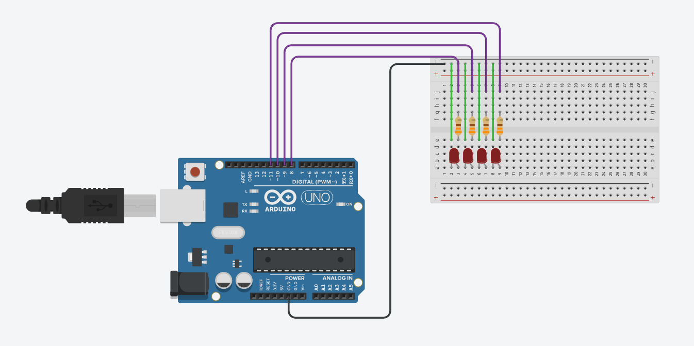

# This tutorial is incomplete

Before you read, just would like to let you know that the tutorial is incomplete and after a point it just stops. (though teh code at which I have written whilst learning is there. 


# Serial communication in Arduino

## Learning goals

 * How to use Arduino's Serial Library to transmit and utilise information between Arduinos

## Code

### Prerequisite knowledge

When working with Ardiono's Serial Library, there are a few things that are helpful to know beforehand: 

Selecting serial ports { <br>
When using Serial in arduino you can specify which of the predesignated serial ports that the board comes with for the function to use by replacing the "Serial"  at the beggining of the code with "Serial1", "Serial2" or "Serial3" depending on the board you have and which serial port you want to use, "Serial" uses the default serial ports (Essentially "Serial0").  <br>
For a table of Designated Serial pins, as well as the Serial code reference, here's a link to Ardiono's [Serial reference](https://www.arduino.cc/reference/en/language/functions/communication/serial/). <br>
An alternative way to see which pins are allocated for serial communication, you can look at the board for the "TX" and RX" pins, and see if they have a number after it, the number identifies which serial port set it belings to (TX0, RX0 is equal to "Serial" (the default pins)) <br>}

Basic circuit setup { <br>
Serial communication for the arduino requires 1-2 wires to functtion, depending if you want one-way, or two way communication, with the TX (transmiting) pin connecting to the other boards RX (recieving) pin. 
<br>}

### Serial functions used

Serial.begin(baud) , function { <br>
Serial.begin assigns a serial port and enables it for use, if you have multiple serial ports you can replace "Serial" with "Serial1" "Serial2" or "Serial3" depending on the board you are using to use the functions on the different serial ports the board has.
For the arduino mega, the board has the following pins:<br>
Serial: 0,1 (RX,TX)<br>
Serial1: 19,18 (RX,TX)<br>
Serial2: 17,16 (RX,TX)<br>
Serial3: ,15,14 (RX,TX)<br>
9600 is the rate being used here<br>
<br>}

### Extra functions that are good to know about

Serial.end(), function { <br>
Serial.end unnassigns the selected serial ports for serial communication usage, enabling them to be used for other purposes. (post assigning with Serial.begin(baud))
<br>}

Serial.setTimeout(time) { <br>
Serial.setTimeout sets the default maximum waiting time in milliseconds for  functions looking for serial data. (The default time is 1000ms)
<br>}

Serial.flush(), function { <br>
Serial.flush delays the continuation of the code until the specified serial port has finished transmitting any outgoing data. 
<br>}


### Introduction


#### Receiving
A good way to start learning how to use arduino's Serial functions is through learning how to handle recieved Serial information with an arduino by using the arduino compiler's serial monitor found in the tools tab (CTRL+SHIFT+M)

Using the serial monitor there are two main parts to it; An Input bar, and an output box
The serial monitor can be used as a way to interact with the arduino as if the information was coming in from the RX pin, as well as what would be sent out through the TX pin. 

Before running the code, a "char" array, the char array is for where the input from the serial ports gets stored, and is required for the Serial.readBytes function to work. 
The char array in this case has been named 'buff' (for buffer) and set to five, meanining that any input less than four characters long will be accepted into the buffer using Serial.readBytes without problem (the last is reserved to mark the end of the line)

```cpp

char buff[5];

```

In the setup() {} function you need to activate the serial ports for the arduino with "Serial.begin(9600)" so that the arduino reserves the serial 0 ports (TX0, RX0) for serial communication. 
The baud rate is set to 9600 in this case, as a default value. 

```cpp

void setup() {
	Serial.begin(9600);
}

```

In the loop() {} function, we now write code to check whether the arduino has recieved any input through the serial monitor and this is by using an if statement to check whether there is any serial input to be read by using the Serial.available() and checking if it is greater than 0. If there is input to be read, we read the information using Serial.readBytes to read the incoming information, and store it into the buffer array (buff) and have the length parameter set to the length of the buffer to avoid potential overflow issues. Then to see what was read we use Serial.prinln() to print what was read and then create a new line in the monitor. 

```cpp

void loop() {
	if (Serial.available()>0) {
		Serial.readBytes(buff,5);
		Serial.println(buff);
	}
}

```

With the code written, now you upload the code to an arduino, and then open up the serial monitor and type in an input through the input bar, and in teh output box, it should print what was recieved in the character buffer (unless it is longer than the buffer length -1). 

#### Sending

Now that you (should) have an arduino succesfully handling received information, the next step is to send information form a different arduino. 


### Practice

#### Circuit Setup

The practice and challenge components will be using the following circuit on the recieving arduino: 



#### Code

FINAL RECIEVER CODE:

```cpp

char buff[5];
int number;

void setup() {
  Serial.begin(9600);
  pinMode(8,OUTPUT);
  pinMode(9,OUTPUT);
  pinMode(10,OUTPUT);
  pinMode(11,OUTPUT);
}

void loop() {
//  if (Serial.available()>0){
    number = Serial.parseInt();
    Serial.read();
    number+=8;
    //Serial.readBytesUntil('\n',buff,3);
    //number=buff[0];
//    Serial.println(buff);
    Serial.println(number);
    digitalWrite(number,HIGH);
    delay(1000);
    digitalWrite(number,LOW);
    
    
    
//  }
}

```

FINAL SENDER CODE:

```cpp

char buff[5];
String output;
int randomNumber;
int finalnumber;

void setup() {
  Serial.begin(9600);

}

void loop() {
  randomNumber = random(4);
  Serial.println(randomNumber);
  delay(1000);
  Serial.flush();
}


```


### Challenge

