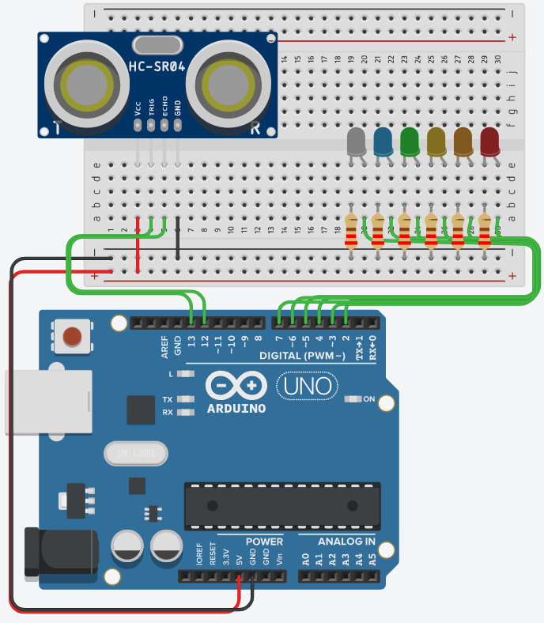

# Is there an easier way to map values from one to another

## Learning Goals

*By the end of this recipe you should be able to answer the following:*

* What?

## Concepts

Re-maps a number from one range to another. That is, a value of fromLow would get mapped to toLow, a value of fromHigh to toHigh, values in-between to values in-between, etc.

Does not constrain values to within the range, because out-of-range values are sometimes intended and useful. The constrain() function may be used either before or after this function, if limits to the ranges are desired.

Note that the "lower bounds" of either range may be larger or smaller than the "upper bounds" so the map() function may be used to reverse a range of numbers, for example

`y = map(x, 1, 50, 50, 1);`

The function also handles negative numbers well, so that this example

`y = map(x, 1, 50, 50, -100);`

is also valid and works well.

The map() function uses integer math so will not generate fractions, when the math might indicate that it should do so. Fractional remainders are truncated, and are not rounded or averaged.

```cpp

void setup(){
    Serial.begin(9600);
    int out = 0;
    for (int i = 0; i <= 350; i++){
        out = map(i, 0, 350, 2, 9);
      	Serial.print("Given the following variable: ");
      	Serial.print(i);
      	Serial.print(" ");
        Serial.print("I would turn on this LED: ");
        Serial.println(out);
    }
}

void loop()
{
  
}
```


## Practice Question



```cpp
#define trig 13
#define echo 12

#define LED_START ______
#define LED_END ______

#define MAX_RANGE ______
#define MIN_RANGE ______

int maxPinOn;
unsigned long distance;

void setup(){
  pinMode(trig, OUTPUT);
  pinMode(echo, INPUT);

  for (int i = LED_START; i <= LED_END; i++){
    pinMode(i, OUTPUT);
  }
}

unsigned long ping(int trigPin, int echoPin){
  long duration;
  digitalWrite(trigPin, LOW);
  delayMicroseconds(2);
  digitalWrite(trigPin, HIGH);
  delayMicroseconds(10);
  digitalWrite(trigPin, LOW);
  duration = pulseIn(echoPin, HIGH);
  return duration * 0.034 / 2; 
}

void loop()
{
  distance = ping(trig, echo);
  maxPinOn = map(distance, ______, ______, ______, ______);
  
  for (int pin = LED_START; pin <= LED_END; pin++){
    Serial.print("Given the following variable: ");
    Serial.print(pin);
    Serial.print(" ");
    Serial.print("I would turn on this LED: ");
    Serial.println(maxPinOn);
  }
}
```