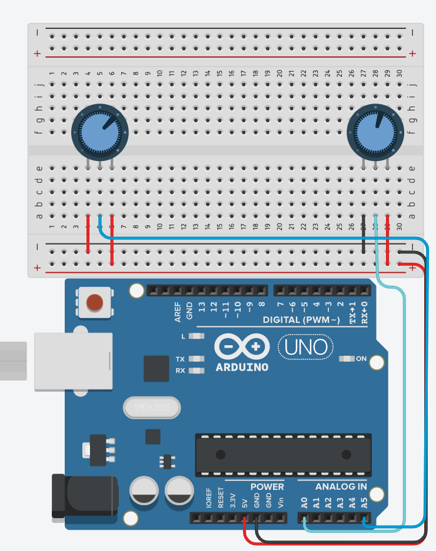

# How do potentiometers work?

## Learning Goals

*By the end of this recipe you should be able to answer the following:*

* What is a potentiometer?
* How do they work on the Arduino system?
* How to build a small system that uses an Arduino?

## Concepts

Potentiometers are electrical components used in electronic circuits to provide variable resistance. They are commonly used in Arduinos to control the amount of current flowing through a circuit, and to create analog input signals that can be read by the microcontroller.

A potentiometer is essentially a resistor with a variable resistance that can be adjusted by turning a shaft or knob. It consists of a resistive element and a movable contact or wiper that slides along the surface of the element, changing the amount of resistance between the wiper and the two ends of the resistive element.

When a potentiometer is connected to an Arduino circuit, the wiper is typically connected to an analog input pin, while the other two ends of the resistive element are connected to ground and the supply voltage. As the shaft is turned, the wiper moves along the resistive element, changing the voltage that is applied to the analog input pin. This change in voltage is then converted to a digital value by the Arduino's analog-to-digital converter (ADC) and can be read and used in the code.

Potentiometers are commonly used in a variety of applications, including audio equipment, motor speed control, and lighting dimming circuits. In Arduino projects, they are often used to control the brightness of an LED, the speed of a motor, or the position of a servo motor.



```cpp
#define DIAL_RIGHT A0
#define DIAL_LEFT A5

int leftReading;
int rightReading;

void setup(){
  Serial.begin(9600);
  pinMode(DIAL_RIGHT, INPUT);
  pinMode(DIAL_LEFT, INPUT);
}

void loop(){
  leftReading = analogRead(DIAL_LEFT);
  rightReading = analogRead(DIAL_RIGHT);
  Serial.print(leftReading);
  Serial.print(" ");
  Serial.println(rightReading);
}
```

## Practice Question

Create the program for the following circuit: 

