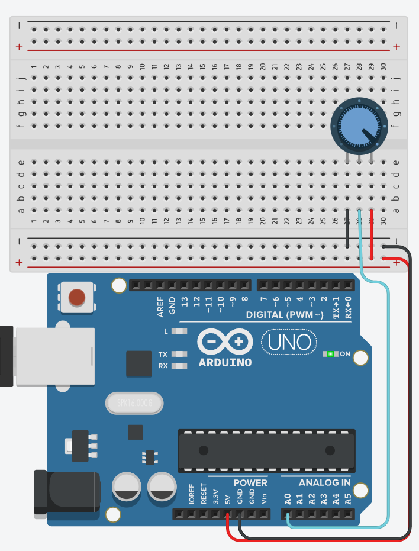
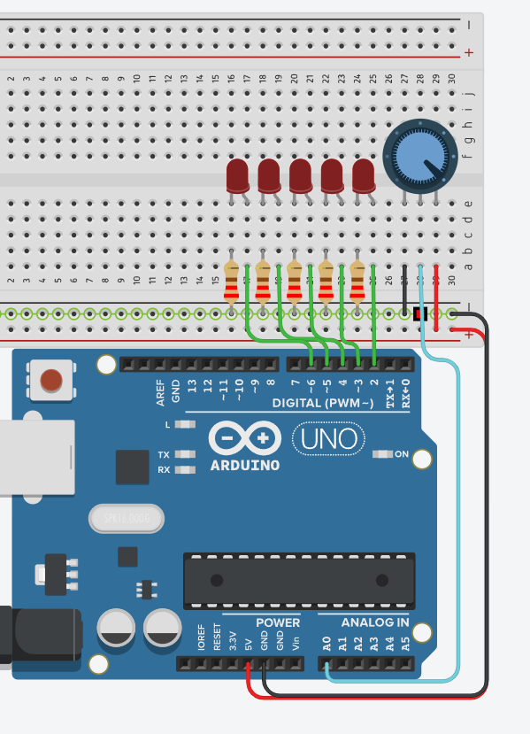

# How do you use analog signals?

## Learning Goals

*By the end of this recipe you should be able to answer the following:*

* What are analog signals?
* How do you read an analog signal?
* How do you write an analog signal?

## Concepts

An analog signal is a continuous voltage signal that varies over time and can take on any value within a certain range. Analog signals are used to represent real-world phenomena that vary continuously, such as temperature, light intensity, and sound pressure.

Analog signals are different from digital signals, which are discrete and take on only a finite number of values. Arduino microcontrollers have built-in analog-to-digital converters (ADCs) that can read analog signals and convert them into digital values that can be processed by the microcontroller.

In Arduino programming, analog inputs are typically read using the analogRead() function, which returns a value between 0 and 1023 corresponding to the voltage level on the analog input pin. The range of the analog signal that can be read by an Arduino is typically determined by the voltage range of the analog input pin, which is usually 0-5 volts.

Consider the following circuit: 



```cpp
#define DIAL A0
#define LOW_LEDS 2
#define HIGH_LEDS 6

int reading;

void setup(){
  Serial.begin(9600);
  pinMode(DIAL, INPUT);
  for (int led = LOW_LEDS; led <= HIGH_LEDS; led++){
    pinMode(led, OUTPUT);
  }
}

void loop(){
  reading = analogRead(DIAL);
  Serial.print(reading);
  Serial.print(" ");
  reading = map(reading, 0, 1023, LOW_LEDS, HIGH_LEDS);
  Serial.println(reading);
  
}
```


## Practice Question

Consider the following circuit and complete the code.



```cpp
#define DIAL A0
#define LOW_LEDS 2
#define HIGH_LEDS 6

int reading;

void setup(){
  pinMode(DIAL, INPUT);
  for (int led = LOW_LEDS; led <= HIGH_LEDS; led++){
    pinMode(led, OUTPUT);
  }
}

void loop(){
  reading = analogRead(____);
  reading = map(reading, ____, ____, ____, ____);
  for (int led = LOW_LEDS; led <= HIGH_LEDS; led++){
    if (reading >= led) {
      digitalWrite(led, HIGH);
    } else {
      digitalWrite(led, LOW);
    }
  }
}
```