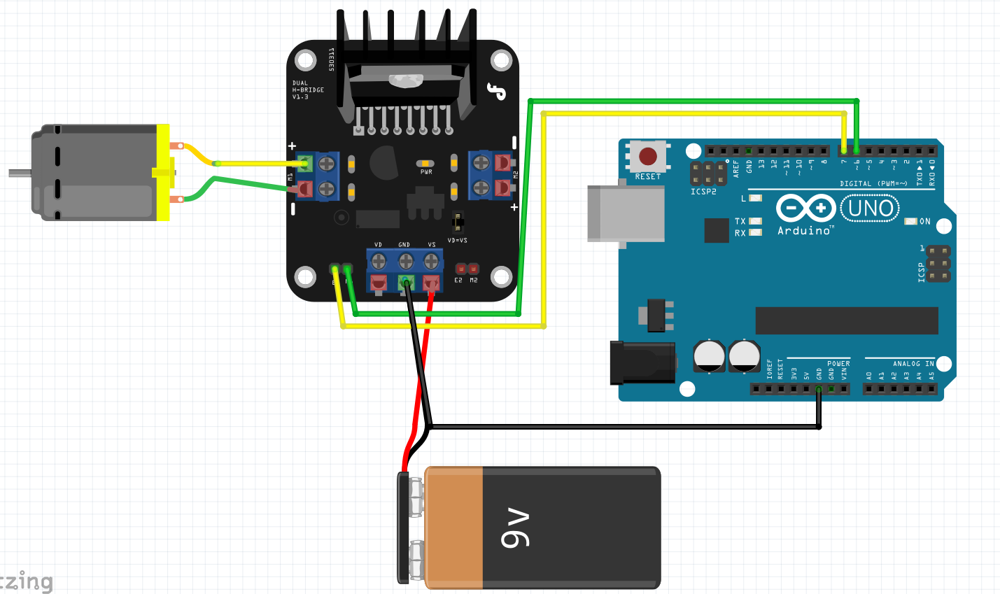

# DF Robot 2A motor controller

This recipe shows you how to construct a simple motor circuit using the DF-MD v1.3 motor controllers we have in the lab

```mermaid
  graph TD;
      9v_battery-->MD_GND_&_Vs;
      Arduino-->MD_Gnd;
      Arduino_Pin7-->MD_E1;
      Arduino_Pin6-->MD_M1;
      Motor --> MD_+|-;
      Arduino --> Code;
```

**original author:** [carteras](https://github.com/carteras)

<!-- add a new author mark if you updated this -->

## Topics covered

"At the end of this recipe, you will be able to answer the following questions or solve the following problems"

<!-- why should people expect to be able to do or know after doing this recipe -->

* How do you configure a single motor to the motor controller and fire it

### Things you'll need to know before you start this

<!-- what should they know before learning it -->

* Basic Circuits
* Arduino C
* Uploading code to Arduino
* for loops

### Third party resources

<!-- Are there other locations where they can find this information? -->

* #TODO DF Robot resource
* #TODO student resource

## Topics


### Introduction

This example expands upon student work and shows how to link the motor controller and the Arduino together as a single circuit


## Worked Examples

<!-- Provide some basic worked examples that let people follow your worked examples. If it's a library, don't forget to tell people how to install it -->



```cpp
#define M1 6
#define E1 7

void setup(){
  pinMode(M1, OUTPUT);
  pinMode(E1, INPUT);
}

void loop(){
  for (int value = 0; value <=255; value +=5){
    digitalWrite(M1, HIGH);
    analogWrite(E1, value);
    delay(30);
  }
}
```

## Practice Questions

<!-- Provide some basic practice questions that let people follow your worked examples.  -->

* #TODO two motors forward
* #TODO slow turn left
* #TODO fast turn right
* #TODO reverse

## Challenge

<!-- Make up a challenge question which asks people to use all of their knowledge they just learnt (and maybe some prior learning) to solve -->

* #TODO silly dancing robot
