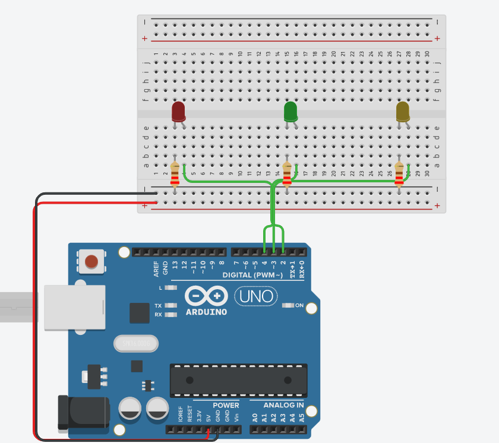
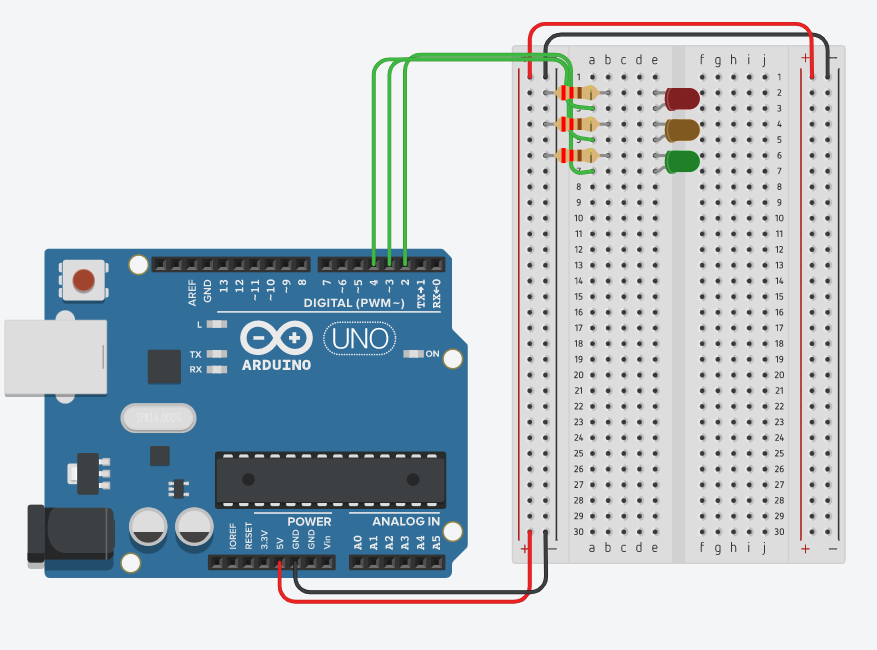
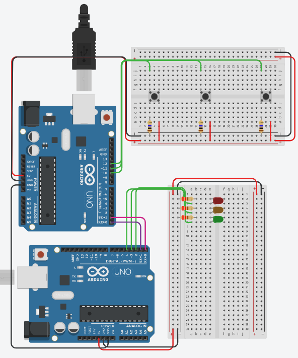

# Managing logic through state


Have you ever been sitting there writing some code and suddenly realised that your logic is all over the place? Maybe you have a loop function that is 500 lines long filled with all sorts of logic nested within logic nested within more logic. 

This recipe looks at one way of helping to mitigate against spaghetti logic by using the concept of keeping and understanding state and only doing one thing at a time. 

**original author:** [carteras](https://github.com/carteras)

<!-- add a new author mark if you updated this -->

## Topics covered

"At the end of this recipe, you will be able to answer the following questions or solve the following problems"

<!-- why should people expect to be able to do or know after doing this recipe -->

* What is state?
* How do we keep state?
* How can we make decisions based off of our state? 
* How can we change our state based off of new information? 

### Things you'll need to know before you start this

<!-- what should they know before learning it -->

* Completed foundation programming (ideally in Arduino C/C++)

### Third party resources

<!-- Are there other locations where they can find this information? -->

* [State (computer science)](https://en.wikipedia.org/wiki/State_(computer_science))

## Topics

### Introduction

<!-- Introduce the topic, what is it, how does it work, include pictures -->

#### What is state?

In Computer Science, state is defined as the condition of a programs stored inputs. The term "state" in similar to how it is used in science - the state of an object - be it gas, liquid, or solid - is defined by the variables that impact the object. 

We've been touching state for some time, we just haven't talked about it. 

```cpp
#define trig 2
#define echo 3
int distance;

/* 
   a bunch of code lives here. Including setup(), getDistance, motorsStop functions
*/

void loop(){
    distance = getDistance(trig, echo);
    if (distance < 15) {
        motorsStop();
    }
}
```

The distance here is the state of the system, or at least a part of it. 

#### How do we keep state?

Technically, storing variables is stateful but we probably need more to understand what our state is. In the example below, we are going to categorise our different possible states, and calculate which state we are in now. 

This example is a simple traffic light analog. We have 3 buttons, and 3 lights. Each button tells the system to turn on a specific light. 

```cpp
#define green_btn 12
#define yellow_btn 11
#define red_btn 10

int pressed_green = 0;
int pressed_yellow = 0; 
int pressed_red = 0;

int msgSent = 0;

int OFF = 0;
int GREEN = 1;
int YELLOW = 2;
int RED = 3;
int STATE = OFF;
```

Right up the top of our code somewhere, up where we define things like pins and variables, we create a group of variables together specifically intended to define our state. 

Because STATE is a special concept that lives in our brain, we are going to define them in all capitals so we remember what we are doing with them. 

In this example, I have 4 possible states, RED, GREEN, YELLOW, and OFF. I also have an additional state variable called STATE. This is where I store whatever the state currently is. 

#### How can we make decisions based off of our state? 

In the example below (which continues the code from above) we can constrain our main loop into the following possible decisions based off of state.

```cpp
int turnedOff(){
  return RED;
}

void loop()
{
  pressed_red = digitalRead(red_btn);
  pressed_yellow = digitalRead(yellow_btn);
  pressed_green = digitalRead(green_btn);
  
  if (STATE == OFF){
    STATE = turnedOff();
  } else if (STATE == RED){
    STATE = redLightOn(pressed_green, pressed_yellow, pressed_red);
  } else if (STATE == YELLOW){
    STATE = yellowLightOn(pressed_green, pressed_yellow, pressed_red);
  } else if (STATE == GREEN){
    STATE = greenLightOn(pressed_green, pressed_yellow, pressed_red);
  }
}
```

In this, we can say if the current state is RED (or if STATE has been set to 3) then we can do some sort of action. 

#### How can we change our state based off of new information? 


```cpp
int redLightOn(int grn, int ylw, int red){
  if (grn == 1) return GREEN;
  if (ylw == 1) return YELLOW;
  if (red == 1) {
    Serial.write("r\n");
    digitalWrite(13, HIGH);
  }
  return RED;
}

void loop() {
  pressed_red = digitalRead(red_btn);
  pressed_yellow = digitalRead(yellow_btn);
  pressed_green = digitalRead(green_btn);
  
  if (STATE == OFF){
    STATE = turnedOff();
  } else if (STATE == RED){
    STATE = redLightOn(pressed_green, pressed_yellow, pressed_red);
  } else if (STATE == YELLOW){
    STATE = yellowLightOn(pressed_green, pressed_yellow, pressed_red);
  } else if (STATE == GREEN){
    STATE = greenLightOn(pressed_green, pressed_yellow, pressed_red);
  }
}
```

## Worked Examples

<!-- Provide some basic worked examples that let people follow your worked examples. If it's a library, don't forget to tell people how to install it -->



```cpp
// C++ code
//
#define red 4
#define yellow 3
#define green 2

int number = 5;
int guess = 0;

int HIGHER = 2;
int LOWER = 1;
int JUST_RIGHT = 3;
int OFF = 0;
int STATE = STATE;


void redOn(){
  digitalWrite(red, HIGH);
  digitalWrite(yellow, LOW);
  digitalWrite(green, LOW);
}

void yellowOn(){
  digitalWrite(red, LOW);
  digitalWrite(yellow, HIGH);
  digitalWrite(green, LOW);
}


void greenOn(){
  digitalWrite(red, LOW);
  digitalWrite(yellow, LOW);
  digitalWrite(green, HIGH);
}


void setup()
{
  Serial.begin(115200);
  pinMode(red, OUTPUT);
  pinMode(yellow, OUTPUT);
  pinMode(green, OUTPUT);
}

void loop()
{
  if (STATE == HIGHER){
    redOn();
  } else if (STATE == LOWER) {
    yellowOn();
  } else if (STATE == JUST_RIGHT) {
    greenOn();
  }
}

void serialEvent(){
  guess = Serial.parseInt();
    // used to read chars Serial.read();
  Serial.print("I have recieved ");
  Serial.println(guess);
  if (guess > number) STATE = HIGHER;
  else if (guess < number) STATE = LOWER;
  else if (guess == number) STATE = JUST_RIGHT;
}
```

## Practice Questions

<!-- Provide some basic practice questions that let people follow your worked examples.  -->
Using the information from above, create an example that takes characters (instead of ints) and replicate. 



## Challenge

<!-- Make up a challenge question which asks people to use all of their knowledge they just learnt (and maybe some prior learning) to solve -->

Using the prior examples create this code block and try again. 

