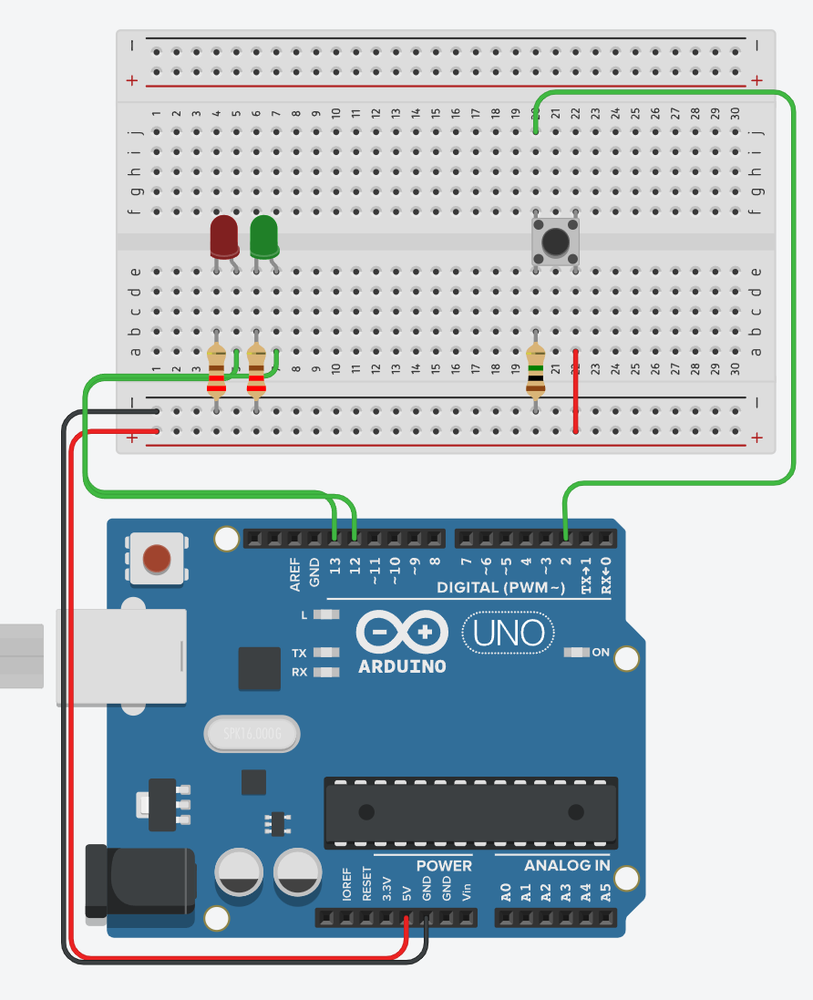

# How do breadboards work? 

A breadboard is a plastic board for building and testing electronics circuits. It has a grid of holes for inserting components and wires. The holes are internally connected, allowing for quick prototyping and testing of circuits without soldering. Breadboards are useful for hobbyists, engineers, and students to quickly test ideas before committing to a permanent circuit.

## Learning Goals

*By the end of this recipe you should be able to answer the following:*

* What is a breadboard?
* How does a breadboard work?

## Concepts

A breadboard is used to prototype electronics by allowing users to quickly and easily build and test circuits without the need for soldering. The following steps describe the general process for using a breadboard:

1. Choose the components for the circuit, such as resistors, transistors, and integrated circuits.
2. Insert the components into the breadboard holes, connecting them together using jumper wires
3. Connect power and ground to the appropriate places on the breadboard.
4. Test the circuit by measuring voltage, current, or other electrical properties, and make changes as needed.
5. Repeat steps 3 and 4 until the circuit is functioning as desired.

By using a breadboard, you can quickly and easily make changes to the circuit, test different configurations, and debug problems. This allows for efficient and effective prototyping of electronics.

### Example

In the example below, you can see three connected circuits. 

1. Arduino -> button -> Arduino (common ground)
2. Arduino -> red led -> Arduino (common ground)
3. Arduino -> green led -> Arduino (common ground)

## Questions

1. What [resistance are the two resistors going into the LEDs](https://www.allaboutcircuits.com/tools/resistor-color-code-calculator/)? Why do you think they are that value?
2. What [resistance is going into the button](https://www.allaboutcircuits.com/tools/resistor-color-code-calculator/)? Why do you think they are that value?
3. Why do you think that the wire into pin 2 is in line with the resistor?
