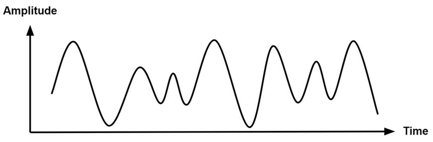
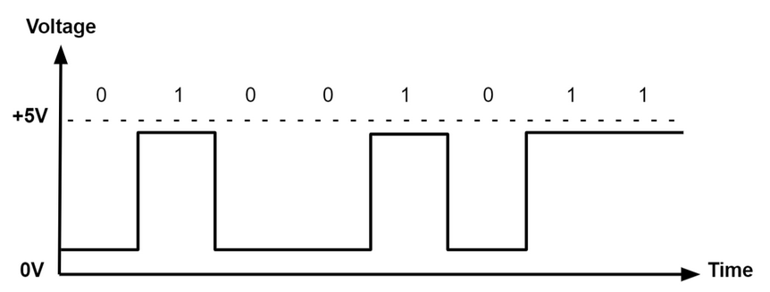

# Digital Signals

## Topics


# Digital Input/Output

## What you will learn

* An introduction of Digital Signals 
* How digital signals are used on Microcontrollers
* Know how to set a pin to be read from or written to
* Understand how to create a digital interaction using digital input to trigger a digital output

## What is a signal

A signal is a electromagnetic or electrical current that carries data from one system or network to another. In basic electronics, a signal is often a series of varying voltages as power is turned on and off in sequences. 

### What is an Analog Signal 

On the Arduino Mega an Analog Signal is time-varying, meaning it changes over time, bound to a range of +5v to 0v but there are an infinite number of values within that range. 

Analog signals are often used to calculate responses to changes in light, distance, sound, temperature, position, pressure, or other physical phenomenon. 



### What is a Digital Signal

A digital signal represents data as a sequence of discrete values (on or off). Digital Signals are prolific with microcontrollers. On the Arduino Mega signals are considered to be on or HIGH when the voltage crosses 2.5v. This introduces a problem with pin 13 as it has both an LED an pull-up resistor meaning it will always return LOW.



## Pin modes 

Pins on the Arduino Mega can be set as either inputs (read) or outputs (write). By default, pins will be set to input. Pins configured this way are open to detecting very small changes. As such, pins that are left in input mode with nothing plugged into them can detect changes due to electrical noise or coupling state from nearby pins. 

In OUTPUT mode, pins provide up to 40 mA of current to other devices. If your device needs more than 40 mA you need to supply external power. 

### Setting a digital pins mode

syntax: 

`pinMode(pin, mode)`

`mode: INPUT, OUTPUT, or INPUT_PULLUP`


## Digital Out

Digital Output is used to turn things on and off and on the Arduino ecosystem we do this with `digitalWrite(pin, VALUE);` 

`value: HIGH or LOW.`

### Using an LED as a digital output

```cpp
int pin = 13;
void setup() {
  pinMode(pin, OUTPUT);    // sets the digital pin 13 as output
}

void loop() {
  digitalWrite(pin, HIGH); // sets the digital pin 13 on
  delay(1000);            // waits for a second
  digitalWrite(pin, LOW);  // sets the digital pin 13 off
  delay(1000);            // waits for a second
}
```

## Digital In

Digital input is frequently used to listen to sensors and on the Arduino ecosystem we do this with: 

`digitalRead(pin)`

### Using a Button as a digital input

```cpp
int ledPin = 13;  // LED connected to digital pin 13
int inPin = 7;    // pushbutton connected to digital pin 7
int val = 0;      // variable to store the read value

void setup() {
  pinMode(ledPin, OUTPUT);  // sets the digital pin 13 as output
  pinMode(inPin, INPUT);    // sets the digital pin 7 as input
}

void loop() {
  val = digitalRead(inPin);   // read the input pin
  digitalWrite(ledPin, val);  // sets the LED to the button's value
}
```

## Dictionary Corner

* What is a pin used for?
* What is the difference between digital and analog signals? 
* Why might we declare a variable to use instead of writing a pin number? 
* What do you think would happen if you try and pull more than 40 mA from a pin? 
* What is the difference between INPUT and OUTPUT in pinMode()?

## Mastery Questions 

### Mastery 1: Dual Blinking Lights 

Follow the creative challenge in the video. 
