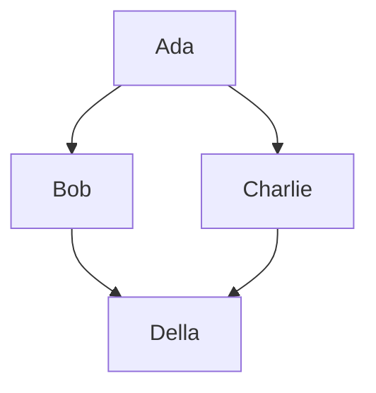
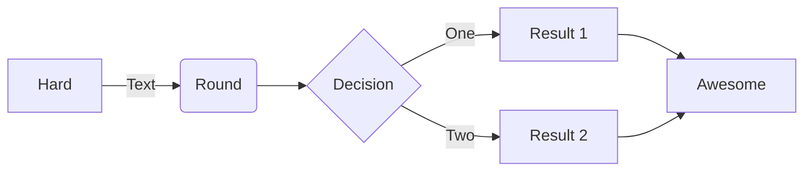
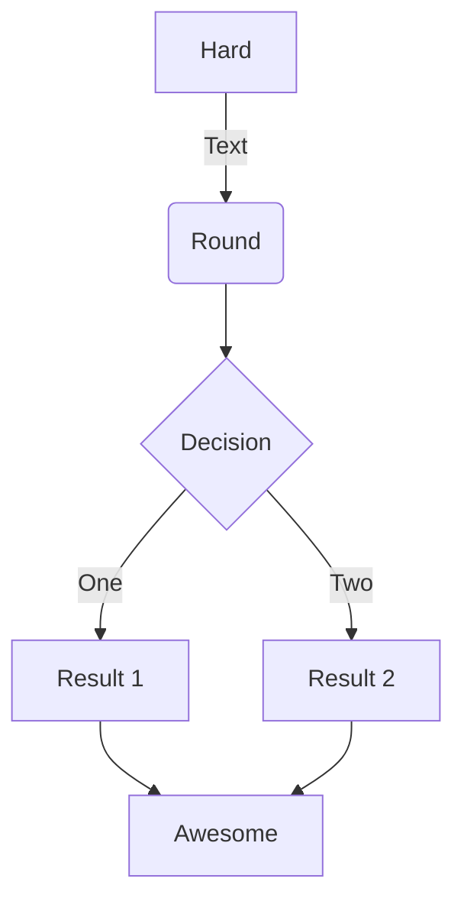
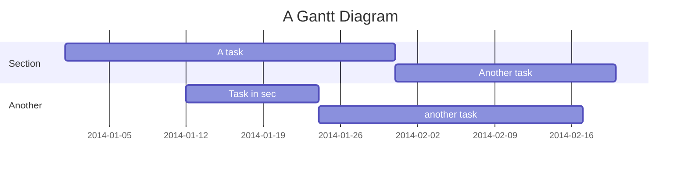

# Mermaid.js







```mermaid
    sequenceDiagram LR;
        Alice->>+John: Hello John, how are you?;
        Alice->>+John: John, can you hear me?;
        John-->>-Alice: Hi Alice, I can hear you!;
        John-->>-Alice: I feel great!;
```

```mermaid
    classDiagram TD;
        Class01 <|-- AveryLongClass : Cool
        Class03 *-- Class04
        Class05 o-- Class06
        Class07 .. Class08
        Class09 --> C2 : Where am i?
        Class09 --* C3
        Class09 --|> Class07
        Class07 : equals()
        Class07 : Object[] elementData
        Class01 : size()
        Class01 : int chimp
        Class01 : int gorilla
        Class08 <--> C2: Cool label
```

