# Hello PacketTracer

How to set up and create a simple network on packet tracer

**original author:** [carteras](https://github.com/carteras)

<!-- add a new author mark if you updated this -->

## Topics covered

"At the end of this recipe, you will be able to answer the following questions or solve the following problems"

<!-- why should people expect to be able to do or know after doing this recipe -->

* What is Packet Tracer?
* How can you set up a simple Local Area Network?

### Third party resources

<!-- Are there other locations where they can find this information? -->

* [CISCO network academy](https://www.netacad.com) or [CISCO Skills for all](https://skillsforall.com/)
* [How to use packet tracer](https://www.netacad.com/portal/resources/packet-tracer)
* resource
* resource

## Topics

### Introduction

<!-- Introduce the topic, what is it, how does it work, include pictures -->

Packet Tracer is a networking simulation tool which allows you to set up, configure, maintain, and troubleshoot, networking machines.

## Worked Examples

<!-- Provide some basic worked examples that let people follow your worked examples. If it's a library, don't forget to tell people how to install it -->

### Signing into Packet Tracer

You will need to sign up with either network academy or skills for all. My account is with network academy, but IIRC, we had problems with this last semester. If this doesn't work try Skills for All. (I don't have the login details for SFA so you will have to use your imagination). Remember to use your school gmail and provide as few details as possible.

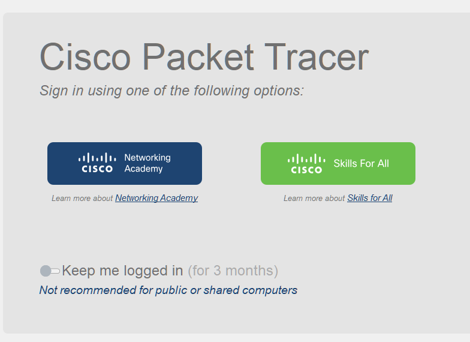

Note: Do not flag the "Keep me logged in for 3 months" unless you are doing it on your personal computer.

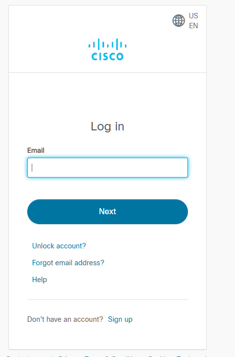

Add in whatever details you used to sign up for SFA or NA

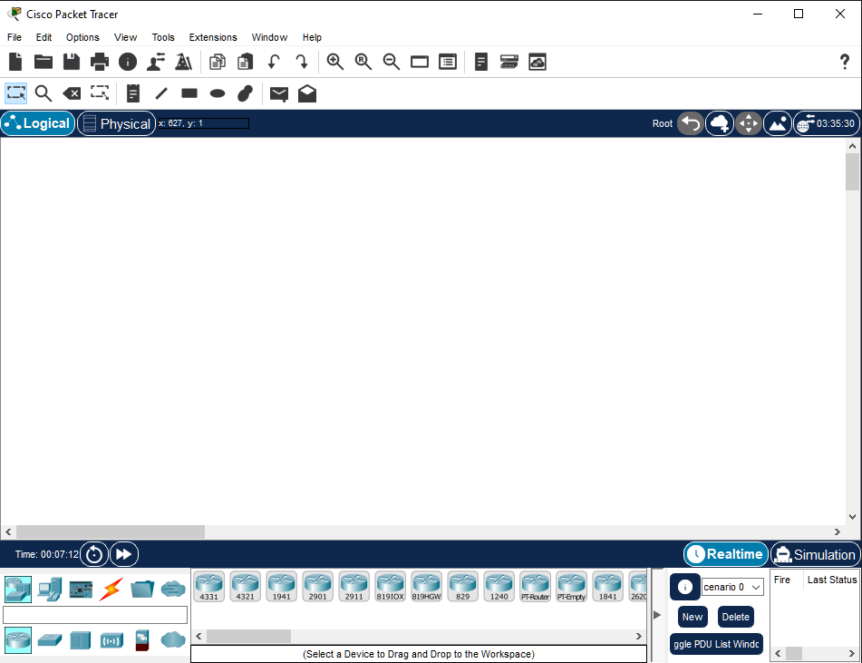

When you've signed in, you should be able to see the Packet Tracer application. 

---

### Adding components to the environment

By default, packet tracer starts in selection mode. It's the symbol on the left hand side of the second row of menu icons

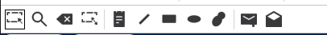

Components are found on the bottom of the interface:

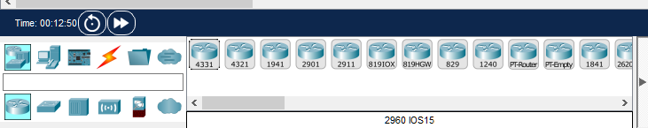

To add a component. Click on a router (say the 4331) and plop it onto the environment.

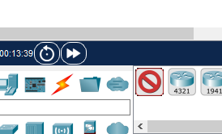

To plop it on the environment, just left click somewhere.

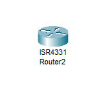

### Removing components from the environment

To remove a component, you need to select the delete icon (or press the del button)

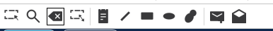

Now, left click on the component that you want to delete.

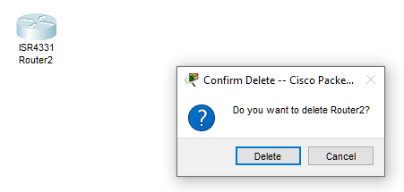

### Connecting two components

Place the following components to the environment.

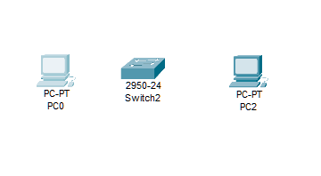

Note: the switch can be found under to the right of `Network Devices`
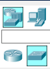

At the bottom of the screen  you can see the connections panel. Click on `copper straight through`. 

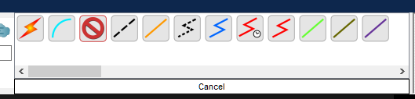

Click on PC1 and then click `FastEthernet0`

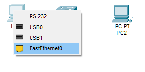

Move the mouse over to the Switch

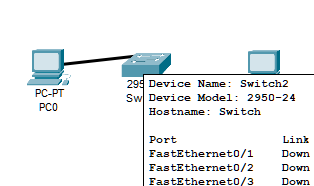

Click on the switch and select `FastEthernet0/1`

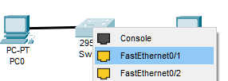

You should now see that we have a partial connection between the PC and the Switch

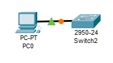

What's happening here? 

Well, we are simulating plugging a network cable into a PC and putting it into the switch. We can see a visualization of this by clicking on the PC. You can see a picture of the PC that we are simulating. 

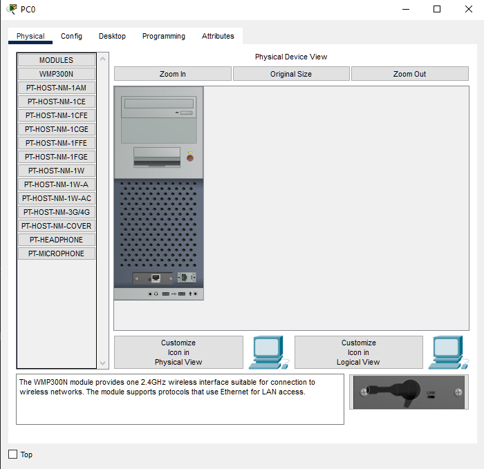

We can also do this for the switch. Notice how it has 24 ports? 

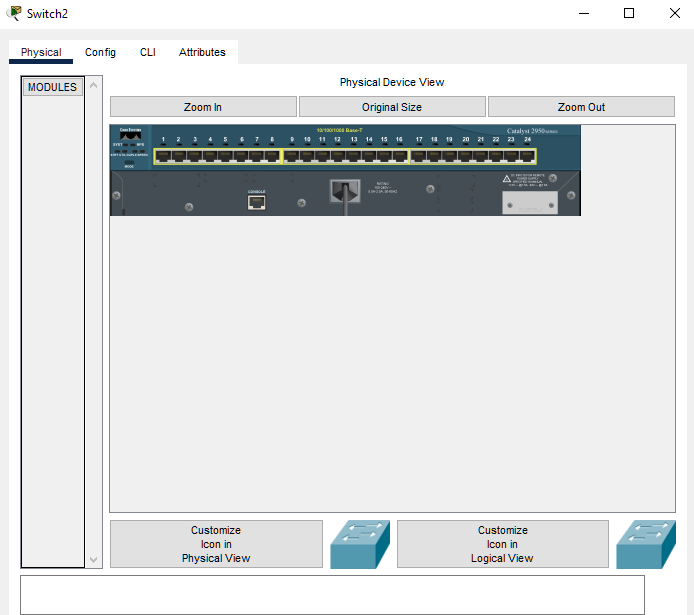

## Practice Questions

<!-- Provide some basic practice questions that let people follow your worked examples.  -->

### Simple Network

Components needed:

* 2950-24 switch x1
* PC x2

Place the required components onto the environment and connect them with `copper straight through` cables.

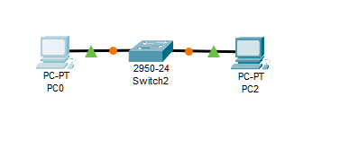

* Click on PC0
* Click on Config | Settings (this should be default)
* Click into the display name and name it `My Computer` 

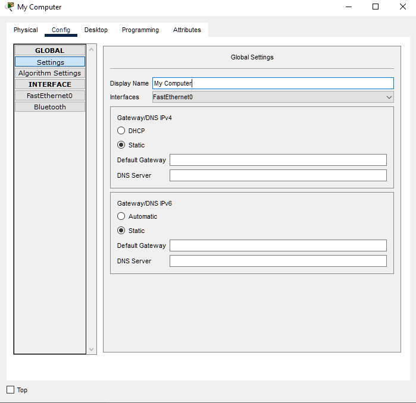

* Click on `FastEthernet0`
* Click into IPv4 and change the IP number to `192.168.0.2`
* Click into the subnet mask. it should automatically change to `255.255.255.0`

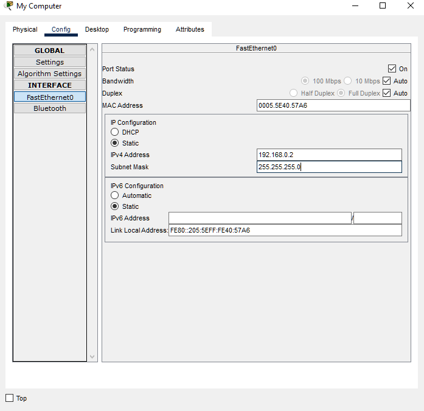

Configure the second computer to the following specifications:

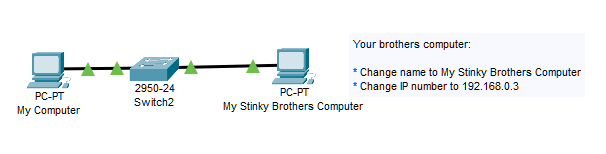

* Click on your computer
* Click onto Command Prompt

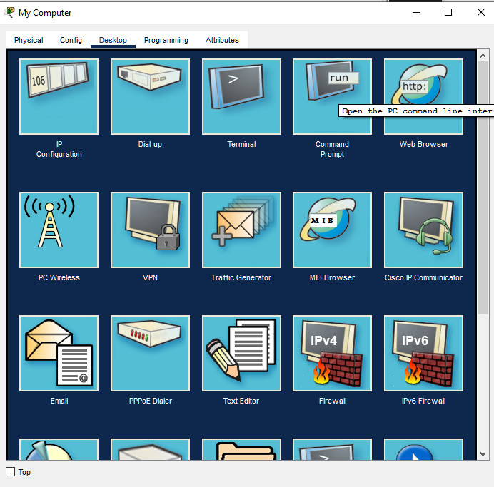

In the command prompt: 

* Type `ipconfig` and press enter
* type `ping 192.168.0.2` and press enter
* type `ping 192.168.0.3` and press enter

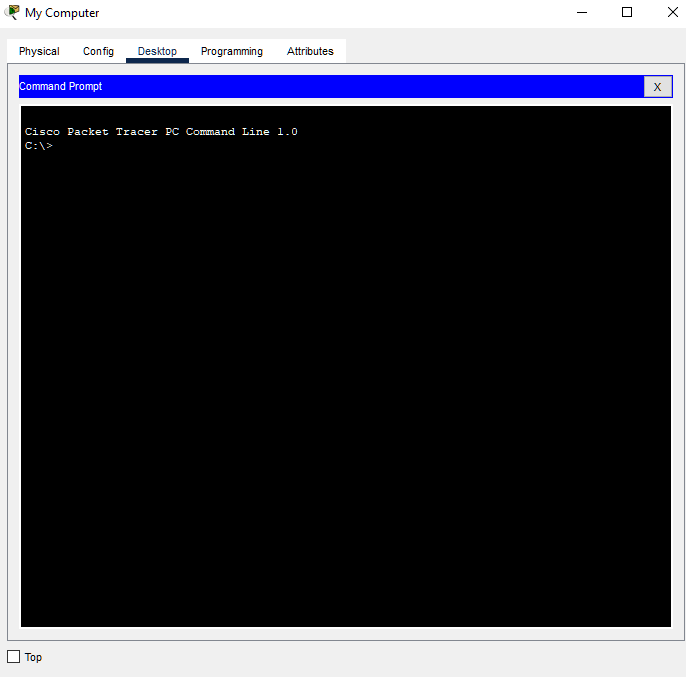

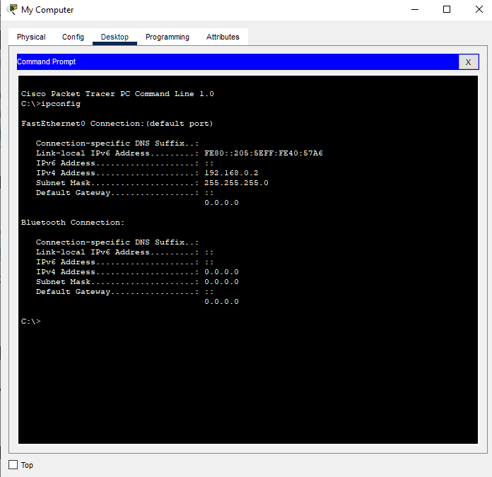

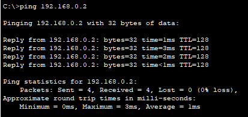

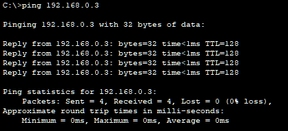

## Challenge

<!-- Make up a challenge question which asks people to use all of their knowledge they just learned (and maybe some prior learning) to solve -->

Challenge, create the following network to the following specifications

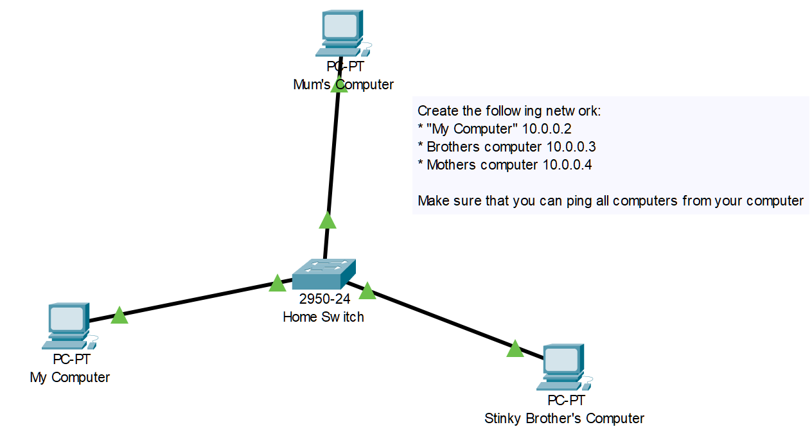

When you're done, flag me so we can check it. 

Make sure you: 

* Save the file
* Upload it to your google drive (somewhere safe for future reference)
* delete the save from the local computer
* sign out of packet tracer.
