# Wireless Home Networking

This recipe will help configure a home network that allows for wireless and fixed devices.

**original author:** [someone](https://github.com/someone)

<!-- add a new author mark if you updated this -->

## Topics covered

"At the end of this recipe, you will be able to answer the following questions or solve the following problems"

<!-- why should people expect to be able to do or know after doing this recipe -->

* In everyday terms, what does a router do?
* What does DHCP mean?
* In every day terms, how does DHCP work?
* How to build the following network 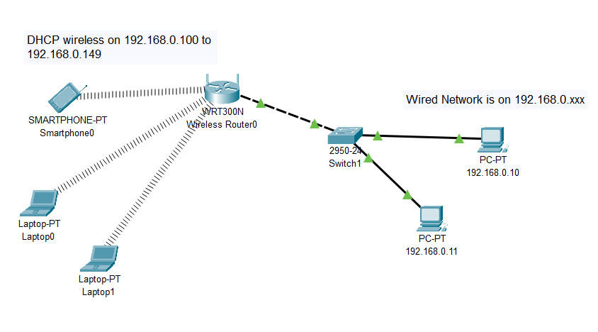

### Things you'll need to know before you start this

<!-- what should they know before learning it -->

* Hello Packet Tracer

### Third party resources

<!-- Are there other locations where they can find this information? -->

* [What is DCHP?](https://www.infoblox.com/glossary/dhcp-server/)
* [How does DCHP work?](https://www.youtube.com/watch?v=S43CFcpOZSI)

## Topics

### Introduction

<!-- Introduce the topic, what is it, how does it work, include pictures -->

Download the start of this project from here: [wireless home Network](https://github.com/carteras/IT-CBR/tree/main/cookbook/networking/packettracer/home%20wireless)
or build the network manually:

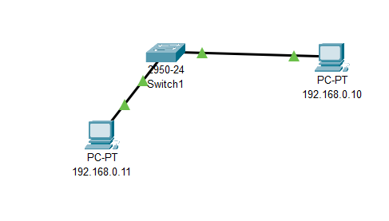

## Worked Examples

<!-- Provide some basic worked examples that let people follow your worked examples. If it's a library, don't forget to tell people how to install it -->

First we need to start with a wireless Router. This router will allow us to connect our wireless networks with our physical networks. This particular Router can also connect to DSL Modems to connect us to the internet.

We select `Networked Devices` and then select `Wireless devices`

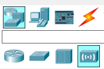

We're going to use the WRT300N router. In most home networks, this would probably act as both your switch, router, and gateway to your ISP. 

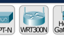

Let's connect it to the network. Make sure you use a crossover cable. Note: at some point I made a mistake in previous versions of this document. So if you see a straight through connection, remember to make sure you are using a cross over here. 

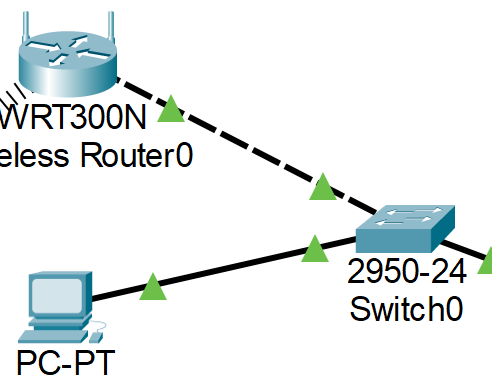

Click on the Router and click config. Make sure that it is set up to be `192.168.0.1` with a subnet of `255.255.255.0`. 

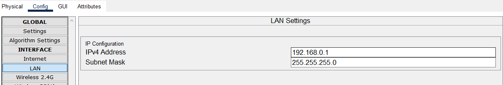

Click on Wireless 2.4G and set the encryption mode to WPA2.PSK and change the Passphrase to Password (or whatever). Do the same for 5g1, and 5g2. 

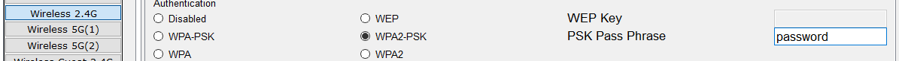

Click into the GUI mode and check it out. 

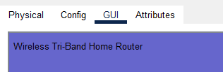

We can also configure the wireless router's IP address here. This is emulating what a normal home router interface looks like. 

Make sure it's still the correct IP/Subnet mask 

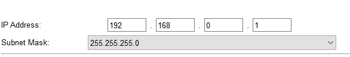

Just below that is the DHCP server. DHCP dynamically allocates IP addresses to machines. In this case, the only machines it knows about will be wireless devices. 

Make sure that you start the IP address above the fixed lan address. By default, it chooses 100 and has a maximum of 50 dynamic IP address. 

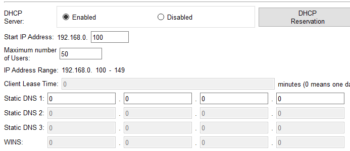

Let's add a laptop. Go to `End Devices` and `End Devices` and then click a Laptop

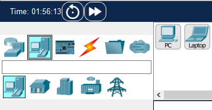

Plot it into our simulated environment. 

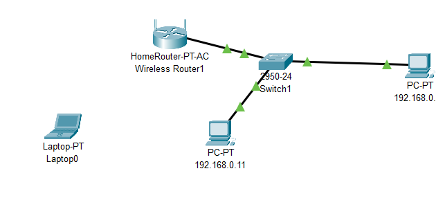

Turn the Laptop off. 

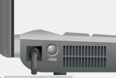

Click and drag the Ethernet Module out of the Laptop. 

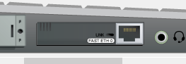

Now it's empty.

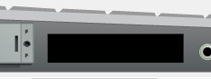

Find a wireless adapter over on the left. 

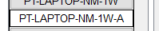

Click and drag it into the hole you made before. 

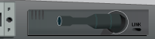

Turn the power back on

Click on the device and go to Wireless0 Interface. Click on WPA2-PSK and change the PassPhrase to whatever your passphrase was (I used `password`)

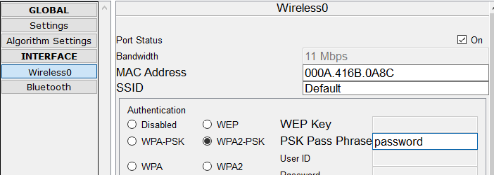

## Practice Questions

<!-- Provide some basic practice questions that let people follow your worked examples.  -->

Add a second Wireless Laptop to the mix. Make sure that you can ping everything. 

## Challenge

<!-- Make up a challenge question which asks people to use all of their knowledge they just learnt (and maybe some prior learning) to solve -->

Let's add a mobile phone to the network. 

