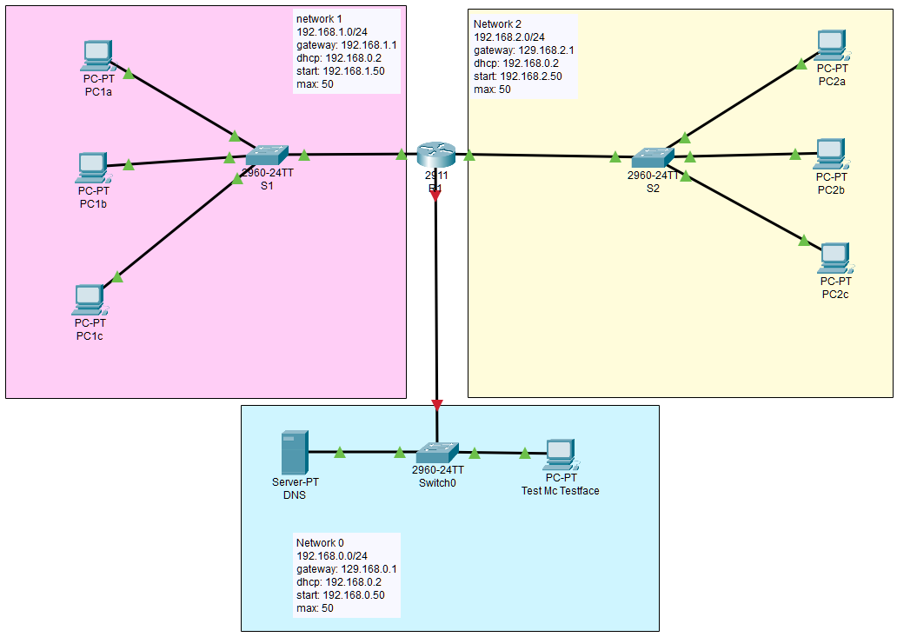
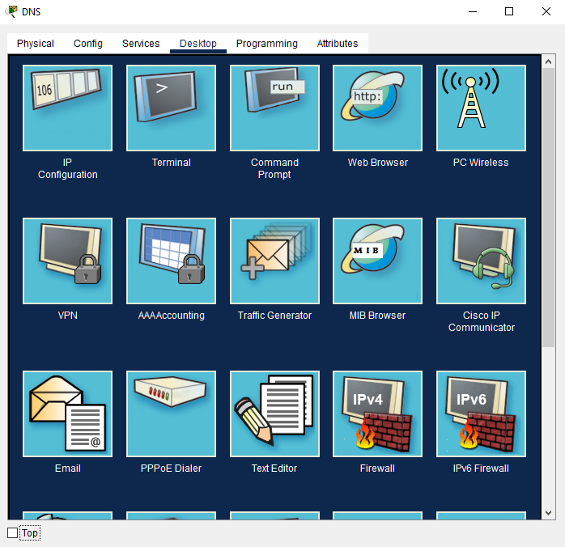
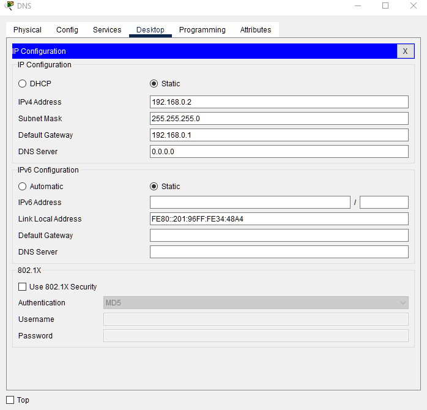
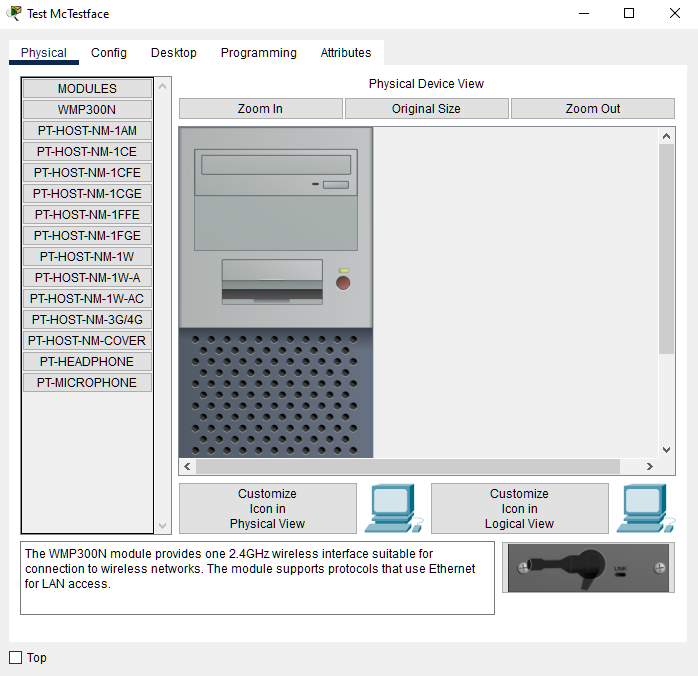
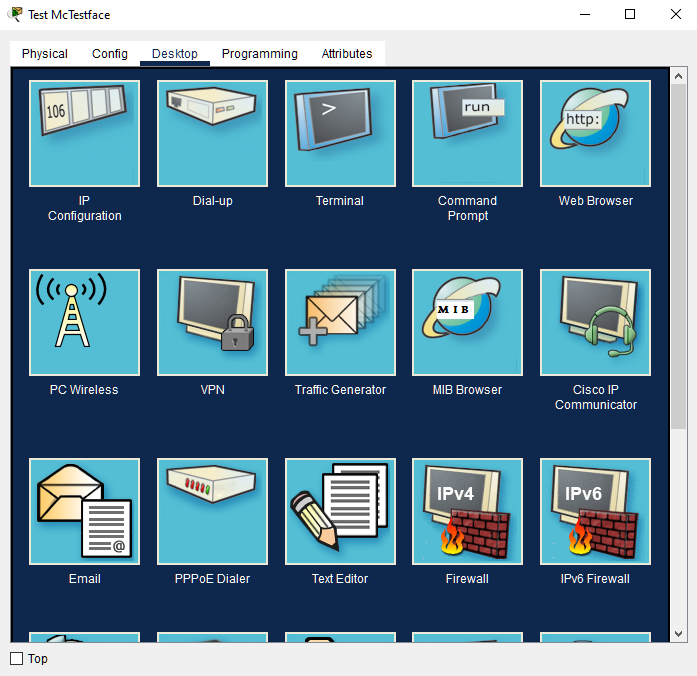
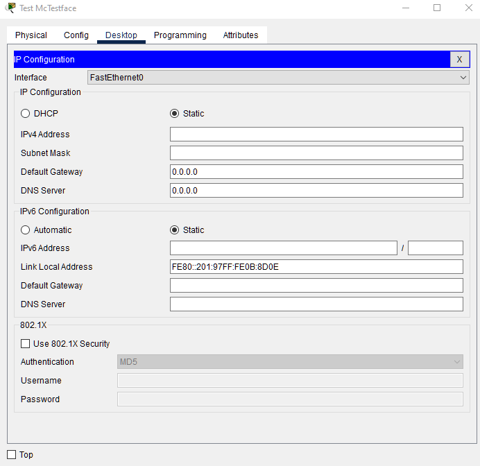
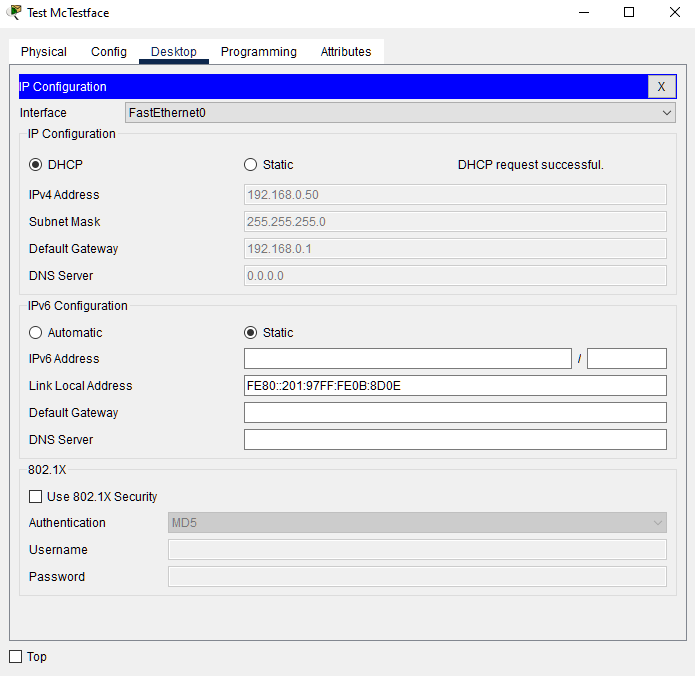
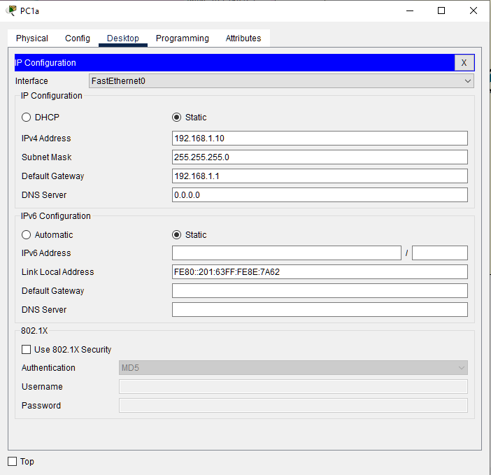
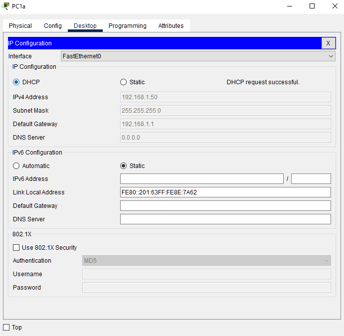

# DCHP for multiple subnets

How do we use a single DHCP server for multiple subnets? 

**original author:** [someone](https://github.com/someone)

<!-- add a new author mark if you updated this -->

## Topics covered

"At the end of this recipe, you will be able to answer the following questions or solve the following problems"

<!-- why should people expect to be able to do or know after doing this recipe -->

* How do we configure a router to help PDU packets find their destination in other subnets?

### Things you'll need to know before you start this

<!-- what should they know before learning it -->

* What is `ip helper-address`?
* Why do we need `iphelper-address`?

### Third party resources

<!-- Are there other locations where they can find this information? -->

* resource
* resource
* resource

## Topics

### Introduction

<!-- Introduce the topic, what is it, how does it work, include pictures -->

We have the following Networks:



Network 0: 
* subnet: 192.168.0.0/24
* gateway: 192.168.0.1
* DHCP: 192.168.0.2
* DHCP Start: 192.168.0.50
* DHCP Clients: 50

Network 1: 
* subnet: 192.168.1.0/24
* gateway: 192.168.1.1
* DHCP: 192.168.0.2
* DHCP Start: 192.168.1.50
* DHCP Clients: 50

Network 2: 
* subnet: 192.168.2.0/24
* gateway: 192.168.2.1
* DHCP: 192.168.0.2
* DHCP Start: 192.168.2.50
* DHCP Clients: 50

## Worked Examples

<!-- Provide some basic worked examples that let people follow your worked examples. If it's a library, don't forget to tell people how to install it -->

### Configure DHCP Server

Open the DNS server


Click on Desktop



Open IP Configuration



Click on services

Click on DHCP

Create three DHCP Pools - one for each network.


### Test McTestface

Open Test McTestface



Open Desktop



Open IP Configuration




Set DHCP



Check to see if the IP address is what you expect. 

Go back to the desktop and into Command Prompt and type `ipconfig`

```bash
C:\>ipconfig

FastEthernet0 Connection:(default port)

   Connection-specific DNS Suffix..: 
   Link-local IPv6 Address.........: FE80::201:97FF:FE0B:8D0E
   IPv6 Address....................: ::
   IPv4 Address....................: 192.168.0.50
   Subnet Mask.....................: 255.255.255.0
   Default Gateway.................: ::
                                     192.168.0.1

Bluetooth Connection:

   Connection-specific DNS Suffix..: 
   Link-local IPv6 Address.........: ::
   IPv6 Address....................: ::
   IPv4 Address....................: 0.0.0.0
   Subnet Mask.....................: 0.0.0.0
   Default Gateway.................: ::
                                     0.0.0.0
```

ping yourself 

```bash
C:\>ping 192.168.0.50

Pinging 192.168.0.50 with 32 bytes of data:

Reply from 192.168.0.50: bytes=32 time<1ms TTL=128
Reply from 192.168.0.50: bytes=32 time=3ms TTL=128
Reply from 192.168.0.50: bytes=32 time=1ms TTL=128
Reply from 192.168.0.50: bytes=32 time=3ms TTL=128

Ping statistics for 192.168.0.50:
    Packets: Sent = 4, Received = 4, Lost = 0 (0% loss),
Approximate round trip times in milli-seconds:
    Minimum = 0ms, Maximum = 3ms, Average = 1ms
```

Ping the DHCP server

```bash
C:\>ping 192.168.0.2

Pinging 192.168.0.2 with 32 bytes of data:

Reply from 192.168.0.2: bytes=32 time<1ms TTL=128
Reply from 192.168.0.2: bytes=32 time<1ms TTL=128
Reply from 192.168.0.2: bytes=32 time<1ms TTL=128
Reply from 192.168.0.2: bytes=32 time<1ms TTL=128

Ping statistics for 192.168.0.2:
    Packets: Sent = 4, Received = 4, Lost = 0 (0% loss),
Approximate round trip times in milli-seconds:
    Minimum = 0ms, Maximum = 0ms, Average = 0ms
```

### Configure R1 to work for Network 0

NOTE: You may be required to enable all three networks. 

Open R1 and go to CLI. 

```bash
Router>enable
Router#configure terminal
Enter configuration commands, one per line.  End with CNTL/Z.
Router(config)#interface g0/1
Router(config-if)#ip address 192.168.0.1 255.255.255.0
Router(config-if)#no shutdown

Router(config-if)#
%LINK-5-CHANGED: Interface GigabitEthernet0/1, changed state to up

%LINEPROTO-5-UPDOWN: Line protocol on Interface GigabitEthernet0/1, changed state to up
end
Router#
%SYS-5-CONFIG_I: Configured from console by console

Router#show ip interface brief
Interface              IP-Address      OK? Method Status                Protocol 
GigabitEthernet0/0     192.168.1.1     YES manual up                    up 
GigabitEthernet0/1     192.168.0.1     YES manual up                    up 
GigabitEthernet0/2     192.168.2.1     YES manual up                    up 
Vlan1                  unassigned      YES unset  administratively down down
```

### ip helper 

```bash
Router#configure terminal
Enter configuration commands, one per line.  End with CNTL/Z.
Router(config)#interface g0/0
Router(config-if)#ip ?
  access-group     Specify access control for packets
  address          Set the IP address of an interface
  authentication   authentication subcommands
  flow             NetFlow Related commands
  hello-interval   Configures IP-EIGRP hello interval
  helper-address   Specify a destination address for UDP broadcasts
  mtu              Set IP Maximum Transmission Unit
  nat              NAT interface commands
  ospf             OSPF interface commands
  proxy-arp        Enable proxy ARP
  split-horizon    Perform split horizon
  summary-address  Perform address summarization
Router(config-if)#ip helper-address 192.168.0.2
```

### Configure PC1a to DHCP 

We are now ready to start enabling DHCP for one of our subnets. Go to PC1a and open up the IP Configuration panel. 



Change IP Configuration from static to DHCP. 

If it fails, give it a second and try again. 




## Practice Questions

<!-- Provide some basic practice questions that let people follow your worked examples.  -->

Configure all of Network 1 and Network 2 to work with DHCP. 

## Unit Test

<!-- Make up a challenge question which asks people to use all of their knowledge they just learnt (and maybe some prior learning) to solve -->


Do all 6 (7) of your PCs allocate to the correct IP address? 
