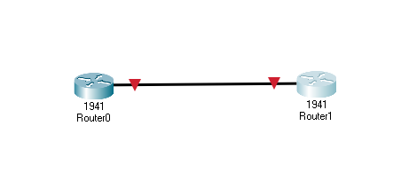
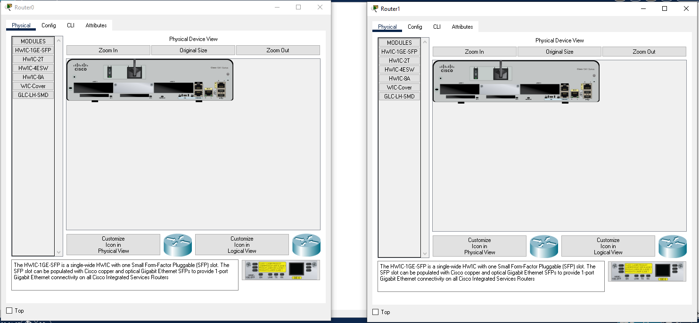
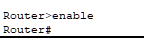
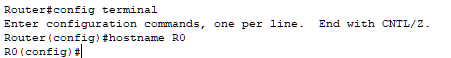
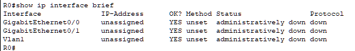
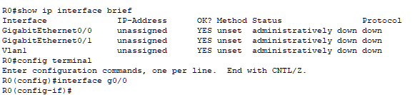
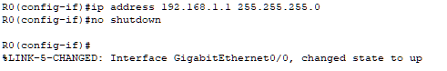
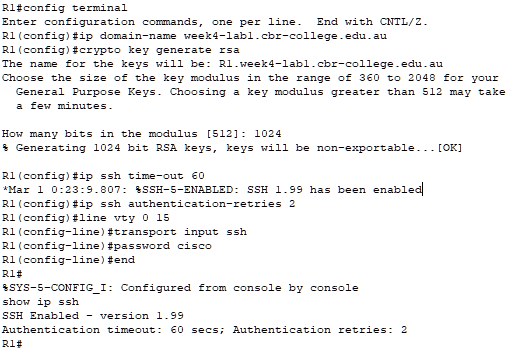
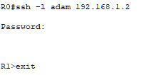
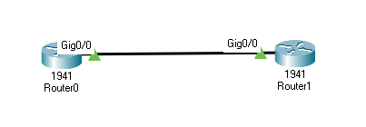

# Configuring SSH

## Topics

### Terminology 

General Terms: 

* CLI - Command line interface
* SSH - Secure Shell : A network protocol that gives uses a secure way to communicate over a network
* The VTY lines are the Virtual Terminal lines of the router, used solely to control inbound Telnet connections. They are virtual, in the sense that they are a function of software - there is no hardware associated with them. 

Device Modes:

* User EXEC Device>
* Privileged EXEC Device#
* Global Config Device­(co­nfig)#
* Interface Config Device­(co­nfi­g-if)#
* Line Config Device­(co­nfi­g-line)

Handy Keyboard Shortcuts

* Up Arrow Automatically re-types last command
* Ctrl+Shift+6 Oh crap, stop! (Cancels whatever it's currently doing)
* Ctrl+C Exits config mode
* Ctrl+Z Applies current command & returns to priv. EXEC mode 
* Ctrl+U Erases anything on current prompt line
* Tab Completes abbreviated command

Show Commands

* show ip interface brief name, IP, status, etc. (all interf­aces)

General Commands 

* en enable user EXEC > priv. EXEC
* conf t config terminal priv. EXEC > global config
* int inter­face global config > interface config

Router Configuration 

* hostname xyz sets hostname to xyz
* line vty 0 15 - enters line config mode for 16 virtual terminal lines 
* ip address [ip] [subnet] - sets an IP address
* no shut - turns on interface

### Lab1 - SSH between two switches

Put two routers onto the deck. It shouldn't matter which kind of routers you pick but I chose 1941

Open both views so they are side by side. 

Open the CLI mode for Router 1. We will be using CLI to configure everything. 

When you open the CLI mode you will see the router booting. It will end with the following statement. 

`Would you like to enter the initial configuration dialog? [yes/no]:`

Say no

By default we start in User EXEC mode. We want to move our permissions to Privileged EXEC mode. We can do this by typing `enable`

Then, we want enter into configuration mode we can type `config terminal` to enter Global Config mode. We will know that we are in config mode because the interface will start with a `#` instead of a `>`

We want to change the hostname from Router 0 to R0. To change the hostname we can do it by typing `hostname R0`

end configuration by typing `end`

### Configuring the link

The next thing we want to do is get our router ready to to work on the network. Let's see if our connections are up or down. 

`show ip interface brief`

Shows all the internet protocol interfaces in a brief format. 

Here we can see that all of our interfaces are down. 

We want to turn the interface that we have plugged in on. 

Go back into config mode with `config terminal`

Now, let's choose an interface. I am going to choose the gigabyte connection 0/0. To do this, I type `interface g0/0`

Notice how our terminal window is now headed with `R0(config-if)#`? That's how you know you are configuring an interface. 

Let's pick an IP address. 

I am going to type   
`ip address 192.168.1.1 255.255.255.0`

Now, I will bring the link up

`no shutdown`

Cisco should tell you that the Interface for g0/0 has changed stated to up. 

### The second router! 

Do the same as above, but for Router 1. Change it's name to R1. R1 will have an IP number of 192.168.1.2 and a subnet of 255.255.255.0

### Testing the connection

Once both machines are configured. Pick one and end out of `config-if` and `config`. To This will leave you in enable mode. You should be left with `R0#` (or `R1#`)

Let's see if we have configured the machines appropriately. We can do this by pinging the other machine. Because I am on R0, I will need to ping the address of R1 

`ping 192.168.1.2` 

If it works you should see something like this: 

`Sending 5, 100-byte ICMP Echos to 192.168.1.2, timeout is 2 seconds: .!!!!`

`Success rate is 80 percent (4/5), round-trip min/avg/max = 0/0/0 ms`

The first packet was dropped as the new address was unknown to it. Try it again. 

### Configuring SSH

Go to R1 and configure the terminal `configure terminal`

#### Configuring RSA security 

Let's set up a domain name. I'm doing this so we can create an RSA key. Not because we have domain name services set up.

`ip domain-name week6-router.cbrc`

Configure an RSA key for R1 by typing 

`crypto key generate rsa`

And when prompted, use `1024`

#### Configure SSH connections

Because we want to terminate connections that take to long, let's put a cap at 60 seconds

`ip ssh time-out 60`

Now we can limit the number authentication requests 

`ip ssh authentication-retries 2`

Let's make all virtual terminal lines have the same configuration

`line vty 0 15`

Now we will tell our vty lines that we can only accept SSH connections (as opposed to clear net telnet connections)

`transport input ssh`

Set a password. 

`password cisco`

### SSHing from one device to another. 

Go over to R0 and in the enabled view type 

`ssh -l some_name 192.168.1.2`

You should be presented with a terminal prompt of `R1>` meaning that you can now configure the terminal of R1 from R0. 

Final view

### What's next? 

Create your own "recipe" for a cookbook to help solve the various concepts that we've encountered today. At the very least, you should create "recipes" for one of the following problems (preferably one that is interesting or that you think you'll need future help on): 

* The different Modes
* How to see the status of all IP interfaces
* How to turn on and off a interface
* How to set the IP and sub net of an interface
* How to set the hostname of an interface
* How to configure SSH
* How to SSH from one device to another

### Hey, you also encountered some new terms! 

You should probably look them up. 

1. What exactly is a VTY?
2. Why did we call interface g0/0? 
3. Why do we use the command `no shutdown`
4. What is RSA?
5. Why would we use 1024 and not 512 for our crypo key?
6. What does `ip ssh time-out 60` mean?
7. What does `ip ssh authentication-retries 2` mean?
8. What does `transport input ssh` mean?

#### What's a cookbook?

A cookbook in the programming/networking context is collection of tiny programs that each demonstrate a particular programming concept. The Cookbook Method is the process of learning a programming language by building up a repository of small programs that implement specific programming concepts.

BENEFITS OF BUILDING YOUR OWN COOKBOOK

* You can share it with others
* Learn topics that are interesting to you
* You build up your knowledge in small increments
* You can see your progress over time
* You have a library of reference material in your own style.
* It is quicker than looking up documentation or looking for a Stack Overflow answer.
* Explore new topics

### What can I use to make my cookbook?

I recommend Notepad and use Markdown notation

https://www.markdownguide.org/basic-syntax/

### How big should my recipe be?

Not very big. Just enough to prompt you in the future and help you understand why you need to do somethings at some points.
