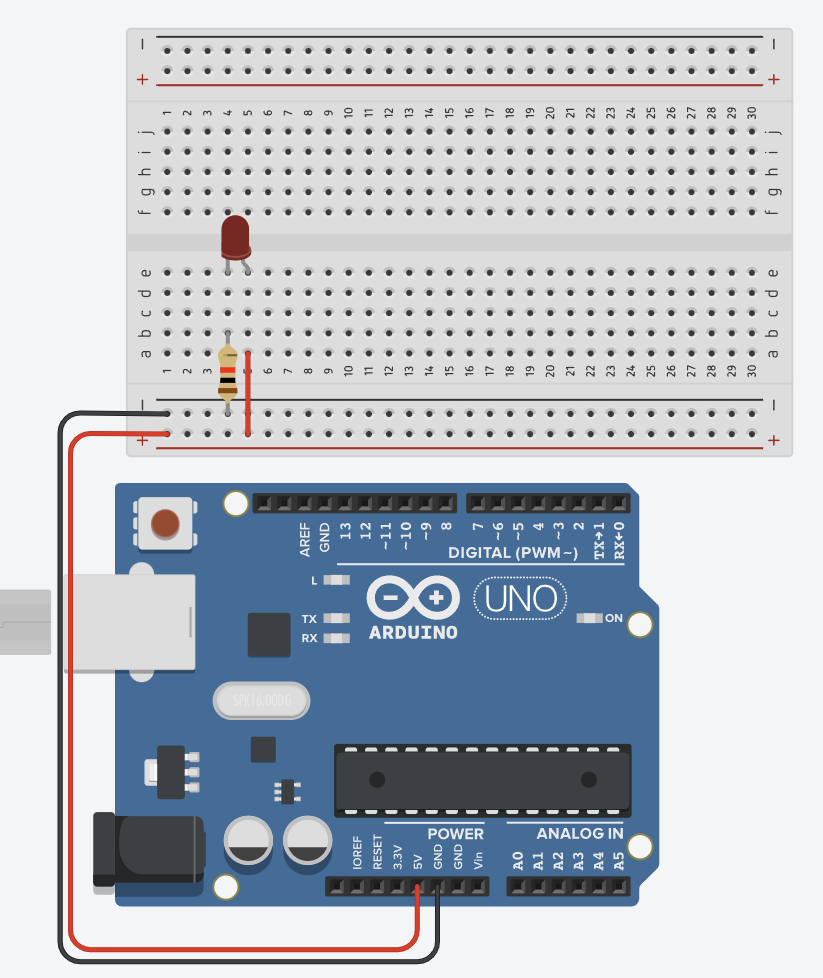
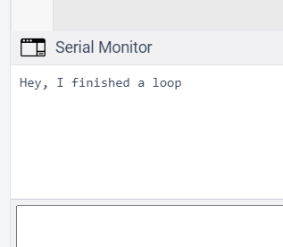
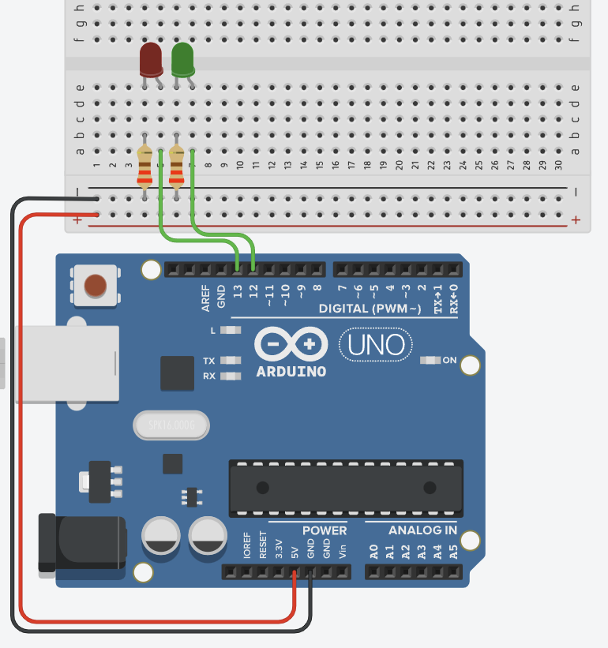

# Hello Arduino 

### Learning Goals

*By the end of this module you should be able to answer the following:*

* What is a microcontroller?
* What is an Arduino?
* What are some basic keywords in Arduino and what do they do? 
* How can you use basic terms to build a simple program? 

### Dictionary Corner

*To be able to answer a question, you need to be able to understand it. Pay special attention to Dictionary Corner because it arms you with the language to express yourself in this space.*

#### Code:

Go to the [Arduino Reference](https://www.arduino.cc/reference/en/) and use that as a reference for the following terms. Create a google doc that has the term and a summary of what the term does (and maybe an example). 

This might seem/be super boring but understanding the language of programming will make building cool robot stuff much easier. 

* Digital Pins (haha, not on the reference. But [can be found here](https://www.arduino.cc/en/Tutorial/Foundations/DigitalPins))
* pinMode
* LED_BUILTIN
* OUTPUT, INPUT
* digitalWrite
* digitalRead
* HIGH, LOW 
* millis()
* delay
* setup()
* loop() 
* if, else, else if
* // ,/* … */
* *, /, +, -
* !=, <, >, <=, >=, ==
* int, long, double, float
* What does the % operator do? (super important, you'll need it today) 
* What is the difference between = and ==
* What do {} mean?
* What is ;
* Serial
* Serial.print(), Serial.println()
* LED_BUILTIN 


## Lessons

### What is Arduino?

Arduino is an open-source electronics prototyping platform based on flexible, easy-to-use, hardware and software. It is intended for artists, designers, hobbyists, and anyone interested in creating interactive objects or developing in environmental spaces. 

Arduinos can sense their environment by receiving inputs from sensors and interact with the environment by controlling lights, motors, or other actuators. The Arduino integrated development environment (IDE) is a cross-platform application written in Java and is derived from the IDE for the Processing programming language and wiring projects. It can run independently and communicate with other software such as Flash, Processing, MaxMSP
and more. Arduino IDE is open source so you can download and share thousands of interactive projects for free!

Here are some Arduino Projects to help give you an idea of tasks that it can complete: 

* Make sound notifications when coffee is done
* Email notifications via mobile
* Blinking fluffy toy
* Professor X’s steampunk wheelchair with voice recognition and drink serving function
* A Star Wars arm gun
* A pulse monitor to store data when cycling
* A robot that can run in the snow and draw pictures on the floor. 

Arduino UNO
Now let’s take a close look at the Arduino micro-controller and try to locate I/O ports (input/output) and onboard LEDs.
I/O Pins, digital pins 0 - 13, analog pins 0 - 5
3 power sources, 5v via USB, 6v-12v power supply, and a Voltage in on the red pins on the bottom of the Arduino
4 LEDs and a reset button. The L is on the onboard LED that connects with digital pin 13, TX and RX are indicators of the transmission signal and receiving signals. When we download sketches to the Arduino these lights blink indicating that data is being transmitted. 

[Arduino Uno r3](https://content.arduino.cc/assets/Pinout-UNOrev3_latest.png)


### Hello world (electronics style!)

Consider the following diagram. 



Things to take notice: 

* It is a complete circuit. That is, we supply power from Pin 13 and we can trace a line all the way back to ground. 
* All circuits must have access to all grounds that they are connected to.
* Why do you think I used that terminology in the last dot point? 

TinkerCad adds the code for us (and we should know how to make C++ code already) and here it is. 

```cpp
void setup()
{
  pinMode(LED_BUILTIN, OUTPUT);
}

void loop()
{
  digitalWrite(LED_BUILTIN, HIGH);
  delay(1000); // Wait for 1000 millisecond(s)
  digitalWrite(LED_BUILTIN, LOW);
  delay(1000); // Wait for 1000 millisecond(s)
}
```

What's happening here? 

* `void setup()` is fired once when the board loads. We use it to set up the board so it will work for our stuff.
* `void loop()` happens over and over again forever as fast as possible.

### Serial printing

One of the tools we use to understand our code when programming in other environments is printing to standard output. This is a bit weird on Arudino because we need to tell the Arduino to tell our computer what is going on. We do this with the Serial Library. (That's what the S in USB means)

We can initialize the Serial connection using the following command `Serial.begin(speed)`. The speed can be any of these: 75, 110, 300, 1200, 2400, 4800, 9600, 19200, 38400, 57600 and 115200

```cpp
void setup()
{
  pinMode(LED_BUILTIN, OUTPUT);
  Serial.begin(115200);  // <-------- I set up the serial connection here 
}

void loop()
{
  digitalWrite(LED_BUILTIN, HIGH);
  delay(1000); 
  digitalWrite(LED_BUILTIN, LOW);
  delay(1000); 
  Serial.println("Hey, I finished a loop");
}
```
If you press in `start simulation` you might be wondering where your beautiful text is! It's down here. 



If you click the serial monitor you can see what it is printing. 

### if / else 

Let's make a program that only prints every other second. 

Things we need to do: 

* Capture time
* store it
* test to see if it meets some condition

We can use millis() to capture time. Let's smash that into the loop. 

```csharp
void setup()
{
  pinMode(LED_BUILTIN, OUTPUT);
  Serial.begin(115200);
}

void loop()
{
  Serial.println(millis());
}
```

Run that code. See how the millis() acts like a number for Serial.println()? Pretty cool, hey. 

But we also need to store that time. I know that that the number millis() returns is an `unsigned long`. I know this because I read the reference. You should read it too. 

What is an unsigned long? An unsigned long is basically using the memory space of a long number (4 bytes) to represent only positive numbers. A long allows for minus signs (signed long) so half of the possible numbers are going to be negative. Clever, right? 

Anyway, we can store time from `millis()` as an unsigned long (or even a long in this case). 

```cpp
unsigned long currentTime;
void setup()
{
  pinMode(LED_BUILTIN, OUTPUT);
  Serial.begin(115200);
}

void loop()
{
  currentTime = millis();
  Serial.println(currentTime);
}
```

Right, now we can test to see if it meets some condition with an if statement. I'm just going to pick a number. If the time in milliseconds is above that number the BUILTIN_LED will turn on

```cpp
unsigned long currentTime;
void setup()
{
  pinMode(LED_BUILTIN, OUTPUT);
  Serial.begin(115200);
}

void loop()
{
  currentTime = millis();
  Serial.println(currentTime);
  if (currentTime > 100){
    digitalWrite(LED_BUILTIN, HIGH);
  } else {
    digitalWrite(LED_BUILTIN, LOW);
  }
}
```

Right, let's make it so that number is 1 second. There are 1,000 milliseconds in a second. 

```cpp
unsigned long currentTime;
void setup()
{
  pinMode(LED_BUILTIN, OUTPUT);
  Serial.begin(115200);
}

void loop()
{
  currentTime = millis();
  Serial.println(currentTime);
  if (currentTime > 1000){
    digitalWrite(LED_BUILTIN, HIGH);
  } else {
    digitalWrite(LED_BUILTIN, LOW);
  }
}
```

Awesome! 

How do we make it so it flashes on and off every other second? Well, we are going to need to use the [remainder operator](https://www.arduino.cc/reference/en/language/structure/arithmetic-operators/remainder/) %.  

tl;dr it works like this 

* 2 % 2 = 0 or 2 divided by 2 has a remainder of 0. 
* 3 % 2 = 1 or 3 divided by 2 has a remainder of 1.

So, with this, we can do something like this, right? 

```cpp
unsigned long currentTime;
void setup()
{
  pinMode(LED_BUILTIN, OUTPUT);
  Serial.begin(115200);
}

void loop()
{
  currentTime = millis();
  Serial.println(currentTime);
  if (currentTime % 1000 == 0){
    digitalWrite(LED_BUILTIN, HIGH);
  } else {
    digitalWrite(LED_BUILTIN, LOW);
  }
}
```

Almost, but not quite. currentTime will only be 1000 for 1 millisecond. We need to change the way we do things. Let's make a terrible conversion from milliseconds to seconds by dividing currentTime by 1000. 

This will give us a single digit number. We also need to only test if  a number is divisible by 2 and not 1000. I don't know where that 1000 came from. 

```cpp
unsigned long currentTime;
void setup()
{
  pinMode(LED_BUILTIN, OUTPUT);
  Serial.begin(115200);
}

void loop()
{
  currentTime = millis();
  Serial.println(currentTime);
  if (currentTime/1000 % 2 == 0){
    digitalWrite(LED_BUILTIN, HIGH);
  } else {
    digitalWrite(LED_BUILTIN, LOW);
  }
}
```

## Practice and Challenges

#### Challenge

Using the following circuit: 



Create a program that does the following. 

* If the `currentTime/1000` is 3 turn the red LED on and green LED off
* If the `currentTime/3000` is 5 turn the red LED off and green LED on
* If the `currentTime/1000` is 15 turn the red LED on and green LED on
* If the `currentTime/1000` is any other number, turn both LEDs off and print the currentTime/1000 to Serial.print. 

Bonus flex if you can do it in less than 30 lines of formatted code.