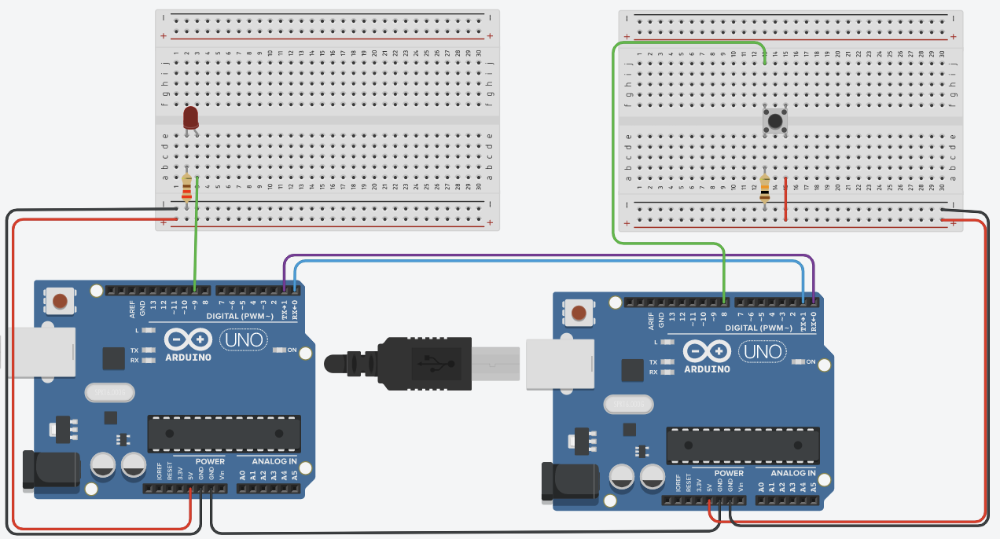

# Topic 

### Learning Goals

*By the end of this module you should be able to answer the following:*

* How to configure two Arduinos to communicate with each other over serial
* What are the pros and cons of this system? 

### Dictionary Corner

*To be able to answer a question, you need to be able to answer it. Pay special attention to Dictionary Corner because it arms you with the language to express yourself in this space.*

* Serial - https://www.arduino.cc/reference/en/language/functions/communication/serial/
* Serial.readBytes() - https://www.arduino.cc/reference/en/language/functions/communication/serial/readbytes/
* Serial.write() - https://www.arduino.cc/reference/en/language/functions/communication/serial/write/
* debouncing - https://www.arduino.cc/en/Tutorial/BuiltInExamples/Debounce
* strcmp(a, b) - https://www.tutorialspoint.com/c_standard_library/c_function_strcmp.htm
* for loops - https://www.arduino.cc/reference/en/language/structure/control-structure/for/
* arrays - https://www.arduino.cc/reference/en/language/variables/data-types/array/


## Setting up a serial connection between two Arduinos. 

We are going to configure two Arduinos to talk to each other via a serial connection. Create a TinkerCad -> Circuit that looks the same as this. 

* r1 - 220ohms (for LED)
* r2 - 10Kohms (for button)
* LED
* push button
* 2x Arduino Uno (or mega)



### Setting up the sender

Setting up the sender is, almost, ridiculously easy. We use the Serial library that we are already familiar with. Instead of `Serial.print` we instead use `Serial.write`

```cpp
char message[7] = "button";

int button = 8;
void setup()
{
  pinMode(13, OUTPUT);
  pinMode(button, INPUT);
  Serial.begin(9600);
}

void loop()
{
  if (digitalRead(button)){
    Serial.write(message, 7);
    digitalWrite(13, HIGH);
  } else {
    digitalWrite(13, LOW);
  }
}
```
### Setting up the receiver

The receive takes some more work. 

The biggest difference in the receiver is the need to compare strings to ensure that we have the right command. This is a new function for us. 

String Compare is a standard C keyword. `strcmp()` compares two strings character by character. If the strings are equal the function returns 0. (Welcome to C)


```cpp
int strcmp (const char* str1, const char* str2);
```
`strcmp()` Parameters
The function takes two parameters:

str1 - a string
str2 - a string


Return value from `strcmp()`

|Return value|Remark|
|--:|--|
|0| Strings are equal|
|>0| if the first non-matching character in str1 is greater (in ASCII) than that of str2. |
|<0|if the first non-matching character in str1 is lower (in ASCII) than that of str2.|

The second thing to be aware of is that we need to clean the message buffer manually. For this I used a for loop to change every character to ' '. 

```cpp
void clearMessage(){
  for (int i = 0; i < sizeof(message); i++){
    message[0] = ' ';
  }
}
```
Here is the final code. 
```cpp
int led = 9;
char message[7];

long timeOff;
void setup()
{
  pinMode(led, OUTPUT);
  Serial.begin(9600);
}

void clearMessage(){
  for (int i = 0; i < sizeof(message); i++){
    message[0] = ' ';
  }
}

void loop()
{
  Serial.readBytes(message, 7);
  if (strcmp(message,"button")==0){
    digitalWrite(led, HIGH);
    timeOff = millis() + 1000;
    clearMessage();
  } 
  
  if (millis() > timeOff){
    digitalWrite(led, LOW);
  }
  Serial.print(millis());
  Serial.print(" ");
  Serial.println(timeOff);
}
```
## Practice and Challenges

####  Technical Literacy 

* Could you make a flow chart that would describe how the clearMessage() works? 
* Do you think you could make a function called strcmp2() that could read two global char arrays (or strings) and compare them character by character?

### Questions

#### Practice

* Complete this task. 