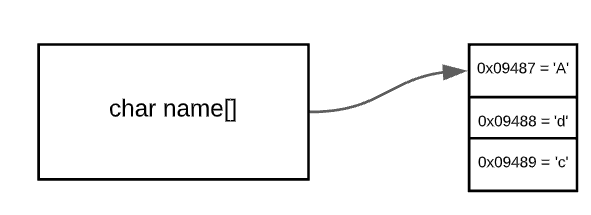

# Topic

## Learning Goals

*By the end of this module you should be able to answer the following:*

* What are functions?
* How do we define functions in python?
* How do we print to STD:Console in a function?
* How do functions accept arguments?
* How can we return from a function back to the main code?

## Code

*It is important to practice code and challenge our brain in new ways. Do all of the problems below, including the example problems. They will make you a better programmer.*

### Example Problems

*Example problems are best if you code them up yourself and store them. Don't just copy and paste, code them in and make them work. If you are really smart about it, you'll remake them slightly differently to really establish your learning.*

#### Problem: You keep copying and pasting some pretty simple code together. (simple function)

```cpp
#include<stdio.h>

void greetUser(){
        printf("Hello!");
}

int main(void){
    greetUser();
    return 0;
}
```

#### Problem: You need to pass a variable into a function

```cpp
#include<stdio.h>

void myAdd(int a, int b){
  printf("%d\n", a+b);
}

int main(void){
    myAdd(1, 2);
    return 0;
}
```

#### Problem: I specifically need to pass a string into a function

```cpp
#include<stdio.h>

void greetUser(char* name){
  printf("Hello %s\n", name);
}

int main(void){
  char name[] = "Ada";
    greetUser(name);
    return 0;
}
```

NOTE: There is some effective magic happening in here.

C doesn't have Strings. It has lists of characters and in C a list is defined as []. So, `char name[] = "Ada";` is saying I am going to make a list of characters called name and that list is `['A', 'd', 'a']`

Because this is not a primitive data type, C doesn't store the value right next to the memory reference. In fact, the memory reference and the place the data can be stored can be a long way away from each other in the memory. This means we can "pass by reference" which means we pass the address.



The end result is some funky things that can happen in all languages.

```cpp
#include<stdio.h>

void greetUser(char* name){
  printf("Hello %s\n", name);
  strcpy(name, "bob");
}

int main(void){
  char name[] = "Ada";
    greetUser(name);
    printf("%s\n", name);  // wait what?
    return 0;
}
```

So, we won't do a lot of strings in C :)

### Problem: Your teacher keeps complaining that functions should return something

```cpp
#include<stdio.h>

int myAdd(int a, int b){
  return a + b;
}

int main(void){
    printf("%d\n", myAdd(1, 2));
    return 0;
}
```

#### Problem: I need to get multiple variables from the user

```cpp
#include<stdio.h>

int myAdd(int a, int b){
  return a + b;
}

int main(void){
  int a;
  int b;
  printf("Add two numbers together ");
  scanf(" %d %d", &a, &b);
  printf("%d\n", myAdd(a, b));
  return 0;
}
```

### Practice Problems

*Practice questions are essential to mastering a skill. Often, you will be asked to do things you haven't exactly done yet, or not at all. Be challenged by it and see if you can get Google, the person next to you, or the teacher, to help before you stop working.*

#### Practice Question 1

Write a function called `display_message()`. This function will print a string telling everyone what you are learning about in this brief.

#### Practice Question 2

Write a function `myDivide(...)` that accepts two integers and returns a float. Your function must calculate the division and return it. Make sure you print the result.

### Meaty Question

Write a function called `myCalculation(...) that accepts two integers and a character in the following format `1 2 +`.

Your function must call your `myDivide(...)` function if you have called a valid division. for example `myCalculation(1, 2, '+')` is not valid but `myCalculation(1, 2, '/')` is. 