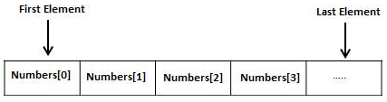

# Arrays

## Learning Goals

*By the end of this module you should be able to answer the following:*

* How can pointers and references be useful? 
* What is the difference between primitive and complex data structures?
* What is a string?
* How can you construct a string or array in C?
* How you can access different parts of an array?
* How do you pass an array from one function to another?

## Code

*It is important to practice code and challenge our brain in new ways. Do all of the problems below, including the example problems. They will make you a better programmer.*

Arrays a kind of data structure that can store a fixed-size sequential collection of elements of the same type. An array is used to store a collection of data, but it is often more useful to think of an array as a collection of variables of the same type.

Instead of declaring individual variables, such as number0, number1, ..., and number99, you declare one array variable such as numbers and use numbers[0], numbers[1], and ..., numbers[99] to represent individual variables. A specific element in an array is accessed by an index.

All arrays consist of contiguous memory locations. The lowest address corresponds to the first element and the highest address to the last element.



#### Declaring Arrays

To declare an array in C, a programmer specifies the type of the elements and the number of elements required by an array as follows

```cpp
type arrayName [ arraySize ];
```

This is called a single-dimensional array. The arraySize must be an integer constant greater than zero and type can be any valid C data type. For example, to declare a 10-element array called balance of type double, use this statement

```cpp
double balance[10];
```

Here balance is a variable array which is sufficient to hold up to 10 double numbers.

#### Initializing Arrays

You can initialize an array in C either one by one or using a single statement as follows −

```cpp
double balance[5] = {1000.0, 2.0, 3.4, 7.0, 50.0};
```

The number of values between braces { } cannot be larger than the number of elements that we declare for the array between square brackets [ ].

If you omit the size of the array, an array just big enough to hold the initialization is created. Therefore, if you write

```cpp
double balance[] = {1000.0, 2.0, 3.4, 7.0, 50.0};
```

You will create exactly the same array as you did in the previous example. Following is an example to assign a single element of the array

```cpp
balance[4] = 50.0;
```

The above statement assigns the 5th element in the array with a value of 50.0. All arrays have 0 as the index of their first element which is also called the base index and the last index of an array will be total size of the array minus 1. Shown below is the pictorial representation of the array we discussed above


#### Accessing Array Elements

An element is accessed by indexing the array name. This is done by placing the index of the element within square brackets after the name of the array. For example

```c
double salary = balance[9];
```

The above statement will take the 10th element from the array and assign the value to salary variable. The following example Shows how to use all the three above mentioned concepts viz. declaration, assignment, and accessing arrays

Example:

```c
#include <stdio.h>
 
int main () {

   int n[ 10 ]; /* n is an array of 10 integers */
   int i,j;
 
   /* initialize elements of array n to 0 */         
   for ( i = 0; i < 10; i++ ) {
      n[ i ] = i + 100; /* set element at location i to i + 100 */
   }
   
   /* output each array element's value */
   for (j = 0; j < 10; j++ ) {
      printf("Element[%d] = %d\n", j, n[j] );
   }
 
   return 0;
}
```

#### Passing Arrays as Function Arguments in C

As a pointer

```c
void myFunction(int *param) {
   .
   .
   .
}
```

Formal parameters as a sized array −

```c
void myFunction(int param[10]) {
   .
   .
   .
}
```

Formal parameters as an unsized array −

```c
void myFunction(int param[]) {
   .
   .
   .
}
```

Example:

```cpp
#include <stdio.h>

double getAverage(int arr[], int size) {

   int i;
   double avg;
   double sum = 0;

   for (i = 0; i < size; ++i) {
      sum += arr[i];
   }

   avg = sum / size;

   return avg;
}
int main () {

   /* an int array with 5 elements */
   int balance[5] = {1000, 2, 3, 17, 50};
   double avg;

   /* pass pointer to the array as an argument */
   avg = getAverage( balance, 5 ) ;
 
   /* output the returned value */
   printf( "Average value is: %f ", avg );
    
   return 0;
}
```

> Average value is: 214.400000

#### Returning an array from a function 

C programming does not allow to return an entire array as an argument to a function. However, you can return a pointer to an array by specifying the array's name without an index.

If you want to return a single-dimension array from a function, you would have to declare a function returning a pointer as in the following example

```cpp 
int * myFunction() {
   .
   .
   .
}
```

A better solutions is to not return the array and instead manipulate the one passed in. 

```cpp#include <stdio.h>
#include <string.h>

void test(char *foo){
    strcpy(foo, "hello world");
}

int main(void){
    char foo[20];
    test(foo);
    printf("%s\n", foo);
    return 1;
}

```

### Example Problems

*Example problems are best if you code them up yourself and store them. Don't just copy and paste, code them in and make them work. If you are really smart about it, you'll remake them slightly differently to really establish your learning.*

### Practice Problems

*Practice questions are essential to mastering a skill. Often, you will be asked to do things you haven't exactly done yet, or not at all. Be challenged by it and see if you can get google, the person next to you, or the teacher, to help before you stop working.*
