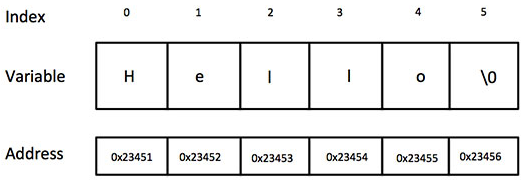

# Strings

## Learning Goals

*By the end of this module you should be able to answer the following:*

* What is a string? 
* How are strings and arrays related? 

## Code

*It is important to practice code and challenge our brain in new ways. Do all of the problems below, including the example problems. They will make you a better programmer.*

Strings are actually one-dimensional array of characters terminated by a null character '\0'. Thus a null-terminated string contains the characters that comprise the string followed by a null.

The following declaration and initialization create a string consisting of the word "Hello". To hold the null character at the end of the array, the size of the character array containing the string is one more than the number of characters in the word "Hello."

```cpp
char greeting[6] = {'H', 'e', 'l', 'l', 'o', '\0'};
```

If you follow the rule of array initialization then you can write the above statement as follows −

```cpp
char greeting[] = "Hello";
```

Following is the memory presentation of the above defined string in C



Actually, you do not place the null character at the end of a string constant. The C compiler automatically places the '\0' at the end of the string when it initializes the array. Let us try to print the above mentioned string −

```cpp
#include <stdio.h>

int main () {

   char greeting[6] = {'H', 'e', 'l', 'l', 'o', '\0'};
   printf("Greeting message: %s\n", greeting );
   return 0;
}
```

> Greeting message: Hello

Common String functions

`strcpy(s1, s2);`

Copies string s2 into string s1.

`strcat(s1, s2);`

Concatenates string s2 onto the end of string s1

`strlen(s1);`

Returns the length of string s1.

`strcmp(s1, s2);`

Returns 0 if s1 and s2 are the same; less than 0 if s1 < s2; greater than 0 if s1 > s2.
`
strchr(s1, ch);`

Returns a pointer to the first occurrence of character ch in string s1.

`strstr(s1, s2);`

Returns a pointer to the first occurrence of string s2 in string s1.

```cpp
#include <stdio.h>
#include <string.h>

int main () {

   char str1[12] = "Hello";
   char str2[12] = "World";
   char str3[12];
   int  len ;

   /* copy str1 into str3 */
   strcpy(str3, str1);
   printf("strcpy( str3, str1) :  %s\n", str3 );

   /* concatenates str1 and str2 */
   strcat( str1, str2);
   printf("strcat( str1, str2):   %s\n", str1 );

   /* total lenghth of str1 after concatenation */
   len = strlen(str1);
   printf("strlen(str1) :  %d\n", len );

   return 0;
}
```

> strcpy( str3, str1) :  Hello
> strcat( str1, str2):   HelloWorld
> strlen(str1) :  10


### Example Problems

*Example problems are best if you code them up yourself and store them. Don't just copy and paste, code them in and make them work. If you are really smart about it, you'll remake them slightly differently to really establish your learning.*

### Practice Problems

*Practice questions are essential to mastering a skill. Often, you will be asked to do things you haven't exactly done yet, or not at all. Be challenged by it and see if you can get google, the person next to you, or the teacher, to help before you stop working.*

#### Practice 1: Write a program in C to input a string and print it

```text
Test Data :
Input the string : Welcome, Ada

Expected Output :

The string you entered is : Welcome, Ada
```

#### Practice 2: Write a program in C to find the length of a string without using library function

```text
Test Data :
Input the string : ada lovelace

Expected Output :

Length of the string 'ada lovelace' is : 12
```

#### Practice 3: Write a program in C to separate the individual characters from a string

```text
Test Data :
Input the string : ada lovelace

Expected Output :

The characters of the string are : a d a   l o v e l a c e
```

#### Practice 4: Write a program in C to print individual characters of string in reverse order

```text
Test Data :
Input the string : ada lovelace

Expected Output :

The characters of the string in reverse are : ecalevol ada
```

#### Practice 5: Write a program in C to count the total number of words in a string

Test Data : 
Input the string : ada lovelace was the first programmer

Expected Output :
Total number of words in the string is : 6
```

#### Practice 6: Write a program in C to compare two strings without using string library functions

```text
Test Data :
Check the length of two strings:
--------------------------------
Input the 1st string : aabbcc
Input the 2nd string : abcdef
String1: aabbcc
String2: abcdef
Expected Output : Strings are not equal.

Check the length of two strings:
--------------------------------
Input the 1st string : aabbcc
Input the 2nd string : aabbcc
String1: aabbcc
String2: aabbcc
Expected Output : Strings are equal.
```
