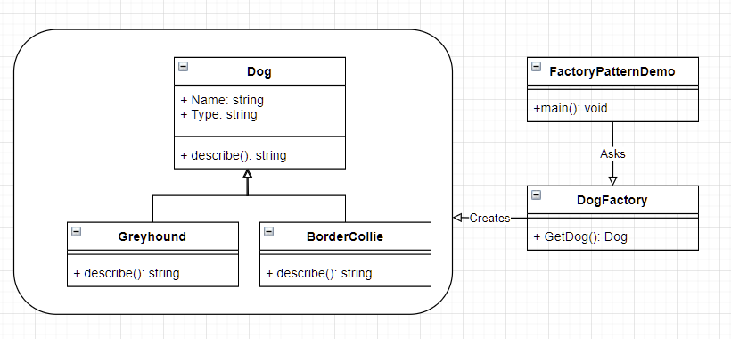
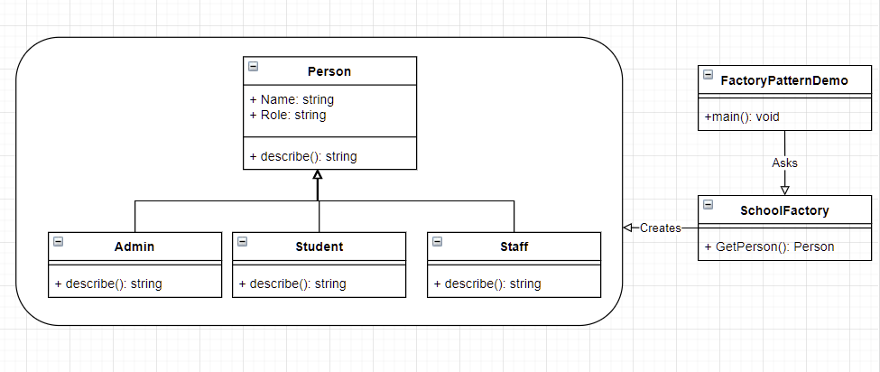

# Factory Methods 

### Learning Goals

*By the end of this module you should be able to answer the following:*

* What is a factory method
* How can you use factory methods for simple problems

### Dictionary Corner

*To be able to answer a question, you need to be able to answer it. Pay special attention to Dictionary Corner because it arms you with the language to express yourself in this space.*

* OOP - Object Oriented Programming
* Polymorphism - the provision of a single interface to entities of different types
* Design Pattern - a best use case for solving common problems. 
* method: a function in a class/object
* a method factory: a common method that can create appropriate objects

## Factory methods

Factory Methods are one of the most used Design Patterns. This type of design pattern comes under creational patterns as this pattern provides one of the best ways to create appropriate objects. 

In the Factory pattern, we create objects without exposing the creation logic to the client and refer to newly created objects using a common interface. 

### Implementation

We are going to create a Dog factory. We will create Dogs based off of input in a method factory. 



### Polymorphic implementation 

```csharp
using System;

namespace FactoryMethods {


    class Program {

        public abstract class Dog {
            public string Name { get; set; }
            public string Type { get; set; }

            public abstract string describe();
        }

        class Greyhound: Dog {

            public Greyhound(string name) {
                Name = name;
                Type = "Greyhound";
            }

            public override string describe() {
                return $"Hey, my name is {Name} and I am a {Type}. I love everybody!";
            }

        }

        class Collie: Dog {
            public Collie(string name) {
                Name = name;
                Type = "Collie";
            }

            public override string describe() {
                return $"Hey, my name is {Name} and I am a {Type}. I am very excited!";
            }
        }


        public static Dog GetDog() {
            Console.WriteLine("What is your dog's name?");
            var DogName = Console.ReadLine();
            Console.WriteLine("Press 1 for Greyhound.");
            Console.WriteLine("Press 2 for Collie.");
            var DogType = Console.ReadLine();
            if (DogType.Equals("1")) {
                return new Greyhound(DogName);
            }
            return new Collie(DogName);
        }

        
        static void Main(string[] args) {
            var myDog; 
            Console.WriteLine("What is the name of your dog?")
            var DogName = Console.ReadLine();
            Console.WriteLine("Type 1 if your dog is a Greyhound");
            Console.WriteLine("Type 2 if your dog is a Collie");
            var Breed = Console.ReadLine();
            if (Breed.Equals("1")){
                myDog = new Greyhound(DogName);
            } else {
                myDog = new Collie(DogName);
            }
            Console.WriteLine(myDog.describe());
        }
    }
}
```
### Method Factory

Let's start by creating our dog factory. 

DogFactories return Dog, and they are static methods. 

```csharp
public static Dog DogFactory(){

}
static void Main(string[] args) {
    var myDog; 
    Console.WriteLine("What is the name of your dog?")
    var DogName = Console.ReadLine();
    Console.WriteLine("Type 1 if your dog is a Greyhound");
    Console.WriteLine("Type 2 if your dog is a Collie");
    var Breed = Console.ReadLine();
    if (Breed.Equals("1")){
        myDog = new Greyhound(DogName);
    } else {
        myDog = new Collie(DogName);
    }
    Console.WriteLine(myDog.describe());
}
```

Now we have the framing for our DogFactory we can decouple main and put it in the Factory. 

```csharp
public static Dog DogFactory(){
    Console.WriteLine("What is the name of your dog?")
    var DogName = Console.ReadLine();
    Console.WriteLine("Type 1 if your dog is a Greyhound");
    Console.WriteLine("Type 2 if your dog is a Collie");
    var Breed = Console.ReadLine();
    if (Breed.Equals("1")){
        myDog = new Greyhound(DogName);
    } else {
        myDog = new Collie(DogName);
    }
}
static void Main(string[] args) {
    var myDog; 
    
    Console.WriteLine(myDog.describe());
}
```
Clearly, this doesn't work right. 
* Let's assume that the `var myDog` will be assigned to whatever `DogFactory` creates. 
* Then instead of attempting to assign Dogs to a myDog variable inside the `DogFactory` we return the correct dog. 
```csharp
public static Dog DogFactory(){
    Console.WriteLine("What is the name of your dog?")
    var DogName = Console.ReadLine();
    Console.WriteLine("Type 1 if your dog is a Greyhound");
    Console.WriteLine("Type 2 if your dog is a Collie");
    var Breed = Console.ReadLine();
    if (Breed.Equals("1")){
        return new Greyhound(DogName);
    } else {
        return new Collie(DogName);
    }
}
static void Main(string[] args) {
    var myDog = DogFactory(); 
    Console.WriteLine(myDog.describe());
}
```


Finished

```csharp
using System;

namespace FactoryMethods {


    class Program {

        public abstract class Dog {
            public string Name { get; set; }
            public string Type { get; set; }

            public abstract string describe();
        }

        class Greyhound: Dog {

            public Greyhound(string name) {
                Name = name;
                Type = "Greyhound";
            }

            public override string describe() {
                return $"Hey, my name is {Name} and I am a {Type}. I love everybody!";
            }

        }

        class Collie: Dog {
            public Collie(string name) {
                Name = name;
                Type = "Collie";
            }

            public override string describe() {
                return $"Hey, my name is {Name} and I am a {Type}. I am very excited!";
            }
        }


        public static Dog GetDog() {
            Console.WriteLine("What is your dog's name?");
            var DogName = Console.ReadLine();
            Console.WriteLine("Press 1 for Greyhound.");
            Console.WriteLine("Press 2 for Collie.");
            var DogType = Console.ReadLine();
            if (DogType.Equals("1")) {
                return new Greyhound(DogName);
            }
            return new Collie(DogName);
        }

        public static Dog DogFactory() {
            Console.WriteLine("What is the name of your dog?");
            var DogName = Console.ReadLine();
            Console.WriteLine("Type 1 if your dog is a Greyhound");
            Console.WriteLine("Type 2 if your dog is a Collie");
            var Breed = Console.ReadLine();
            if (Breed.Equals("1")) {
                return new Greyhound(DogName);
            }
            return new Collie(DogName);
        }
        
        static void Main(string[] args) {
            var myDog = DogFactory();
            Console.WriteLine(myDog.describe());
        }
    }
}

```

### Why is this cool.

Look at the difference between the two main methods: 

```csharp
static void Main(string[] args) {
    var myDog = DogFactory();
    Console.WriteLine(myDog.describe());
}
```

vs

```csharp
static void Main(string[] args) {
    var myDog; 
    Console.WriteLine("What is the name of your dog?")
    var DogName = Console.ReadLine();
    Console.WriteLine("Type 1 if your dog is a Greyhound");
    Console.WriteLine("Type 2 if your dog is a Collie");
    var Breed = Console.ReadLine();
    if (Breed.Equals("1")){
        myDog = new Greyhound(DogName);
    } else {
        myDog = new Collie(DogName);
    }
    Console.WriteLine(myDog.describe());
}
```

In the later version all of the logic is held in the main method - both logic for creating Dogs and also the running of the program itself. This makes for code that is explicitly complicated to even understand what is going on. 

In the former code (the new style) the logic of creating dogs is separated from the logic of running the main method. This simplifies the code base and makes it easier for us to play with. 

## Practice and Challenges

### Technical Literacy 

* What is Object Oriented Programming? 
* What is a class? 
* What is an object? 
* How do classes and objects relate to each other? 
* What is polymorphism? 
* Describe polymorphic behaviour? 
* What are design patterns? 
* Describe what a factory method is?

### Questions

* How would you explain what polymorphic behaviour is to someone's grandmother? 
* How would you explain factory method to a five year old?

### Practice

#### Dog Factory

* Create your own DogFactory except this time add more dog types to it. 
* You should have 5 or more dog types 

### Challenge: School factory

Create a simple school factory. 

* You must have 20 randomly generated members of the school
* Each member must be stored in a list or array
* create a loop (probably a while loop) which gets them to describe themselves 10 times
* After you do that, create a new function called action which can pick a random action that each member can do Some inspiration: 
  * Students may: go to class, socialise, hang out in the car park
  * Teachers may: go to class, go to office, go get coffee
  * Admin may: go get coffee, go to office, have important meetings



Here is some helper code. Note you will need more names :) 
```csharp
public static string GetName() {
    var rand = new Random();
    string[] GivenNames = { "Ada", "Bob", "Charles" };
    string[] FamilyNames = { "Lovelace", "Bobbington", "Babbage" };
    int GivenIndex = rand.Next(GivenNames.Length);
    int FamilyIndex = rand.Next(FamilyNames.Length);
    return $"{FamilyNames[FamilyIndex]}, {GivenNames[GivenIndex]}";
}
```