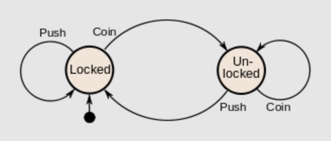
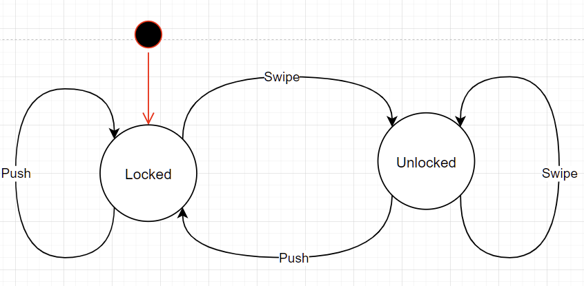
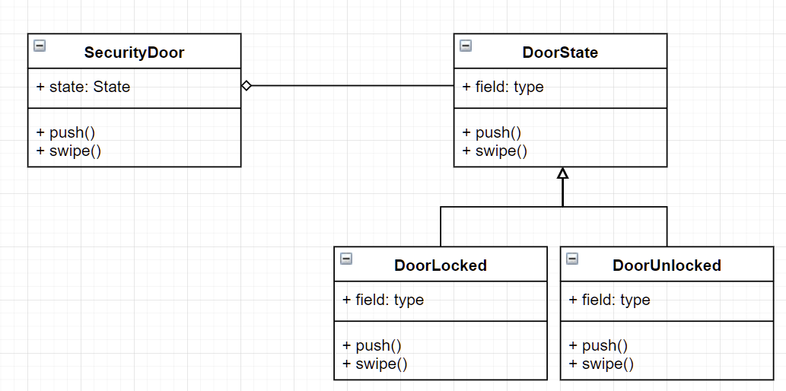

# State Patterns 

### Learning Goals

*By the end of this module you should be able to answer the following:*

* How can we use inheritance to create complex systems with simple (ish) code? 
* What are the goals of behavioural patterns? 
* What is the State Pattern and what is it intended to solve? 


### Dictionary Corner

*To be able to answer a question, you need to be able to understand it. Pay special attention to Dictionary Corner because it arms you with the language to express yourself in this space.*

* State - a system is described as stateful if it is designed to remember preceding events or user interactions
* Automata theory – the study of abstract machines and the computational problems that can be solved by them. 
* Abstract Machine – A thought experiment regarding computability such as the complexity of algorithms. The best known example is the Turing Machine
* Finite-state machine (FSM) – is an abstract machine that can be in exactly one of a finite number of states at any given time. The FSM can change states from one state to another in response to inputs. 
* State Pattern – is a behavioural pattern that allows an object to alter its behaviour when its internal state changes. 


## Lesson

### State 

A System is described as stateful if it is designed to remember preceding events or interactions. 

Programs state is stored with variables. Variables represent storage locations in memory. 

```csharp
string myName;
```
Is an example of creating some part of state by storing a users name. 


### Classes of Automata

Combinational Logic – a type of digital logic which is implemented by Boolean circuits where the output is pure function of the present input only. (Think of a super Truth Table)


Finite-state machine – an abstract machine that can be in exactly one of a finite-number of states at any given time who can change their state given desirable input


Pushdown automation – In the theory of computation a pushdown automation (PDA) is a type of automation that employs a stack (a type of simple data structure)


Turing Machine – a simple mathematical model of computation that defines an abstract machine. 


### Finite-State Machines (FSM)

Is an important point to understand before we start using State Patterns as they are an explicit concept. 

An FSM is defined by: 

* A list of all possible states
* The initial state
* The inputs that trigger each transition (the change between states)

Example: Coin-Operated Turnstile. 

If we consider a turnstile as a state machine it has two possible states: Locked and Unlocked. There are two possible inputs: push, and coin. 


|Current State|Input|Next State|Output|
|:--|:--|:--|:--|
Locked|coin|Unlocked|Unlocks the turnstile so that the customer can push through.
Locked|push|Locked|None|
Unlocked|coin|Unlocked|None|
Unlocked|push|Locked|When the customer has pushed through, locks the turnstile.

There are two possible inputs that affect its state: putting a coin in the slot (coin) and pushing the arm (push). In the locked state, pushing on the arm has no effect; no matter how many times the input push is given, it stays in the locked state. Putting a coin in – that is, giving the machine a coin input – shifts the state from Locked to Unlocked. In the unlocked state, putting additional coins in has no effect; that is, giving additional coin inputs does not change the state. However, a customer pushing through the arms, giving a push input, shifts the state back to Locked.


### Programming The State Pattern. 

Let's start with a fairly basic example that most students could probably code: 

This code will iterate through the list of quotes and print them in upper and lower text. My video example includes a more complicated case (MockingCase). 

```csharp
using System;
using System.Collections.Generic;

namespace PatternsState {

class Program {
        static void Main(string[] args) {
            var quotes = new List<string>();
            quotes.Add("Be yourself; everyone else is taken - Oscar WIlde");
            quotes.Add("The greatest glory in living lies not in never falling, but in rising every time we fall. -Nelson Mandela");
            quotes.Add("A room without books is like a body without a soul. - Marcus Tullius Cicero");
            quotes.Add("The way to get started is to quit talking and begin doing. -Walt Disney");
            quotes.Add("Be the change that you wish to see in the world. - Mahatma Gandhi");
            quotes.Add("Your time is limited, so don't waste it living someone else's life. Don't be trapped by dogma – which is living with the results of other people's thinking. -Steve Jobs");
            quotes.Add("If you tell the truth, you don't have to remember anything. - Mark Twain");

            for (int i = 0; i < quotes.Count; i++) {
                if (i % 2 == 0) {
                    Console.WriteLine(quotes[i].ToLower());
                } else {
                    Console.WriteLine(quotes[i].ToUpper());
                }
            }
        }
    }
}
```

Before we move into the State Pattern, let's use Inheritance to create polymorphic behaviour. 

At first glance it seems more complicated due to line length but it simplifies any of the code being written in any particular area. 

```csharp
using System;
using System.Collections.Generic;

namespace PatternsState {

class Program {
        public abstract class CaseState {
            public abstract void WriteOut(String Phrase);
        }

        public class LowerCaseState : CaseState {
            public override void WriteOut(string Phrase) {
                Console.WriteLine(Phrase.ToLower());
            }
        }

        public class UpperCaseState : CaseState {
            public override void WriteOut(string Phrase) {
                Console.WriteLine(Phrase.ToUpper());
            }
        }

        public class MockingCase : CaseState {
            public override void WriteOut(string Phrase) {
                for (int i = 0; i < Phrase.Length; i++) {
                    if (i % 2 == 0) {
                        Console.Write(char.ToUpper(Phrase[i]));
                    } else {
                        Console.Write(Phrase[i]);
                    }
                }
            }
        }

        static void Main(string[] args) {
            var quotes = new List<string>();
            quotes.Add("Be yourself; everyone else is taken - Oscar WIlde");
            quotes.Add("The greatest glory in living lies not in never falling, but in rising every time we fall. -Nelson Mandela");
            quotes.Add("A room without books is like a body without a soul. - Marcus Tullius Cicero");
            quotes.Add("The way to get started is to quit talking and begin doing. -Walt Disney");
            quotes.Add("Be the change that you wish to see in the world. - Mahatma Gandhi");
            quotes.Add("Your time is limited, so don't waste it living someone else's life. Don't be trapped by dogma – which is living with the results of other people's thinking. -Steve Jobs");
            quotes.Add("If you tell the truth, you don't have to remember anything. - Mark Twain");

            //CaseState context = new MockingCase();
            CaseState context;
            int foo = 0;
            foreach (string quote in quotes) {
                if (foo == 0) {
                    foo = foo + 1;
                    context = new LowerCaseState();
                } else if (foo == 1) {
                    foo = foo + 1;
                    context = new UpperCaseState();
                } else {
                    foo = 0;
                    context = new MockingCase();
                }
                context.WriteOut(quote);
            }
            
        }
    }
}

```

Why is this part is still dodgy: 

```csharp
foreach (string quote in quotes) {
    if (foo == 0) {
        foo = foo + 1;
        context = new LowerCaseState();
    } else if (foo == 1) {
        foo = foo + 1;
        context = new UpperCaseState();
    } else {
        foo = 0;
        context = new MockingCase();
    }
    context.WriteOut(quote);
}
```

That's right, because we are handling logic and behaviour in the same place. 

Let's use the state pattern to fix this: 

To begin, we create our state manager. 

```csharp
public class StateContext {
    // This is our state variable
    private CaseState _State;

    // by default, it is in LowerCaseState
    public StateContext() {
        _State = new LowerCaseState();
    }

    // But we can change state to a new state
    public void SetState(CaseState State) {
        _State = State;
    }

    // Because this is an interface we need to handle how we write. 
    public void WriteOut(String Phrase) {
        // We tell our state object to write to it. 
        // We also send this object to it so we can store the new state
        _State.WriteOut(this, Phrase);
    }
}
```

But wait, how will the state manage this new WriteOut method? Our version only has one input! 

Good catch. We need to modify that: 

```csharp
public abstract void WriteOut(StateContext Context, String Phrase);
```
We can then ripple that change through the rest of our code: 

```csharp
using System;
using System.Collections.Generic;

namespace PatternsState {

    public class StateContext {
        private CaseState _State;

        public StateContext() {
            _State = new LowerCaseState();
        }

        public void SetState(CaseState State) {
            _State = State;
        }

        public void WriteOut(String Phrase) {
            _State.WriteOut(this, Phrase);
        }
    }


    public abstract class CaseState {
        public abstract void WriteOut(StateContext Context, String Phrase);
    }

    public class LowerCaseState : CaseState {
        public override void WriteOut(StateContext Context, string Phrase) {
            Console.WriteLine(Phrase.ToLower());
            Context.SetState(new UpperCaseState());
        }
    }

    public class UpperCaseState : CaseState {
        public override void WriteOut(StateContext Context, string Phrase) {
            Console.WriteLine(Phrase.ToUpper());
            Context.SetState(new MockingCaseState());
        }
    }

    public class MockingCaseState : CaseState {
        public override void WriteOut(StateContext Context, string Phrase) {
            for (int i = 0; i < Phrase.Length; i++) {
                if (i % 2 == 0) {
                    Console.Write(char.ToUpper(Phrase[i]));
                } else {
                    Console.Write(Phrase[i]);
                }
            }
            Console.WriteLine();
            Context.SetState(new LowerCaseState());
        }
    }

class Program {
        static void Main(string[] args) {
            var quotes = new List<string>();
            quotes.Add("Be yourself; everyone else is taken - Oscar WIlde");
            quotes.Add("The greatest glory in living lies not in never falling, but in rising every time we fall. -Nelson Mandela");
            quotes.Add("A room without books is like a body without a soul. - Marcus Tullius Cicero");
            quotes.Add("The way to get started is to quit talking and begin doing. -Walt Disney");
            quotes.Add("Be the change that you wish to see in the world. - Mahatma Gandhi");
            quotes.Add("Your time is limited, so don't waste it living someone else's life. Don't be trapped by dogma – which is living with the results of other people's thinking. -Steve Jobs");
            quotes.Add("If you tell the truth, you don't have to remember anything. - Mark Twain");


            StateContext context = new StateContext();

            foreach (string quote in quotes) {
                context.WriteOut(quote);
            }
        }
    }
}
1
```
## Discussion

On one hand, this looks like it is a lot more complicated. However, adding a new state is trivial. 

## Practice and Challenges

### Questions

#### Practice

1. Complete the Code in the lesson
2. Add a new state which writes the code in reverse. 

#### Challenge

Create the following state machine: 


