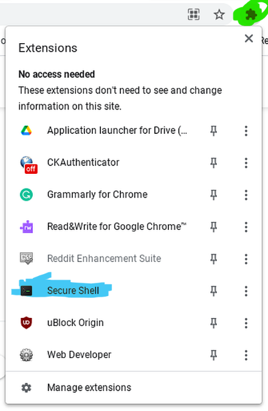
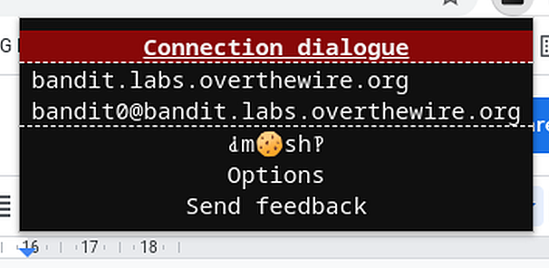
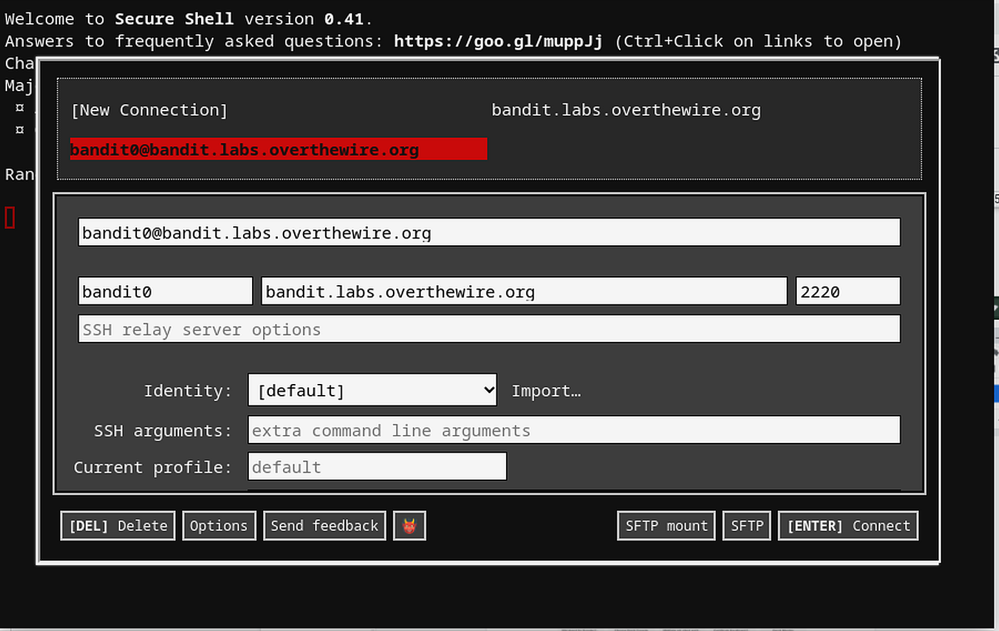
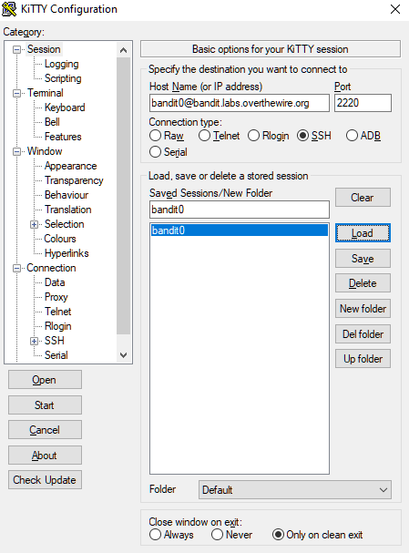
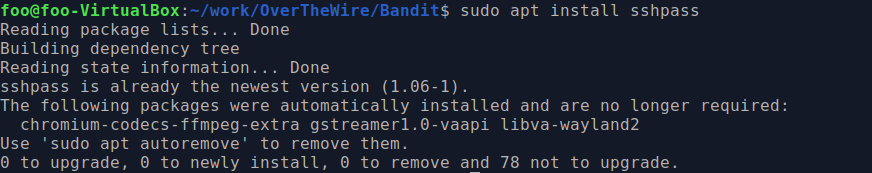
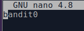
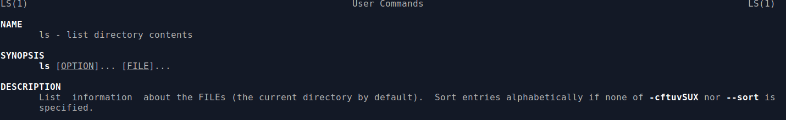
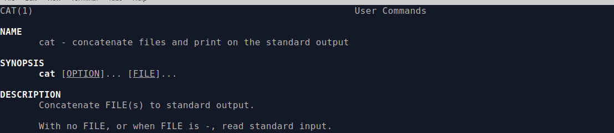

# Wargaming 101 

### Learning Goals

*By the end of this module you should be able to answer the following:*

* What is Wargaming?
* What is OverTheWire
* How to connect to overthewire on ChromeOS
* How to connect to overthewire on Windows10

### Dictionary Corner

*To be able to answer a question, you need to be able to understand it. Pay special attention to Dictionary Corner because it arms you with the language to express yourself in this space.*

* SSH - Secure Shell is a network protocol that gives users a secure way to access remote machines over an unsecured network. 
* ls - a basic *NIX command to list the structure of a directory
* cat - a basic *NIX command to produce the contents of text file to the console 
* PuTTy - a windows shell client 
* Secure Shell - An extension for Google Chromebooks to give you SSH access. 

## Connecting to Overthewwire

### What are wargames (specifically overthewire)

Just like how the Australian Defence Force doesn't learn how to defend bases, cyber security experts can't just focus on how to be defensive. Wargames are how people learn the basic tools behind offensive cyber security. 

Overthewire hosts a range of wargames that scale in difficulty. In our case, we are going to join bandit. Bandit is aimed at beginners. However, don't get too confident, it still isn't trivial. 

Luckily, there are an immense number of tutorials online. Feel free to use them, but be aware that your assessment for this period relies on your understanding of the techniques you use here. 

You will need to create a "Cookbook Recipe" for: 

* Each Level you crack
* Each new command or tool that you need to learn to crack the level

For example, to even get to bandit0 requires you to use SSH. You'll need to write a recipe for that. To get to bandit1 you'll need to play with `ls` and `cat`. That's two recipes. 

Command Recipes need to contain: 

* A summary
* Example(s) - this will grow with each option that you need to implement to solve your problems 
* A discussion of how you used it to solve each problem in context to the tool. 

Level Recipes need to contain

* A summary 
* An explanation of how you solved the problem with links to each command recipe 
* If there are alternative methods to solving the problem a discussion (with examples) 
  * For example, could you use a programming language, or pipe text to funky grep statements? 

Check out bandit over here: 

[Bandit at over the wire (https)](https://overthewire.org/wargames/bandit/)

### Chromebooks

Go to the [Secure Shell website](https://chrome.google.com/webstore/detail/secure-shell/iodihamcpbpeioajjeobimgagajmlibd) and add it to your chromebook. If this doesn't work can you please report this to me immediately. 

Click the extensions button and then click Secure Shell: 



Click on Connection Dialog 


Connect to bandit0



Read the page and then click `Level 0` to begin. 

### Windows 10

I highly recommend that you use [PuTTy](https://www.putty.org/) or [KiTTy](http://www.9bis.net/kitty/#!pages/download.md) to connect to bandit. There are some awkward features to both (especially in the sense of saving passwords and reusing them). However, they are simple. 

You'll need to create a document to save the passphrase for each level. 

Note, if you are hardcore, you might want to consider setting up a Virtual Machine and deploying from some flavour of *NIX. That's what I'm going to do. 

Open PuTTy: 

Fill in the address and port detail. Note use the `username@address` format of ssh connection. In this case, `bandit0@bandit.labs.overthewire.org`

Click save 



Double click it! Welcome to Bandit0

If you want to learn how to sign in make sure you read the clues on [Bandit](https://overthewire.org/wargames/bandit/)

When you're ready, click `Level 0`

### MacOS 

You already have a *NIX machine. Congratulations! 

I don't have a mac machine. So I can't give you screenshots. 

* Press the command button and space bar simultaneously 
* Type terminal
* Open it


### Lachlan's Shell Service (webshell)

```
Hello!

First, type

./make_person firstname

e.g.

./make_person lachlan


then type

cd firstname/

and then type

ls

to see the files in the current directory
Type

./bandit.sh bandit0

to get started, whenever you have a new password type

echo "the password you got" > banditN

e.g.

echo "fGUhj4kla9jbbUNNfktd78OOpsqOltut" > bandit1

then, you can type

./bandit.sh bandit1

to login to the next bandit challenge!!
```

### Linux 

Open a terminal session 

Install sshpass `sudo apt install sshpass` (mine is already isntalled)



Have a look at your directory structure with the `ls` command

Make a new directory for your work `mkdir work`

Make another new directory for bandit `mkdir bandit`

Make a file called bandit0 `> bandit0`

edit it with nano `nano bandit0`



Press `ctrl+s` to save and then `ctrl+x` to exit

Sign on to bandit0 using sshpass and ssh

`sshpass -f bandit0 ssh bandit0@bandit.labs.overthewire.org -p 2220`


## Discussion

You are going to need to master two commands for the first 3 Levels: 

* ls
* cat

When you've signed onto overthewire you can start investigating them:

* `man ls` 
* `man cat`






## Practice and Challenges

#### Challenge

Complete the following levels this week: 

* Level 0
* Level 1
* Level 2
* Level 3
* Level 4
* Level 5

Remember to write them up. 