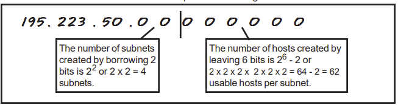
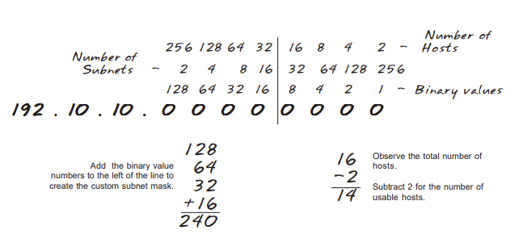
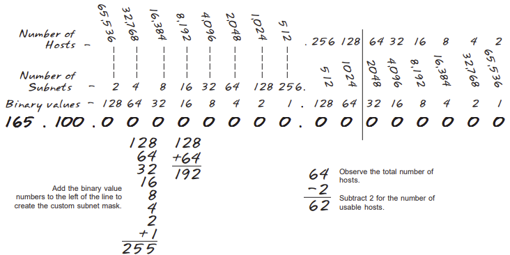
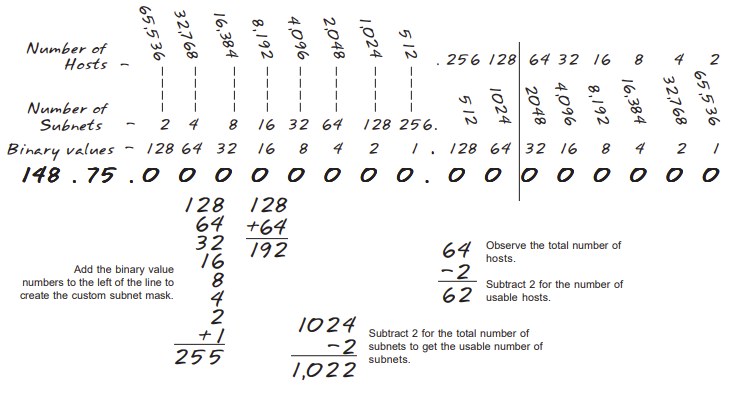
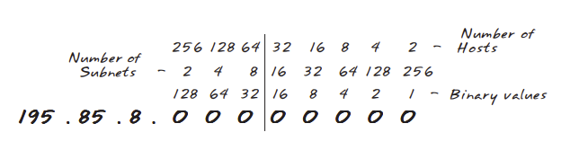
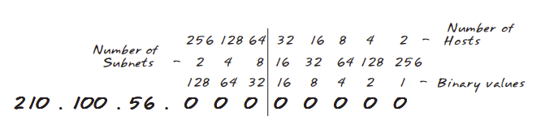
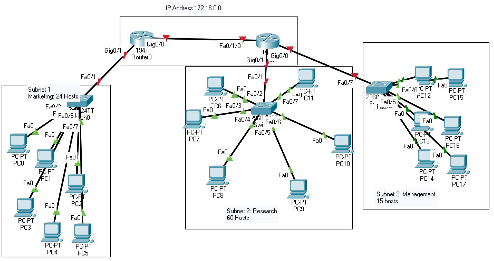

# Topic 

### Learning Goals

*By the end of this module you should be able to answer the following:*

* What is a subnet? 
* Why do we need subnets? 
* How do you make a subnet?

### Dictionary Corner

*To be able to answer a question, you need to be able to answer it. Pay special attention to Dictionary Corner because it arms you with the language to express yourself in this space.*

* IP Address - https://www.kaspersky.com/resource-center/definitions/what-is-an-ip-address
* IP Address classes - https://en.wikipedia.org/wiki/Classful_network
* Network and Hosts - https://en.wikipedia.org/wiki/Subnetwork

## Lesson

### IP Addresses

An IP address is a 32-bit number that uniquely identifies a host (computer or other device, such as a printer or router) on a TCP/IP network.

IP addresses are normally expressed in dotted-decimal format, with four numbers separated by periods, such as 192.168.123.132. 

To understand how subnet masks are used to distinguish between hosts, networks, and subnetworks, examine an IP address in binary notation

For example, take the dotted-decimal IP address 192.168.123.132 
(in binary notation) the 32 bit number 110000000101000111101110000100

This number may be hard to make sense of, so divide it into four parts of eight binary digit (known as octets)

The example IP address, then, becomes 11000000.10101000.01111011.10000100

For TCP/IP wide area network (WAN) to work efficiently as a collection of networks
the routers that pass packets of data between networks that do not know the exact location of a host for which a packet of information is destined. 

Routers only know what network the host is a member of and use information stored in their route table to determine how to get the packet to the destination host's network. 

After the packet is delivered to the destination's network, the packet is delivered to the appropriate host.

For this process to work, an IP address has two parts. The first part of an IP address is used as a network address, the last part as a host address.

### Network and Host Address

|IP|Type|
|--:|:--|
|192.168.123.132|TCP/IP Address|
|192.168.123.XXX|Network address|
|XXX.XXX.XXX.132|Host|

### Subnets
The second item, which is required for TCP/IP to work, is the subnet mask. 

The subnet mask is used by the TCP/IP protocol to determine whether a host is on the local subnet or on a remote network.

In TCP/IP, the parts of the IP address that are used as the network and host addresses are not fixed, so the network and host addresses above cannot be determined unless you have more information. This information is supplied in another 32-bit number called a subnet mask. In this example, the subnet mask is 255.255.255.0. 

It is not obvious what this number means unless you know that 255 in binary notation equals 11111111; so, the subnet mask is: 11111111.11111111.11111111.0000000 Lining up the IP address and the subnet mask together, the network and host portions of the address can be separated: 11000000.10101000.01111011.10000100 -- IP address (192.168.123.132) 11111111.11111111.11111111.00000000 -- Subnet mask (255.255.255.0) 

The first 24 bits (the number of ones in the subnet mask) are identified as the network address, with the last 8 bits (the number of remaining zeros in the subnet mask) identified as the host address. This gives you the following: 11000000.10101000.01111011.00000000 -- Network address (192.168.123.0) 00000000.00000000.00000000.10000100 -- Host address (000.000.000.132) 

So now you know, for this example using a 255.255.255.0 subnet mask, that the network ID is 192.168.123.0, and the host address is 0.0.0.132. When a packet arrives on the 192.168.123.0 subnet (from the local subnet or a remote network), and it has a destination address of 192.168.123.132, your computer will receive it from the network and process it.

Almost all decimal subnet masks convert to binary numbers that are all ones on the left and all zeros on the right. Some other common subnet masks are: Decimal Binary 255.255.255.192 1111111.11111111.1111111.11000000 255.255.255.224 1111111.11111111.1111111.11100000 Internet RFC 1878 (available from http://www.internic.net ) describes the valid subnets and subnet masks that can be used on TCP/IP networks

### ANDing
Every IP address must be accompanied by a subnet mask. By now you should be able to look
at an IP address and tell what class it is. Unfortunately your computer doesn’t think that way. For your computer to determine the network and subnet portion of an IP address it must
“AND” the IP address with the subnet mask.

#### ANDing with standard subnet masks

|Type|Network||Host|Denary|
|--:|--:|--|:--|:--|
|IP Address|11000000.01100100.00001010|.|00100001|192.100.10.33|
|Subnet Mask|11111111.11111111.11111111|.|00000000|255.255.255.0|
|AND|11000000.01100100.00001010|.|00000000|192.100.10.0|

#### ANDing with custom subnet masks
When you take a single network such as 192.100.10.0 and divide it into five smaller networks
(192.100.10.16, 192.100.10.32, 192.100.10.48, 192.100.10.64, 192.100.10.80) the outside
world still sees the network as 192.100.10.0, but the internal computers and routers see five
smaller subnetworks. Each independent of the other. This can only be accomplished by using
a custom subnet mask. A custom subnet mask borrows bits from the host portion of the
address to create a subnetwork address between the network and host portions of an IP
address. In this example each range has 14 usable addresses in it. The computer must still
AND the IP address against the custom subnet mask to see what the network portion is and
which subnetwork it belongs to.

IP Address: 192.100.10.0
Custom Subnet mask: 255.255.255.240

Address ranges: 

*  192.10.10.0 to 192.100.10.15
*  192.10.10.16 to 192.100.10.31
*  192.10.10.32 to 192.100.10.47
*  192.10.10.48 to 192.100.10.63
*  192.10.10.64 to 192.100.10.79
*  192.10.10.80 to 192.100.10.95
*  192.10.10.96 to 192.100.10.111
*  192.10.10.112 to 192.100.10.127
*  192.10.10.128 to 192.100.10.143
*  192.10.10.144 to 192.100.10.159
*  192.10.10.160 to 192.100.10.175
*  192.10.10.176 to 192.100.10.191
*  192.10.10.192 to 192.100.10.207
*  192.10.10.208 to 192.100.10.223
*  192.10.10.224 to 192.100.10.239
*  192.10.10.240 to 192.100.10.255

|Type|Network||Sub|Host|Denary|
|--:|--|--|:--|:--|:--|
|IP Address|11000000.01100100.00001010|.|0010|0001|192.100.10.33|
|Subnet mask|11111111.11111111.11111111|.|1111|0000|255.255.255.240|
|AND|11000000.01100100.00001010|.|0010|0000|192.100.10.32|

* 4 bits were 'borrowed' from the host portion of the address for the custom subnet mask. 
* The ANDing process of the four borrowed bits shows which range of IP addresses this address will fall into. 

### How to determine the number of subnets and the number of hosts per subject? 

Two formulas can provide this basic information:

* Number of subnets = 2 (Second subnet formula: Number of subnets = 2 - 2)
* Number of hosts per subnet = 2 - 2

Both formulas calculate the number of hosts or subnets based on the number of binary bits
used. For example if you borrow three bits from the host portion of the address use the
number of subnets formula to determine the total number of subnets gained by borrowing the
three bits. This would be 2 or 2 x 2 x 2 = 8 subnets.

To determine the number of hosts per subnet you would take the number of binary bits used in
the host portion and apply this to the number of hosts per subnet formula If five bits are in the host portion of the address this would be 2 or 2 x 2 x 2 x 2 x 2 = 32 hosts.

When dealing with the number of hosts per subnet you have to subtract two addresses from
the range. The first address in every range is the subnet number. The last address in every
range is the broadcast address. These two addresses cannot be assigned to any device in
the network which is why you have to subtract two addresses to find the number of usable
addresses in each range.

For example if two bits are borrowed for the network portion of the address you can easily
determine the number of subnets and hosts per subnets using the two formulas.

#### What about that second subnet formula:

* Number of subnets = 2 - 2

In some instances the first and last subnet range of addresses are reserved. This is similar to the first and last host addresses in each range of addresses.

The first range of addresses is the zero subnet. The subnet number for the zero subnet is
also the subnet number for the classful subnet address.

The last range of addresses is the broadcast subnet. The broadcast address for the last
subnet in the broadcast subnet is the same as the classful broadcast address.

## Discussion

### Technical Literacy 

## Practice and Challenges

### Questions

#### Worked Examples

##### Example 1: 
* Number of needed subnets: 14
* Number of needed usable hosts: 14
* Network Address: 192.10.10.0

|||
|--:|:--|
|Address class|C|
|Default Mask|255.255.255.240|
|Custom Mask|255.255.255.240|
|Total number of subnets|16|
|Total number of host addresses|16|
|Number of usable addresses|14|
|Number of bits borrowed|4|

Working out: 

##### Example 2
* Number of needed subnets: 1000
* Number of needed usable hosts: 60
* Network Address: 165.100.0.0

|||
|--:|:--|
|Address class|C|
|Default Mask|255.255.0.0|
|Custom Mask|255.255.255.192|
|Total number of subnets|1024|
|Total number of host addresses|64|
|Number of usable addresses|62|
|Number of bits borrowed|10|

Working out:

##### Example 3

NOTE: /26 indicates the total number of bits used for the network and subnetwork portion of the address. All bits remaining belong to the host portion of the address. 

|||
|--:|:--|
|Network Address|148.75.0.0/26|
|Address class|B|
|Default Mask|255.255.0.0|
|Custom Mask|255.255.255.192|
|Total number of subnets|1024|
|Total number of host addresses|64|
|Number of usable addresses|62|
|Number of bits borrowed|10|

Working out:

##### Example 4
* Number of needed subnets:14
* Number of needed usable hosts:  14
* Network Address: 192.192.10.10.0

|||
|--:|:--|
|Address class|C|
|Default Mask|255.255.255.0|
|Custom Mask|255.255.255.240|
|Total number of subnets|16|
|Total number of host addresses|16|
|Number of usable addresses|14|
|Number of bits borrowed|4|
|What is the 4th subnet range|192.10.10.48 to 192.10.10.63|
|What is the subnet number for the 8th subnet|192.10.10.112|
|What is the subnet broadcast address for the 13th subnet|192.10.10.207|
|What are the assignable addresses for the 9th subnet|192.10.10.129 to 192.10.10.142|

Working out:

#### Practice

##### Question 1
* Number of needed subnets: 6
* Number of needed usable hosts:  30
* Network Address: 195.85.8.0

|||
|--:|:--|
|Address class||
|Default Mask||
|Custom Mask||
|Total number of subnets||
|Total number of host addresses||
|Number of usable addresses||
|Number of bits borrowed||

Working out:

##### Question 2
* Number of needed subnets: 6
* Number of needed usable hosts:  30
* Network Address: 210.100.56.0

|||
|--:|:--|
|Address class||
|Default Mask||
|Custom Mask||
|Total number of subnets||
|Total number of host addresses||
|Number of usable addresses||
|Number of bits borrowed||

Working out:

##### Question 3

* Number of needed subnets:10
* Network Address: 192.192.10.10.0

|||
|--:|:--|
|Address class||
|Default Mask||
|Custom Mask||
|Total number of subnets||
|Total number of host addresses||
|Number of usable addresses||
|Number of bits borrowed||
|What is the 9th subnet range||
|What is the subnet number for the 4th subnet||
|What is the subnet broadcast address for the 12th subnet||
|What are the assignable addresses for the 10th subnet||

Working out:

#### Challenge

Based on the diagram below design a network addressing scheme that will supply the minimum number of subnets and allow enough extra subnets and hosts for 100% growth. 

* Number of needed subnets:
* Number of needed usable hosts:  
* Network Address: 

|||
|--:|:--|
|Address class||
|Default Mask||
|Custom Mask||
|Minimum number of subnets needed||
|Extra subnets required for 100% growth?||
|Total number of host addresses in the largest group||
|Number of additional addresses needed for 100% growth in the largest subnet||
|Total number of addresses needed for the largest subnet||
|IP address range for Research||
|IP Address range for marketing||
|IP Address range for management||
|IP Address range for Router A to Router B|||

