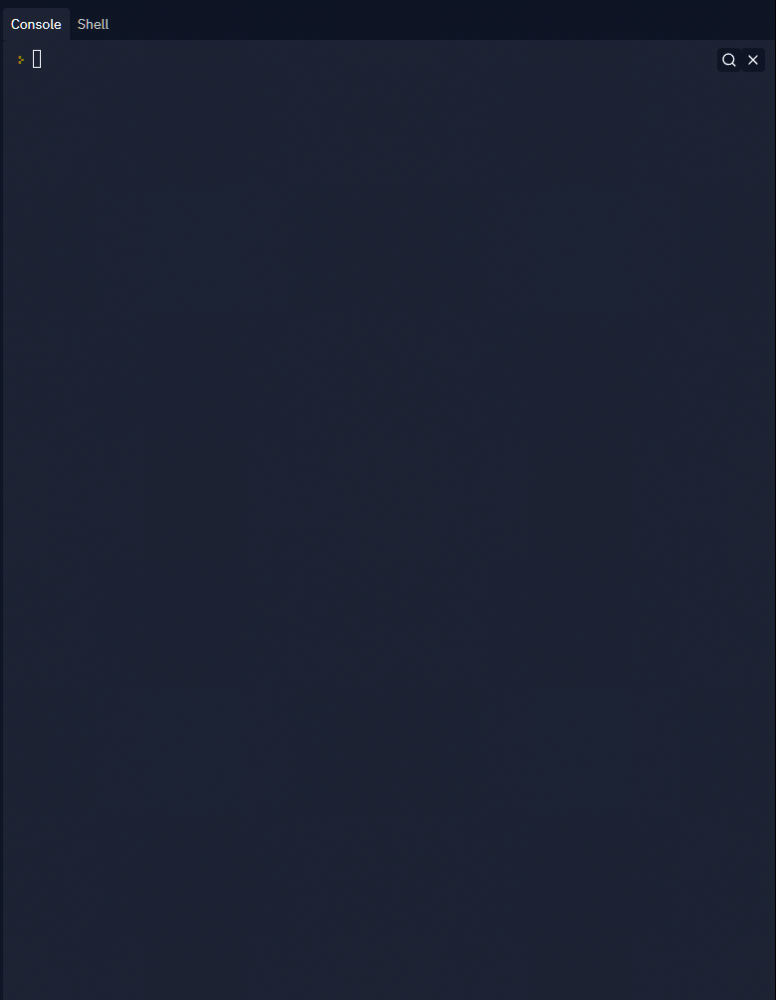
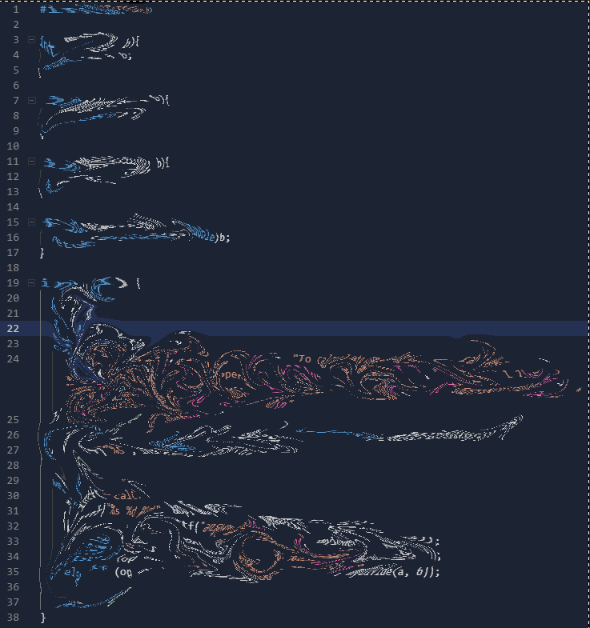
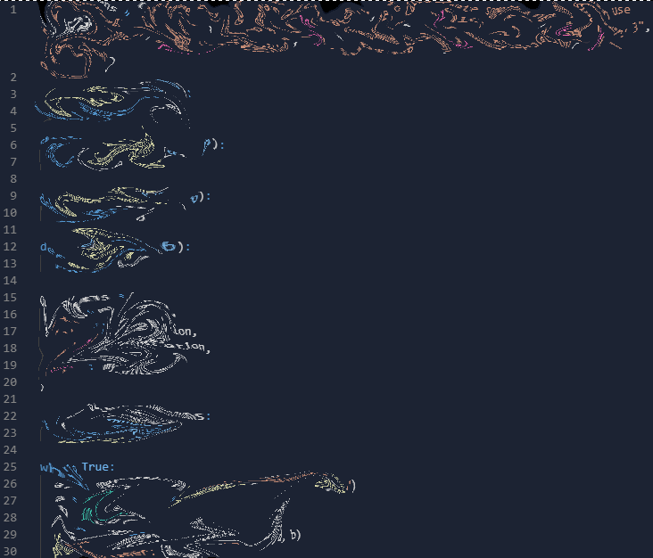

# Challenge

## Challenge Goals

*In this challenge you will need to flex your knowledge and understanding of the following:*

* variables
* selection/conditions (if/else/else-if)
* iteration (probably while loops)
* functions

## Challenge details

Using your knowledge and understanding of programming. You are to reverse engineer the following program:

Instructions:

* Your code must produce instructions of use. This only appears once
* Your code will block for user input to allow multiple calculations
* This input comes in the format `calc: operation var1 var2`
  * example: `calc: + 1 2`
* Your output will come in the format `answer: var`
  * example: `answer: 3`
* The `calc:` and `answer:` parts of the line are automated

Your code is expected:

* To run infinitely using some sort of loop
* correctly solve the operation
* use functions to solve said operations

Diagram of working program: 

### Extra spicy

Too easy? Hungry for some extra marks? Want to flex your nerd-fu? I got you with some ideas for how to reach true glory.

#### All

* create some other operations
  * example `L 4 3` could calculate the hypotenuse of a right angle triangle
  * example: `^ 2 2` could calculate 2 to the power of 2

#### C

* Make integer division work properly
* Make integer division round to 1 decimal place
* Complete your code in less than 38 lines: 

NOTE: your code must have "good" formatting. You can't make practically unreadable code.

NOTE: This will be overlooked if you make some amazing [code golf](https://code.golf/) but it has to be sweet.

#### Python

* Complete your challenge without selection/condition statements.
* Complete your challenge is fewer than 30 lines of code.

<i>The code above is both 30 lines and doesn't use if statements</i></>

NOTE: your code must have "good" formatting. You can't make practically unreadable code.

NOTE: This will be overlooked if you make some amazing [code golf](https://code.golf/) but it has to be sweet.
